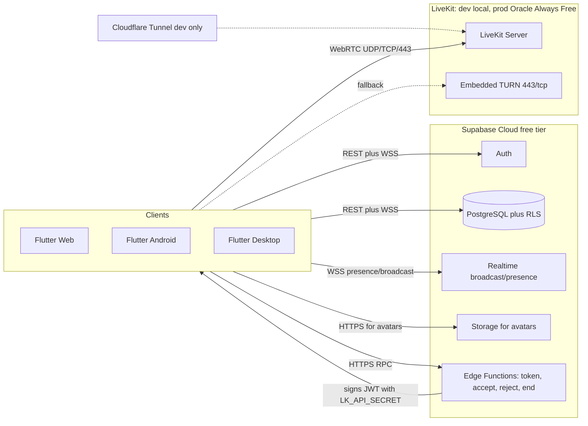
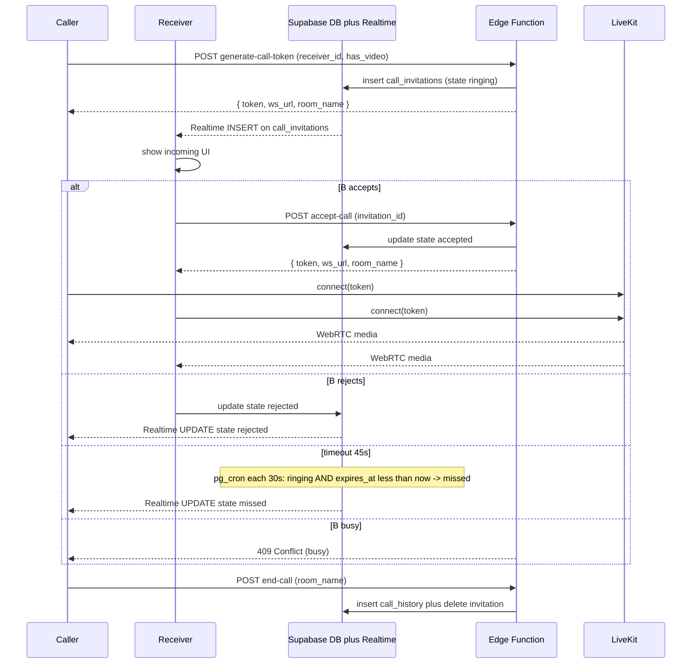
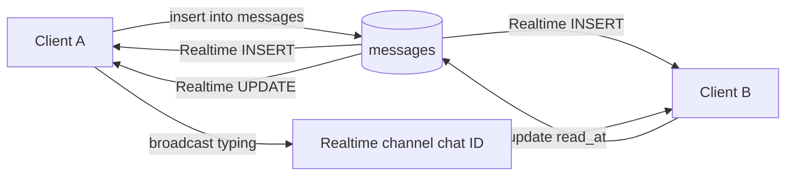

# VibeCall — Implementation Plan for AI Agents

> **Audience**: AI coding agents (Cursor, Claude Code и аналоги), выполняющие план пошагово.
> **Product**: кроссплатформенный аналог Skype.
> **MVP**: регистрация → уникальный username → контакты → 1‑на‑1 аудио/видео-звонки → текстовый чат → демонстрация экрана.
> **Budget**: $0 на старте. Все архитектурные решения зафиксированы с этим ограничением.
> **Платформенный приоритет**: Web → Android → Windows/Linux Desktop → (iOS позже, когда появится Apple Dev $99/год).

---

## 0. Как читать и использовать этот документ

Этот документ — единственный источник истины для реализации. Любое отступление от него должно сначала вернуться в PR с правкой `PLAN.md`.

### Правила для агента

1. **Один шаг = один PR**. Не объединяй шаги в один коммит, кроме случаев, когда это прямо разрешено в шаге.
2. **Не отступай от стека и версий** (Раздел 1). Если библиотека из плана не подходит — открой issue/комментарий, не подменяй молча.
3. **Не клади секреты в репозиторий**. Все ключи — через `.env` (gitignored) или `supabase secrets set ...`.
4. **Проверяй Acceptance перед закрытием шага**. Каждый чекбокс — это команда, которую можно запустить.
5. **Конвенциональные коммиты**: `feat(scope): ...`, `fix(scope): ...`, `chore(scope): ...`. Scope = имя фичи (`auth`, `call`, `chat`, `infra`, ...).
6. **Конфиденциальность**: никаких email/телефонов в логи и Sentry-events (см. Раздел 4 «Sentry»).
7. **Branch naming**: `feat/<phase>-<step>-<slug>`, например `feat/p3-3.6-call-controller`.
8. **PR title**: префиксом номер шага: `[3.6] feat(call): implement CallController`.
9. **PR description**: ссылка на раздел плана (`#step-36`) + краткий чеклист из Acceptance.
10. **Фиксация выполнения шага**. В том же PR, который реализует шаг:
    - все чекбоксы Acceptance переводятся из `- [ ]` в `- [x]`;
    - сразу после блока `**Acceptance**` добавляется строка `**Status**: done — <commit-sha>` (короткий SHA итогового merge-коммита или единственного коммита шага);
    - если по объективным причинам какой-то пункт Acceptance не выполняется — оставить `- [ ]`, в `Status` указать `partial — <sha>` и добавить под Status строку `**Deferred**: <что и почему отложено>`.
    Эти правки — единственный авторитетный индикатор прогресса. AI-агент, читающий `PLAN.md`, обязан пропускать любой шаг, у которого `Status: done` или `Status: partial`.

### Структура шага

```
### Step X.Y — <название>
**Goal**: один абзац, что должно быть готово.
**Inputs**: предыдущие шаги, env-переменные, внешние сервисы.
**Actions**: пронумерованный список действий с командами/кодом.
**Acceptance**: чеклист проверяемых условий.
**Status**: добавляется после выполнения (`done — <sha>` / `partial — <sha>`).
**Out**: список созданных/изменённых файлов и артефактов.
**Pitfalls**: типичные ошибки и их обход.
```

### Глобальные команды проверки

Используются в Acceptance многократно:

- `cd client && flutter analyze` — 0 ошибок, 0 предупреждений
- `cd client && flutter test` — все тесты зелёные
- `cd client && dart run build_runner build` — без ошибок (флаг `--delete-conflicting-outputs` удалён в build_runner ≥2.15, поведение теперь по умолчанию)
- `supabase db lint` — без ошибок
- `supabase functions serve` — функции стартуют без ошибок
- `docker compose -f infra/dev/docker-compose.yml config` — валидный YAML

---

## 1. Зафиксированные решения

### Стек

Версии зафиксированы по факту резолва на машине разработчика в мае 2026 (Flutter 3.41.5 / Dart 3.11.3). При обновлении Flutter SDK перепроверять через `flutter pub outdated` и поднимать пины при необходимости.

| Слой | Технология | Версия | Обоснование (для $0 + Web-first) |
|---|---|---|---|
| Клиент | Flutter / Dart | Flutter ≥3.32, Dart ≥3.8 | единый код для 5 платформ; нижние границы определены требованиями `freezed 3.x` и `json_serializable 6.13+` |
| Auth / DB / Realtime / Storage | Supabase Cloud | Free Tier | 500 MB DB, 5 GB egress, 50K MAU, 1 GB Storage, 500K Edge Function invocations |
| Серверная логика | Supabase Edge Functions (Deno) | runtime 1.45+ | бесплатно, скрывает LiveKit API Secret |
| WebRTC SFU | LiveKit Server | `livekit/livekit-server:v1.7+` | open-source, без vendor lock |
| LiveKit dev hosting | Docker локально + Cloudflare Tunnel | latest | $0, публичный HTTPS без своего домена |
| LiveKit prod hosting (Phase 6) | Oracle Cloud Always Free, Ampere A1 | 4 vCPU + 24 GB RAM | бессрочно бесплатно, 10 TB egress/мес |
| Домен (prod) | DuckDNS поддомен | — | бесплатно |
| TLS (prod) | Caddy 2 + Let's Encrypt | `caddy:2-alpine` | автоматический ACME |
| State management | Riverpod 3 + riverpod_generator | `flutter_riverpod ^3.3.0`, `riverpod_annotation ^4.0.0`, `riverpod_generator ^4.0.0` | low boilerplate, AsyncValue, code-gen |
| Иммутабельные модели | Freezed + json_serializable | `freezed ^3.2.0`, `freezed_annotation ^3.1.0`, `json_serializable ^6.13.0`, `json_annotation ^4.11.0` | стандарт |
| Навигация | go_router | `^17.2.0` | declarative routing |
| Realtime/WebRTC SDK | livekit_client | `^2.7.0` | официальный клиент |
| Auth/DB SDK | supabase_flutter | `^2.9.0` | официальный клиент |
| Локализация | flutter_localizations + intl | sdk | ru/en с Phase 0 |
| Crash reporting | Sentry Free | `sentry_flutter ^9.20.0` | 5K events/мес бесплатно |
| Web хостинг (Phase 6) | Cloudflare Pages | Free | unlimited bandwidth |
| CI/CD | GitHub Actions | — | free для public repo |
| Codegen runner | build_runner | `^2.15.0` | в 2.15 удалён `--delete-conflicting-outputs` (поведение теперь по умолчанию) |
| Тесты | flutter_test + mocktail | `mocktail ^1.0.4` | стандарт |
| Linting | flutter_lints | `^6.0.0` | стандарт |
| Riverpod/custom lints | custom_lint + riverpod_lint | **отложены** | `custom_lint 0.8.x` пинит `analyzer ^7.5/^8`, конфликтует с `json_serializable 6.11+` (analyzer ≥9). Вернуть, когда выйдет `custom_lint` с поддержкой analyzer 9. См. §13. |

### Что НЕ входит в MVP

- iOS публикация (требует $99/год Apple Dev)
- Группы / групповые звонки
- Передача файлов / голосовые сообщения
- E2EE (LiveKit поддерживает, добавим в Phase 7)
- Запись звонков (LiveKit Egress)
- VoIP push (CallKit/ConnectionService) — Web их не требует
- Аналитика продукта (без неё MVP жизнеспособен)

### Бюджетный аудит ($0 для всего MVP)

- Supabase Free Tier — покрывает тысячи активных пользователей
- LiveKit на dev машине — $0
- Cloudflare Tunnel — $0, нет лимита трафика
- GitHub Actions — $0 для public repo
- Sentry Free — $0
- DuckDNS, Let's Encrypt, Cloudflare Pages — $0
- Oracle Always Free (Phase 6) — $0 бессрочно, 10 TB egress/мес ≈ 6000 часов 720p звонков

---

## 2. Архитектура

### Компонентная диаграмма



### Последовательность звонка



### Поток данных чата



---

## 3. Структура репозитория

Создаётся в Phase 0.

```
vibecall/
  README.md
  PLAN.md
  .gitignore
  .github/
    workflows/
      flutter_web.yml
      flutter_android.yml
      flutter_desktop.yml
      supabase_migrations_check.yml
  client/
    pubspec.yaml
    analysis_options.yaml
    build.yaml
    .env.example
    l10n.yaml
    lib/
      main.dart
      app/
        app.dart
        router.dart
        theme.dart
        env.dart
      core/
        error/
        network/
        l10n/
        utils/
      features/
        auth/
          data/   domain/   presentation/
        onboarding/
        profile/
        contacts/
        presence/
        chat/
        call/
      shared/
        widgets/   models/   providers/
    l10n/
      app_en.arb
      app_ru.arb
    test/
    android/   ios/   web/   windows/   linux/   macos/
  supabase/
    config.toml
    migrations/
      0001_profiles.sql
      0002_profiles_rls.sql
      0003_pg_trgm.sql
      0004_username_rpc.sql
      0005_contacts.sql
      0006_search_users_rpc.sql
      0007_call_invitations.sql
      0008_call_history.sql
      0009_call_rls.sql
      0010_pg_cron_call_timeout.sql
      0011_conversations_messages.sql
      0012_chat_rls.sql
      0013_avatars_storage.sql
    functions/
      _shared/
        cors.ts
        auth.ts
      generate-call-token/index.ts
      accept-call/index.ts
      reject-call/index.ts
      end-call/index.ts
    seed.sql
  infra/
    dev/
      docker-compose.yml
      livekit-dev.yaml
      cloudflared.example.env
      README.md
    prod/
      docker-compose.yml
      livekit-prod.yaml
      Caddyfile
      ufw.sh
      README.md
```

---

## 4. Конвенции

### Git и PR
- Trunk-based: `main` + короткоживущие `feat/<phase>-<step>-<slug>`.
- Squash merge. Один PR на один шаг плана.
- PR description обязан содержать: ссылку на шаг (`Step 3.6`), список Acceptance с отметками, скриншоты/видео для UI-шагов.

### Code style (Dart/Flutter)
- `flutter_lints ^4.0.0` + дополнительно `prefer_const_constructors`, `prefer_const_literals_to_create_immutables`, `avoid_print`, `always_use_package_imports`.
- Модели: только Freezed + json_serializable, никаких ручных `copyWith`.
- Provider naming: `<entity><Action>Provider` (`authStateProvider`, `contactsListProvider`).
- Никакого прямого `Supabase.instance.client` вне `*Repository`. UI и controllers получают доступ только через repositories.
- Никаких `print` — только `dart:developer` `log()` или Sentry.

### Структура фичи (feature-first + слои)

```
features/<feature>/
  data/
    <feature>_dto.dart            # Freezed DTO для JSON
    <feature>_repository.dart     # абстрактный
    <feature>_repository_impl.dart
  domain/
    <feature>_entity.dart         # Freezed домен
    <feature>_use_cases.dart      # опционально
  presentation/
    providers/
      <feature>_controller.dart   # Riverpod Notifier
    screens/
      <feature>_screen.dart
    widgets/
```

### Секреты

`client/.env` (gitignored, шаблон в `client/.env.example`):

```
SUPABASE_URL=https://<project>.supabase.co
SUPABASE_ANON_KEY=ey...
SENTRY_DSN=https://...@sentry.io/...
ENV=dev
```

Supabase Edge Function secrets (вне репо, ставятся через `supabase secrets set`):

```
LIVEKIT_API_KEY=APIxxxx
LIVEKIT_API_SECRET=secret-xxxx
LIVEKIT_WS_URL=wss://<tunnel-or-prod-domain>
```

Загрузка в Flutter — через `--dart-define-from-file=.env` или пакет `envied` (фиксируем `--dart-define-from-file` как стандарт, чтобы не плодить зависимости).

### Sentry — фильтр PII

В `beforeSend` обрезать `event.user.email`, `event.user.username`, `event.request.headers['authorization']`, `event.contexts['profile']`. Хранить только `event.user.id` (uuid).

### Локализация
- Все строки UI — через `AppLocalizations.of(context).<key>`.
- ARB-файлы: `app_en.arb` (source), `app_ru.arb`. Никаких хардкод-строк в виджетах.

### База данных
- Все таблицы — `public`, всегда с RLS.
- Имена колонок — `snake_case`. Имена таблиц — множественное число.
- Каждая миграция — отдельный файл `NNNN_<slug>.sql`, без правки прошлых миграций.
- Никакого `service_role` ключа на клиенте.

### Тесты
- Unit-тесты обязательны для всех repositories и controllers.
- Виджет-тесты — для критичных экранов (sign-in, incoming call, active call).
- Покрытие не обязательно, но `flutter test` должен проходить на каждом PR.

---

## 5. Phase 0 — Foundation

Цель: репо, окружения, скелет приложения, CI. Никакой бизнес-логики.

### Step 0.1 — Инициализация репозитория

**Goal**: GitHub-репо с базовой структурой, README, .gitignore.

**Inputs**: GitHub аккаунт.

**Actions**:
1. Создать public GitHub repo `vibecall` (public нужен для бесплатного CI).
2. Локально:
   ```bash
   git init vibecall && cd vibecall
   git branch -M main
   git remote add origin <repo-url>
   ```
3. Создать `[.gitignore](.gitignore)` с правилами для Flutter, Dart, Supabase CLI, JetBrains, VS Code, macOS, Windows, Linux, `.env`, `*.local.yaml`, `client/.env`, `infra/**/.env`, `supabase/.env*`, `supabase/.branches`, `supabase/.temp`.
4. Создать `[README.md](README.md)` с одним абзацем описания и ссылкой на `[PLAN.md](PLAN.md)`.
5. Скопировать этот `PLAN.md` в корень.
6. Initial commit, push в `main`.

**Acceptance**:
- [x] `git clone <repo>` работает в чистой папке
- [x] В корне есть `README.md`, `PLAN.md`, `.gitignore`
- [x] CI ещё не настроен — нормально

**Status**: done — f148eb5

**Out**: `README.md`, `PLAN.md`, `.gitignore` (фактически также подтянут `LICENSE` MIT, добавленный при создании репозитория на GitHub).

### Step 0.2 — Flutter scaffold + зависимости

**Goal**: Flutter-проект в `client/` с фиксированным набором зависимостей и работающим codegen (Freezed + Riverpod generator + json_serializable).

**Inputs**: Step 0.1, установленный Flutter ≥3.32 / Dart ≥3.8.

**Actions**:
1. `flutter create --platforms=web,android,windows,linux --org com.vibecall --project-name vibecall client`
2. Заменить `[client/pubspec.yaml](client/pubspec.yaml)` — фиксированный набор (версии актуальны на май 2026):
   ```yaml
   name: vibecall
   description: VibeCall — Skype-like cross-platform app
   publish_to: 'none'
   version: 0.1.0+1

   environment:
     sdk: ">=3.8.0 <4.0.0"
     flutter: ">=3.32.0"

   dependencies:
     flutter:
       sdk: flutter
     flutter_localizations:
       sdk: flutter
     intl: any
     supabase_flutter: ^2.9.0
     livekit_client: ^2.7.0
     flutter_riverpod: ^3.3.0
     riverpod_annotation: ^4.0.0
     freezed_annotation: ^3.1.0
     json_annotation: ^4.11.0
     go_router: ^17.2.0
     sentry_flutter: ^9.20.0
     permission_handler: ^12.0.0
     cached_network_image: ^3.4.0
     url_launcher: ^6.3.0
     equatable: ^2.0.5
     logger: ^2.4.0
     image_picker: ^1.1.2

   dev_dependencies:
     flutter_test:
       sdk: flutter
     flutter_lints: ^6.0.0
     build_runner: ^2.15.0
     riverpod_generator: ^4.0.0
     freezed: ^3.2.0
     json_serializable: ^6.13.0
     # custom_lint and riverpod_lint are temporarily disabled:
     # custom_lint 0.8.x pins analyzer ^7.5 / ^8, while json_serializable 6.11+
     # requires analyzer >=9. Re-enable once custom_lint adds analyzer 9 support.
     # See §13 (Deferred).
     mocktail: ^1.0.4

   flutter:
     uses-material-design: true
     generate: true
   ```
3. Создать `[client/analysis_options.yaml](client/analysis_options.yaml)`:
   ```yaml
   include: package:flutter_lints/flutter.yaml

   # custom_lint plugin is temporarily disabled — see pubspec.yaml.
   # When custom_lint adds analyzer >=9 support, uncomment:
   # analyzer:
   #   plugins:
   #     - custom_lint

   analyzer:
     errors:
       invalid_annotation_target: ignore
     exclude:
       - "**/*.g.dart"
       - "**/*.freezed.dart"

   linter:
     rules:
       avoid_print: true
       prefer_const_constructors: true
       prefer_const_literals_to_create_immutables: true
       always_use_package_imports: true
       require_trailing_commas: true
   ```
4. `cd client && flutter pub get`
5. Создать заглушку `[client/lib/main.dart](client/lib/main.dart)` (только `runApp(MaterialApp)` с placeholder Scaffold).
6. (Опционально) создать `[client/build.yaml](client/build.yaml)` с настройками для Freezed + Riverpod. По умолчанию не требуется — пресеты пакетов работают «из коробки».
7. Прогнать smoke-тест codegen: создать временно `lib/_smoke_codegen.dart` с одним `@freezed sealed class` (+ `factory fromJson`) и одним `@riverpod` провайдером; запустить `dart run build_runner build`; убедиться, что появились `_smoke_codegen.freezed.dart` и `_smoke_codegen.g.dart`; удалить и сам файл, и оба генерата.
8. `flutter analyze`, `flutter test`, `flutter build web --release`.

**Acceptance**:
- [x] `cd client && flutter analyze` → 0 issues
- [x] `cd client && flutter test` → 1 passed (дефолтный smoke test)
- [x] `cd client && flutter build web --release` собирается
- [x] `cd client && dart run build_runner build` отрабатывает без ошибок и на smoke-сэмпле выдаёт `*.freezed.dart` + `*.g.dart`

**Status**: done — 1ab4576

**Out**: `client/pubspec.yaml`, `client/analysis_options.yaml`, `client/lib/main.dart`, скелет Flutter-проекта, `client/pubspec.lock` (зафиксирован для воспроизводимых сборок).

**Pitfalls**:
- В **build_runner ≥2.15** флаг `--delete-conflicting-outputs` удалён (поведение теперь по умолчанию). При запуске генерации не передавать его.
- На **Windows** `flutter pub get` ругается «Building with plugins requires symlink support». Лечится включением Developer Mode (`start ms-settings:developers`). Без него web-сборка работает, нативные плагины — нет.
- `freezed 3.x` ожидает `sealed class X with _$X` либо `abstract class X with _$X`. Старый синтаксис `@freezed class X with _$X { factory X = _X; }` без `sealed`/`abstract` теперь даёт предупреждение.
- При апгрейде Flutter SDK перепроверить версии через `flutter pub outdated` — план фиксирует майскую 2026 связку.
- `permission_handler` на Web бессмысленен (браузер сам спрашивает); не вызывать его из Web-кода.

### Step 0.3 — Окружение и env-loading

**Goal**: безопасная загрузка `.env` в приложение, единый класс `Env`.

**Actions**:
1. Создать `[client/.env.example](client/.env.example)`:
   ```
   SUPABASE_URL=
   SUPABASE_ANON_KEY=
   SENTRY_DSN=
   LIVEKIT_WS_URL=
   ENV=dev
   ```
2. Создать локально `client/.env` (gitignored), наполнить.
3. Создать `[client/lib/app/env.dart](client/lib/app/env.dart)`:
   ```dart
   class Env {
     static const supabaseUrl = String.fromEnvironment('SUPABASE_URL');
     static const supabaseAnonKey = String.fromEnvironment('SUPABASE_ANON_KEY');
     static const sentryDsn = String.fromEnvironment('SENTRY_DSN');
     static const livekitWsUrl = String.fromEnvironment('LIVEKIT_WS_URL');
     static const env = String.fromEnvironment('ENV', defaultValue: 'dev');
     static bool get isProd => env == 'prod';
     static void assertAll() {
       assert(supabaseUrl.isNotEmpty, 'SUPABASE_URL is empty');
       assert(supabaseAnonKey.isNotEmpty, 'SUPABASE_ANON_KEY is empty');
     }
   }
   ```
4. Стандартный запуск: `flutter run --dart-define-from-file=.env`.
5. Обновить README командой запуска.

**Acceptance**:
- [ ] `flutter run -d chrome --dart-define-from-file=.env` поднимает приложение
- [ ] `Env.assertAll()` не падает в dev

**Out**: `.env.example`, `client/lib/app/env.dart`, README с командой запуска.

### Step 0.4 — Supabase project + CLI

**Goal**: создан Supabase-проект (Free Tier), CLI настроен, локальная разработка через `supabase start` готова.

**Actions**:
1. Создать аккаунт и проект на https://supabase.com (бесплатный план).
2. Установить `supabase` CLI ≥1.180.
3. В корне:
   ```bash
   supabase init
   supabase link --project-ref <ref>
   ```
4. Создать `[supabase/config.toml](supabase/config.toml)` (генерируется автоматически, проверить).
5. Получить `URL` и `anon key` из Supabase Dashboard → положить в `client/.env`.
6. Локальная Supabase для разработки: `supabase start` (поднимает локальный Postgres + Auth + Realtime через Docker).
7. Создать `[supabase/migrations/.gitkeep](supabase/migrations/.gitkeep)`.

**Acceptance**:
- [ ] `supabase status` показывает Running
- [ ] Project ref сохранён в `supabase/config.toml`
- [ ] `client/.env` содержит реальные URL/anon key

**Out**: `supabase/config.toml`, `.env` (локально), Supabase Dashboard проект.

### Step 0.5 — Локализация ru/en

**Goal**: подключены `flutter_localizations` + ARB, есть две локали.

**Actions**:
1. Создать `[client/l10n.yaml](client/l10n.yaml)`:
   ```yaml
   arb-dir: l10n
   template-arb-file: app_en.arb
   output-localization-file: app_localizations.dart
   ```
2. `[client/l10n/app_en.arb](client/l10n/app_en.arb)`:
   ```json
   { "@@locale": "en", "appTitle": "VibeCall", "signIn": "Sign in", "signUp": "Sign up" }
   ```
3. `[client/l10n/app_ru.arb](client/l10n/app_ru.arb)`:
   ```json
   { "@@locale": "ru", "appTitle": "VibeCall", "signIn": "Войти", "signUp": "Регистрация" }
   ```
4. `flutter gen-l10n` — сгенерируется `client/lib/l10n/app_localizations.dart` (под `gen/` в Flutter ≥3.16).
5. В `MaterialApp` добавить `localizationsDelegates: AppLocalizations.localizationsDelegates`, `supportedLocales: AppLocalizations.supportedLocales`.

**Acceptance**:
- [ ] `flutter gen-l10n` без ошибок
- [ ] `flutter run -d chrome` показывает заголовок «VibeCall»
- [ ] При смене locale устройства строки переключаются

**Out**: `client/l10n.yaml`, ARB-файлы.

### Step 0.6 — Riverpod + go_router + Theme скелет

**Goal**: `ProviderScope`, `MaterialApp.router` с одним placeholder-роутом `/`, тёмная и светлая темы, точка входа в Sentry.

**Actions**:
1. `[client/lib/app/theme.dart](client/lib/app/theme.dart)` — `lightTheme` и `darkTheme` (Material 3, `useMaterial3: true`).
2. `[client/lib/app/router.dart](client/lib/app/router.dart)` — `GoRouter` с одним `/` маршрутом на `HomePlaceholderScreen`.
3. `[client/lib/app/app.dart](client/lib/app/app.dart)` — `MaterialApp.router(routerConfig: ...)`.
4. `[client/lib/main.dart](client/lib/main.dart)`:
   ```dart
   Future<void> main() async {
     WidgetsFlutterBinding.ensureInitialized();
     Env.assertAll();
     await Supabase.initialize(url: Env.supabaseUrl, anonKey: Env.supabaseAnonKey);
     if (Env.sentryDsn.isNotEmpty) {
       await SentryFlutter.init((o) {
         o.dsn = Env.sentryDsn;
         o.beforeSend = stripPii;
         o.environment = Env.env;
       }, appRunner: () => runApp(const ProviderScope(child: VibeCallApp())));
     } else {
       runApp(const ProviderScope(child: VibeCallApp()));
     }
   }
   ```
5. Реализовать `stripPii` в `[client/lib/core/error/sentry_filter.dart](client/lib/core/error/sentry_filter.dart)`.

**Acceptance**:
- [ ] `flutter run -d chrome --dart-define-from-file=.env` рендерит placeholder
- [ ] Sentry test event приходит при `Sentry.captureException(Exception('test'))`
- [ ] `flutter analyze` → 0

**Out**: `app.dart`, `router.dart`, `theme.dart`, `core/error/sentry_filter.dart`.

### Step 0.7 — CI: GitHub Actions

**Goal**: на каждый PR гоняется analyze + test + build (web/android/desktop).

**Actions**:
1. `[.github/workflows/flutter_web.yml](.github/workflows/flutter_web.yml)`:
   ```yaml
   name: flutter web
   on:
     pull_request:
     push: { branches: [main] }
   jobs:
     build:
       runs-on: ubuntu-latest
       defaults: { run: { working-directory: client } }
       steps:
         - uses: actions/checkout@v4
         - uses: subosito/flutter-action@v2
           with: { channel: stable, flutter-version: '3.24.x' }
         - run: flutter pub get
         - run: dart run build_runner build --delete-conflicting-outputs
         - run: flutter analyze
         - run: flutter test
         - run: flutter build web --release --dart-define=SUPABASE_URL=stub --dart-define=SUPABASE_ANON_KEY=stub
   ```
2. Аналогичные workflow для Android (без iOS) и Windows/Linux (matrix).
3. `[.github/workflows/supabase_migrations_check.yml](.github/workflows/supabase_migrations_check.yml)` — `supabase db lint`.

**Acceptance**:
- [ ] PR в `main` показывает 3 зелёных чека (web, android, desktop)
- [ ] Любой `flutter analyze` warning ломает CI

**Out**: 4 workflow в `.github/workflows/`.

**Phase 0 Definition of Done**:
- Репо публичный, CI зелёный, `flutter run -d chrome` запускает placeholder, Supabase локально работает, ARB-локали подключены.

---

## 6. Phase 1 — Auth + Profiles

Цель: пользователь может зарегистрироваться, подтвердить email, выбрать уникальный username, видеть и редактировать свой профиль (включая аватар).

### Step 1.1 — Migration: profiles + trigger

**Goal**: таблица `profiles`, триггер автозаполнения, базовый индекс.

**Actions**:
1. `[supabase/migrations/0001_profiles.sql](supabase/migrations/0001_profiles.sql)`:
   ```sql
   create extension if not exists "uuid-ossp";

   create table public.profiles (
     id uuid primary key references auth.users(id) on delete cascade,
     username text unique not null check (username ~ '^[a-z0-9_]{3,20}$'),
     display_name text not null check (char_length(display_name) between 1 and 50),
     avatar_url text,
     bio text check (bio is null or char_length(bio) <= 280),
     created_at timestamptz not null default now(),
     updated_at timestamptz not null default now()
   );

   create or replace function public.handle_new_user()
   returns trigger language plpgsql security definer set search_path = public as $$
   begin
     insert into public.profiles (id, username, display_name)
     values (
       new.id,
       'user_' || replace(substr(new.id::text, 1, 8), '-', ''),
       coalesce(new.raw_user_meta_data->>'display_name', 'New User')
     );
     return new;
   end; $$;

   drop trigger if exists on_auth_user_created on auth.users;
   create trigger on_auth_user_created
     after insert on auth.users
     for each row execute function public.handle_new_user();

   create or replace function public.set_updated_at()
   returns trigger language plpgsql as $$
   begin new.updated_at = now(); return new; end; $$;

   create trigger profiles_set_updated_at
     before update on public.profiles
     for each row execute function public.set_updated_at();
   ```
2. `supabase db push` (или `supabase migration up` локально).

**Acceptance**:
- [ ] `supabase db lint` без ошибок
- [ ] После `supabase auth admin create-user` (или signUp через клиент) в `profiles` появляется запись
- [ ] `username` уникален, регулярка ограничивает спецсимволы

**Out**: миграция `0001`.

### Step 1.2 — RLS для profiles

**Goal**: чтение публичное, изменение только своего профиля.

**Actions**:
1. `[supabase/migrations/0002_profiles_rls.sql](supabase/migrations/0002_profiles_rls.sql)`:
   ```sql
   alter table public.profiles enable row level security;

   create policy profiles_select_public on public.profiles
     for select using (true);

   create policy profiles_update_self on public.profiles
     for update using (auth.uid() = id) with check (auth.uid() = id);

   create policy profiles_insert_self on public.profiles
     for insert with check (auth.uid() = id);
   ```

**Acceptance**:
- [ ] Анон пользователь может `select * from profiles`
- [ ] Пользователь A не может `update` запись пользователя B (verify SQL)

**Out**: миграция `0002`.

### Step 1.3 — pg_trgm + индексы

**Goal**: быстрый partial-match по username/display_name.

**Actions**:
1. `[supabase/migrations/0003_pg_trgm.sql](supabase/migrations/0003_pg_trgm.sql)`:
   ```sql
   create extension if not exists pg_trgm;
   create index profiles_username_trgm_idx on public.profiles
     using gin (username gin_trgm_ops);
   create index profiles_display_name_trgm_idx on public.profiles
     using gin (display_name gin_trgm_ops);
   ```

**Acceptance**:
- [ ] `explain select ... where username ilike '%foo%'` использует GIN index

**Out**: миграция `0003`.

### Step 1.4 — RPC `username_available`

**Goal**: проверка уникальности username на лету.

**Actions**:
1. `[supabase/migrations/0004_username_rpc.sql](supabase/migrations/0004_username_rpc.sql)`:
   ```sql
   create or replace function public.username_available(p_username text)
   returns boolean
   language sql stable security definer set search_path = public as $$
     select not exists (
       select 1 from public.profiles
       where username = lower(p_username)
     ) and lower(p_username) ~ '^[a-z0-9_]{3,20}$';
   $$;

   revoke all on function public.username_available(text) from public;
   grant execute on function public.username_available(text) to authenticated, anon;
   ```

**Acceptance**:
- [ ] `select username_available('admin')` возвращает boolean
- [ ] Anon роль имеет execute permission

**Out**: миграция `0004`.

### Step 1.5 — Auth feature (sign up / in / out)

**Goal**: экраны Sign Up / Sign In / Sign Out с email+пароль + confirmation flow.

**Actions**:
1. `[client/lib/features/auth/data/auth_repository.dart](client/lib/features/auth/data/auth_repository.dart)` — обёртка над `Supabase.instance.client.auth`:
   - `Future<void> signUp(email, password, {displayName})`
   - `Future<void> signIn(email, password)`
   - `Future<void> signOut()`
   - `Future<void> resendConfirmation(email)`
   - `Stream<AuthState> get authStateChanges`
2. `[client/lib/features/auth/presentation/providers/auth_controller.dart](client/lib/features/auth/presentation/providers/auth_controller.dart)`:
   ```dart
   @riverpod
   class AuthController extends _$AuthController {
     @override
     Stream<AuthState?> build() =>
       ref.watch(authRepositoryProvider).authStateChanges;
   }
   ```
3. UI: `SignInScreen`, `SignUpScreen`, `ConfirmEmailScreen` — простые формы с валидацией.
4. Маршруты в `go_router`: `/sign-in`, `/sign-up`, `/confirm-email`. Redirect-логика:
   - не авторизован + не на auth-маршруте → `/sign-in`
   - авторизован + нет профиля с заполненным username → `/onboarding`
   - всё ок → `/home`
5. Тесты: `AuthRepository` mock + проверка вызовов.

**Acceptance**:
- [ ] Можно зарегистрироваться, прийти на `ConfirmEmailScreen`
- [ ] После confirmation сессия активна
- [ ] `signOut` возвращает на `/sign-in`
- [ ] `flutter analyze` → 0
- [ ] Unit-тесты на AuthRepository

**Out**: фича `auth/` полностью.

**Pitfalls**:
- Supabase email confirmation на dev можно отключить через Dashboard → Auth → Providers. Не отключай в prod.
- В Web confirmation link открывается в той же вкладке — `supabase_flutter` должен правильно разбирать `redirect_url`. Конфигурируется в Dashboard → Auth → URL Configuration.

### Step 1.6 — Onboarding

**Goal**: после первого входа пользователь выбирает уникальный `username` и `display_name`.

**Actions**:
1. `[client/lib/features/onboarding/presentation/screens/onboarding_screen.dart](client/lib/features/onboarding/presentation/screens/onboarding_screen.dart)` — форма с двумя полями.
2. Live-проверка `username` через RPC `username_available` с debounce 300ms.
3. По submit: `supabase.from('profiles').update({...}).eq('id', userId)`.
4. После успеха — redirect на `/home`.

**Acceptance**:
- [ ] Невалидный username показывает ошибку до отправки
- [ ] Занятый username выдаёт «Этот никнейм уже занят»
- [ ] Успех → `/home`

**Out**: фича `onboarding/`.

### Step 1.7 — Профиль + аватар

**Goal**: экран просмотра/редактирования профиля, загрузка аватара в Supabase Storage.

**Actions**:
1. Миграция `[supabase/migrations/0013_avatars_storage.sql](supabase/migrations/0013_avatars_storage.sql)`:
   ```sql
   insert into storage.buckets (id, name, public) values ('avatars', 'avatars', true)
     on conflict (id) do nothing;

   create policy "avatars are publicly readable" on storage.objects
     for select using (bucket_id = 'avatars');

   create policy "users can upload own avatar" on storage.objects
     for insert with check (
       bucket_id = 'avatars' and auth.uid()::text = (storage.foldername(name))[1]
     );

   create policy "users can update own avatar" on storage.objects
     for update using (
       bucket_id = 'avatars' and auth.uid()::text = (storage.foldername(name))[1]
     );

   create policy "users can delete own avatar" on storage.objects
     for delete using (
       bucket_id = 'avatars' and auth.uid()::text = (storage.foldername(name))[1]
     );
   ```
   Путь файла: `<userId>/<uuid>.jpg`.
2. `[client/lib/features/profile/...](client/lib/features/profile/)` — экран `ProfileScreen` (просмотр + редактирование), кнопка «Сменить аватар» → `image_picker` → upload в bucket `avatars` → обновить `profiles.avatar_url`.

**Acceptance**:
- [ ] Загруженный аватар отображается в профиле и в шапке (`cached_network_image`)
- [ ] Пользователь не может загрузить файл в чужую папку (verify в Supabase Studio)

**Out**: миграция `0013`, фича `profile/`.

**Phase 1 Definition of Done**:
Пользователь регистрируется, подтверждает почту, выбирает username, редактирует профиль с аватаром. RLS закрыты, CI зелёный.

---

## 7. Phase 2 — Contacts + Presence

Цель: добавление в контакты по поиску, заявки pending/accepted, presence online/offline в реальном времени.

### Step 2.1 — Migration: contacts + RLS

**Actions**:
1. `[supabase/migrations/0005_contacts.sql](supabase/migrations/0005_contacts.sql)`:
   ```sql
   create type contact_status as enum ('pending', 'accepted', 'blocked');

   create table public.contacts (
     id uuid primary key default gen_random_uuid(),
     user_id uuid not null references public.profiles(id) on delete cascade,
     contact_id uuid not null references public.profiles(id) on delete cascade,
     status contact_status not null default 'pending',
     created_at timestamptz not null default now(),
     unique (user_id, contact_id),
     check (user_id <> contact_id)
   );

   create index contacts_user_idx on public.contacts (user_id, status);
   create index contacts_contact_idx on public.contacts (contact_id, status);

   alter table public.contacts enable row level security;

   create policy contacts_select_own on public.contacts for select
     using (auth.uid() = user_id or auth.uid() = contact_id);

   create policy contacts_insert_own on public.contacts for insert
     with check (auth.uid() = user_id);

   create policy contacts_update_involved on public.contacts for update
     using (auth.uid() = user_id or auth.uid() = contact_id);

   create policy contacts_delete_involved on public.contacts for delete
     using (auth.uid() = user_id or auth.uid() = contact_id);
   ```

**Acceptance**: `supabase db lint` ок, RLS работает (проверить SQL-сценариями).

**Out**: миграция `0005`.

### Step 2.2 — RPC `search_users`

**Actions**:
1. `[supabase/migrations/0006_search_users_rpc.sql](supabase/migrations/0006_search_users_rpc.sql)`:
   ```sql
   create or replace function public.search_users(q text)
   returns table (id uuid, username text, display_name text, avatar_url text)
   language sql stable security definer set search_path = public as $$
     select id, username, display_name, avatar_url
     from public.profiles
     where (username ilike '%' || q || '%' or display_name ilike '%' || q || '%')
       and id <> auth.uid()
     order by similarity(username, q) desc nulls last
     limit 20;
   $$;

   revoke all on function public.search_users(text) from public;
   grant execute on function public.search_users(text) to authenticated;
   ```

**Acceptance**: вызов от анона выдаёт 401; от authenticated — список.

**Out**: миграция `0006`.

### Step 2.3 — Contacts feature

**Actions**:
1. `ContactsRepository`: `listAccepted()`, `listIncomingRequests()`, `listOutgoingRequests()`, `sendRequest(contactId)`, `acceptRequest(id)`, `rejectRequest(id)`, `remove(id)`, `block(id)`.
2. `ContactsController` (Riverpod) + Realtime subscription на `contacts` где `user_id = auth.uid() or contact_id = auth.uid()`.
3. UI: `ContactsScreen` с табами «Контакты / Входящие / Исходящие».

**Acceptance**:
- [ ] Двусторонняя дружба: при `accept` создаётся вторая запись `contacts (user_id=B, contact_id=A, status=accepted)` (через триггер или клиентский код — выбрать клиентский для простоты).
- [ ] Тесты на repository.

**Out**: фича `contacts/`.

### Step 2.4 — User search UI

**Actions**:
1. `SearchScreen` с `TextField` (debounce 250ms) → `supabase.rpc('search_users', {q})`.
2. Карточка результата: аватар, display_name, username, кнопка «Добавить» / статус.

**Acceptance**: поиск выдаёт результаты, кнопка добавления отправляет заявку.

**Out**: экран `SearchScreen`.

### Step 2.5 — Presence

**Goal**: показывать online/offline у контактов в реальном времени.

**Actions**:
1. После логина клиент подключается к `supabase.channel('global-presence', RealtimeChannelConfig(presence: PresenceOptions(key: userId)))` и `track({})`.
2. `PresenceController` хранит `Set<String> onlineUserIds`, обновляется по callback `presence_state` / `presence_diff`.
3. В UI контактов и чата — точка-индикатор.
4. На lifecycle `paused`/`detached` — `untrack`.

**Acceptance**:
- [ ] Открыть две вкладки разными аккаунтами — оба видят онлайн друг друга
- [ ] Закрыть одну вкладку — у другого через ~30s статус меняется на offline

**Out**: фича `presence/`.

**Pitfalls**:
- В Web `WidgetsBindingObserver` срабатывает не на закрытие вкладки. Дополнительно слушать `dart:html` `beforeunload` (через `package:web` или conditional import). Допустимо опираться на серверный таймаут Realtime.

**Phase 2 DoD**: контакты добавляются, presence работает, поиск работает, CI зелёный.

---

## 8. Phase 3 — 1-на-1 Calls

Цель: пользователь A нажимает «Позвонить» → пользователю B приходит входящий → принять/отклонить → активный звонок через self-hosted LiveKit. Полный сигналинг через Supabase Realtime, токены — через Edge Functions.

### Step 3.1 — Migrations: call_invitations + call_history

**Actions**:
1. `[supabase/migrations/0007_call_invitations.sql](supabase/migrations/0007_call_invitations.sql)`:
   ```sql
   create type call_inv_state as enum ('ringing','accepted','rejected','cancelled','missed','timeout','busy');

   create table public.call_invitations (
     id uuid primary key default gen_random_uuid(),
     room_name text not null,
     caller_id uuid not null references public.profiles(id) on delete cascade,
     receiver_id uuid not null references public.profiles(id) on delete cascade,
     has_video boolean not null default true,
     state call_inv_state not null default 'ringing',
     created_at timestamptz not null default now(),
     expires_at timestamptz not null default now() + interval '45 seconds',
     ended_at timestamptz,
     check (caller_id <> receiver_id)
   );

   create index call_inv_receiver_state_idx on public.call_invitations (receiver_id, state);
   create index call_inv_caller_state_idx on public.call_invitations (caller_id, state);
   create unique index call_inv_one_active_per_receiver
     on public.call_invitations (receiver_id) where state = 'ringing';
   ```
2. `[supabase/migrations/0008_call_history.sql](supabase/migrations/0008_call_history.sql)`:
   ```sql
   create type call_outcome as enum ('missed','rejected','accepted','cancelled','busy','timeout');

   create table public.call_history (
     id uuid primary key default gen_random_uuid(),
     room_name text not null,
     caller_id uuid not null references public.profiles(id) on delete set null,
     receiver_id uuid not null references public.profiles(id) on delete set null,
     outcome call_outcome not null,
     has_video boolean not null default true,
     duration_sec int not null default 0,
     started_at timestamptz not null default now(),
     ended_at timestamptz
   );

   create index call_history_caller_idx on public.call_history (caller_id, started_at desc);
   create index call_history_receiver_idx on public.call_history (receiver_id, started_at desc);
   ```
3. `[supabase/migrations/0009_call_rls.sql](supabase/migrations/0009_call_rls.sql)`:
   ```sql
   alter table public.call_invitations enable row level security;
   create policy ci_select on public.call_invitations for select
     using (auth.uid() in (caller_id, receiver_id));
   create policy ci_insert on public.call_invitations for insert
     with check (auth.uid() = caller_id);
   create policy ci_update_receiver on public.call_invitations for update
     using (auth.uid() = receiver_id) with check (auth.uid() = receiver_id);
   create policy ci_update_caller_cancel on public.call_invitations for update
     using (auth.uid() = caller_id and state = 'ringing')
     with check (auth.uid() = caller_id and state in ('cancelled','ringing'));

   alter table public.call_history enable row level security;
   create policy ch_select on public.call_history for select
     using (auth.uid() in (caller_id, receiver_id));
   ```

**Acceptance**: миграции применяются, RLS закрывает чужие звонки.

**Out**: миграции `0007`, `0008`, `0009`.

### Step 3.2 — LiveKit dev: Docker + Cloudflare Tunnel

**Goal**: на машине разработчика поднят LiveKit с публичным HTTPS-адресом без своего домена.

**Actions**:
1. Создать Cloudflare аккаунт (бесплатный), Zero Trust → Networks → Tunnels → создать tunnel `vibecall-dev`, получить токен.
2. `[infra/dev/docker-compose.yml](infra/dev/docker-compose.yml)`:
   ```yaml
   services:
     livekit:
       image: livekit/livekit-server:v1.7.2
       command: --config /etc/livekit.yaml
       restart: unless-stopped
       network_mode: host
       volumes:
         - ./livekit-dev.yaml:/etc/livekit.yaml:ro
     cloudflared:
       image: cloudflare/cloudflared:latest
       restart: unless-stopped
       network_mode: host
       command: tunnel --no-autoupdate run --token ${CF_TUNNEL_TOKEN}
       env_file: .env
   ```
3. `[infra/dev/livekit-dev.yaml](infra/dev/livekit-dev.yaml)`:
   ```yaml
   port: 7880
   bind_addresses: ["0.0.0.0"]
   rtc:
     tcp_port: 7881
     port_range_start: 50000
     port_range_end: 50200
     use_external_ip: false
   keys:
     devkey: devsecretdevsecretdevsecretdevse
   logging:
     level: info
   ```
4. `[infra/dev/cloudflared.example.env](infra/dev/cloudflared.example.env)`:
   ```
   CF_TUNNEL_TOKEN=<paste-from-cloudflare>
   ```
   В Cloudflare Zero Trust → Public Hostname: `vibecall-lk-dev.<your-cf-domain>` → Service: `http://localhost:7880`. Для WebSocket это работает «из коробки».
5. `[infra/dev/README.md](infra/dev/README.md)` — инструкция запуска: `docker compose up -d`.
6. `LIVEKIT_WS_URL=wss://vibecall-lk-dev.<cf>.com` — добавить в `client/.env` и в Supabase secrets.

**Acceptance**:
- [ ] `curl -I https://vibecall-lk-dev.<cf>.com` → 200/426 (Upgrade Required нормально для WS endpoint)
- [ ] `wscat -c wss://vibecall-lk-dev.<cf>.com/rtc?...` отвечает

**Out**: `infra/dev/`.

**Pitfalls**:
- На Windows `network_mode: host` не работает. Перевести на explicit `ports:` `[7880:7880, 7881:7881, "50000-50200:50000-50200/udp"]` и в `livekit-dev.yaml` указать `use_external_ip: false`. Cloudflare Tunnel тогда не нужен для WebRTC media (медиа пойдёт через TURN на 7881/tcp). Документировать оба варианта в `infra/dev/README.md`.
- Cloudflare Tunnel не проксирует UDP. Это ок для dev: LiveKit умеет fallback на TCP `7881`. Production-конфиг отличается (Phase 6).

### Step 3.3 — Edge Functions

**Actions**:
1. Установить секреты:
   ```bash
   supabase secrets set LIVEKIT_API_KEY=devkey LIVEKIT_API_SECRET=devsecretdevsecretdevsecretdevse LIVEKIT_WS_URL=wss://vibecall-lk-dev.<cf>.com
   ```
2. `[supabase/functions/_shared/cors.ts](supabase/functions/_shared/cors.ts)` — общие CORS-заголовки.
3. `[supabase/functions/_shared/auth.ts](supabase/functions/_shared/auth.ts)` — извлекает `user` из JWT (`SUPABASE_URL`/`anon key` нужен только для проверки):
   ```ts
   import { createClient } from "https://esm.sh/@supabase/supabase-js@2";

   export async function getUser(req: Request) {
     const auth = req.headers.get("Authorization") ?? "";
     const supa = createClient(
       Deno.env.get("SUPABASE_URL")!,
       Deno.env.get("SUPABASE_ANON_KEY")!,
       { global: { headers: { Authorization: auth } } },
     );
     const { data, error } = await supa.auth.getUser();
     if (error || !data.user) throw new Response("Unauthorized", { status: 401 });
     return { user: data.user, supa };
   }
   ```
4. `[supabase/functions/generate-call-token/index.ts](supabase/functions/generate-call-token/index.ts)`:
   ```ts
   import { AccessToken } from "https://esm.sh/livekit-server-sdk@2.6.1";
   import { getUser } from "../_shared/auth.ts";
   import { corsHeaders } from "../_shared/cors.ts";

   Deno.serve(async (req) => {
     if (req.method === "OPTIONS") return new Response("ok", { headers: corsHeaders });
     try {
       const { user, supa } = await getUser(req);
       const { receiverId, hasVideo } = await req.json();
       if (!receiverId || typeof hasVideo !== "boolean") {
         return new Response("Bad request", { status: 400, headers: corsHeaders });
       }

       const adminSupa = createServiceClient();
       const { data: busy } = await adminSupa.from("call_invitations")
         .select("id").eq("receiver_id", receiverId).eq("state", "ringing").maybeSingle();
       if (busy) return new Response(JSON.stringify({ error: "busy" }), {
         status: 409, headers: { ...corsHeaders, "Content-Type": "application/json" },
       });

       const ids = [user.id, receiverId].sort();
       const roomName = `dm_${ids[0]}__${ids[1]}_${Date.now()}`;

       const { error: insertErr } = await adminSupa.from("call_invitations").insert({
         room_name: roomName, caller_id: user.id, receiver_id: receiverId, has_video: hasVideo,
       });
       if (insertErr) throw insertErr;

       const at = new AccessToken(
         Deno.env.get("LIVEKIT_API_KEY")!,
         Deno.env.get("LIVEKIT_API_SECRET")!,
         { identity: user.id, ttl: 60 * 60 },
       );
       at.addGrant({
         roomJoin: true, room: roomName,
         canPublish: true, canSubscribe: true, canPublishData: true,
         canPublishSources: hasVideo
           ? ["camera","microphone","screen_share","screen_share_audio"]
           : ["microphone"],
       });

       return new Response(JSON.stringify({
         token: await at.toJwt(),
         wsUrl: Deno.env.get("LIVEKIT_WS_URL"),
         roomName,
       }), { headers: { ...corsHeaders, "Content-Type": "application/json" } });
     } catch (e) {
       if (e instanceof Response) return e;
       return new Response(String(e), { status: 500, headers: corsHeaders });
     }
   });

   function createServiceClient() {
     return createClient(
       Deno.env.get("SUPABASE_URL")!,
       Deno.env.get("SUPABASE_SERVICE_ROLE_KEY")!,
     );
   }
   import { createClient } from "https://esm.sh/@supabase/supabase-js@2";
   ```
5. `[supabase/functions/accept-call/index.ts](supabase/functions/accept-call/index.ts)`: проверить, что receiver — это auth.uid, что state=ringing; обновить state=accepted; вернуть токен для receiver.
6. `[supabase/functions/reject-call/index.ts](supabase/functions/reject-call/index.ts)`: state=rejected.
7. `[supabase/functions/end-call/index.ts](supabase/functions/end-call/index.ts)`: вычислить duration, вставить в `call_history`, обновить state соответствующе или удалить запись.

**Acceptance**:
- [ ] `curl -X POST .../generate-call-token` от authenticated клиента возвращает JWT
- [ ] От не-caller возвращает 401/403
- [ ] При активном звонке возвращает 409 busy
- [ ] JWT валидируется LiveKit-сервером (`livekit-cli token verify`)

**Out**: 4 функции + `_shared/`.

### Step 3.4 — pg_cron timeout

**Goal**: автоматически переводить `ringing` в `missed` через 45 секунд.

**Actions**:
1. `[supabase/migrations/0010_pg_cron_call_timeout.sql](supabase/migrations/0010_pg_cron_call_timeout.sql)`:
   ```sql
   create extension if not exists pg_cron;

   create or replace function public.expire_old_call_invitations()
   returns void language sql security definer set search_path = public as $$
     update public.call_invitations
     set state = 'missed', ended_at = now()
     where state = 'ringing' and expires_at < now();
   $$;

   select cron.schedule(
     'expire-call-invitations',
     '*/1 * * * *',
     $$ select public.expire_old_call_invitations(); $$
   );
   ```

**Acceptance**: создать invitation вручную с `expires_at = now() - interval '1 minute'`, через минуту state = missed.

**Out**: миграция `0010`.

**Pitfalls**: `pg_cron` не входит в Free Tier некоторых регионов Supabase. Если недоступен — fallback: серверный таймер в Flutter-клиенте получателя, который через 45s отправляет `update state=missed` (RLS уже разрешает receiver-у это делать).

### Step 3.5 — Call data layer

**Actions**:
1. `CallInvitationDto` (Freezed) + `CallInvitation` (domain).
2. `CallRepository`:
   - `Future<CallToken> startCall(receiverId, hasVideo)` → вызов Edge Function
   - `Future<CallToken> acceptCall(invitationId)`
   - `Future<void> rejectCall(invitationId)`
   - `Future<void> cancelCall(invitationId)`
   - `Future<void> endCall(roomName, durationSec)`
   - `Stream<CallInvitation> incomingCallStream()` — Realtime подписка на INSERT в call_invitations where receiver_id = auth.uid
   - `Stream<CallInvitation> outgoingCallUpdates(id)` — UPDATE на конкретное приглашение

**Acceptance**: unit-тесты с mock Supabase-клиента.

**Out**: `features/call/data/`.

### Step 3.6 — CallController (Riverpod)

**Goal**: глобальный контроллер звонка, переживающий навигацию.

**Actions**:
1. `[client/lib/features/call/presentation/providers/call_controller.dart](client/lib/features/call/presentation/providers/call_controller.dart)`:
   ```dart
   @freezed
   sealed class CallState with _$CallState {
     const factory CallState.idle() = _Idle;
     const factory CallState.outgoing({required String roomName, required String receiverId}) = _Outgoing;
     const factory CallState.incoming({required CallInvitation invitation}) = _Incoming;
     const factory CallState.connecting() = _Connecting;
     const factory CallState.active({required Room room, required RemoteParticipant peer}) = _Active;
     const factory CallState.ended({required CallOutcome outcome}) = _Ended;
     const factory CallState.error(String message) = _Error;
   }

   @Riverpod(keepAlive: true)
   class CallController extends _$CallController {
     Room? _room;
     DateTime? _connectedAt;
     @override CallState build() => const CallState.idle();

     Future<void> startCall({required String receiverId, required bool video}) async { /* ... */ }
     Future<void> accept(CallInvitation inv) async { /* ... */ }
     Future<void> reject(CallInvitation inv) async { /* ... */ }
     Future<void> cancel() async { /* ... */ }
     Future<void> hangup() async { /* ... */ }
     Future<void> toggleMute() async { /* ... */ }
     Future<void> toggleCamera() async { /* ... */ }
   }
   ```
2. Подписаться на `room.events` (`ParticipantConnected`, `ParticipantDisconnected`, `Disconnected`) и обновлять state.

**Acceptance**: интеграционно — два клиента в одной сети могут установить соединение через локальный LiveKit (manual test).

**Out**: `CallController`.

### Step 3.7 — Incoming call listener + BroadcastChannel

**Goal**: после логина приложение слушает входящие. На Web — одна вкладка «звенит».

**Actions**:
1. `incomingCallListenerProvider` (Riverpod) — `keepAlive: true`, стартует после `auth=signedIn`, подписывается на `CallRepository.incomingCallStream()`. При новом invitation:
   - На Web: захватить лидерство через `BroadcastChannel('vibecall-call')` с `navigator.locks` (или таймштамп-голосование). Только лидер показывает overlay.
   - На остальных платформах: всегда показывать overlay.
2. `IncomingCallOverlay` — модальное окно поверх любого экрана с кнопками Accept/Reject.
3. Реализовать через `go_router` `ShellRoute` + `Overlay`.

**Acceptance**:
- [ ] Открыть 2 вкладки одного аккаунта → звонок звенит только в одной
- [ ] Reject в одной вкладке закрывает overlay в обеих (через BroadcastChannel)

**Out**: `IncomingCallOverlay`, `incomingCallListenerProvider`.

### Step 3.8 — Active call screen

**Actions**:
1. `ActiveCallScreen` — два `VideoTrackWidget` (local + remote), HUD с кнопками: mute, camera off, end, switch camera, screen share (stub до Phase 5).
2. Аудио-only режим (если `has_video=false`) — крупный аватар собеседника + анимация уровня звука.
3. По `CallState.ended` — экран «Звонок завершён» с длительностью.

**Acceptance**:
- [ ] Видео-звонок между двумя клиентами работает (manual e2e)
- [ ] Mute/camera toggle реально перестаёт публиковать трек

**Out**: экран звонка.

### Step 3.9 — Call history

**Actions**:
1. `CallHistoryScreen` — список из `call_history` с фильтрами «Все / Пропущенные».

**Acceptance**: история отображается, иконки и цвета по outcome.

**Out**: `CallHistoryScreen`.

**Phase 3 DoD**: два пользователя могут провести аудио/видео-звонок через локальный LiveKit. Все сценарии (accept/reject/busy/timeout/cancel) работают. CI зелёный.

---

## 9. Phase 4 — Текстовый чат

Цель: 1‑на‑1 текстовый чат с историей, индикатором «прочитано» и «печатает».

### Step 4.1 — Migration: conversations + messages

**Actions**:
1. `[supabase/migrations/0011_conversations_messages.sql](supabase/migrations/0011_conversations_messages.sql)`:
   ```sql
   create table public.conversations (
     id uuid primary key default gen_random_uuid(),
     user_a uuid not null references public.profiles(id) on delete cascade,
     user_b uuid not null references public.profiles(id) on delete cascade,
     last_message_at timestamptz not null default now(),
     created_at timestamptz not null default now(),
     check (user_a < user_b)
   );
   create unique index conversations_pair_idx on public.conversations (user_a, user_b);

   create or replace function public.ensure_conversation(p_other uuid)
   returns uuid language plpgsql security definer set search_path = public as $$
   declare a uuid; b uuid; cid uuid;
   begin
     if auth.uid() = p_other then raise exception 'self chat not allowed'; end if;
     if auth.uid() < p_other then a := auth.uid(); b := p_other;
     else a := p_other; b := auth.uid(); end if;
     insert into public.conversations (user_a, user_b) values (a, b)
       on conflict (user_a, user_b) do update set user_a = excluded.user_a
       returning id into cid;
     return cid;
   end; $$;

   create table public.messages (
     id uuid primary key default gen_random_uuid(),
     conversation_id uuid not null references public.conversations(id) on delete cascade,
     sender_id uuid not null references public.profiles(id) on delete cascade,
     body text not null check (char_length(body) between 1 and 4000),
     read_at timestamptz,
     created_at timestamptz not null default now()
   );
   create index messages_conv_created_idx on public.messages (conversation_id, created_at desc);

   create or replace function public.touch_conversation()
   returns trigger language plpgsql as $$
   begin
     update public.conversations set last_message_at = new.created_at
     where id = new.conversation_id;
     return new;
   end; $$;
   create trigger messages_touch_conv
     after insert on public.messages
     for each row execute function public.touch_conversation();
   ```
2. `[supabase/migrations/0012_chat_rls.sql](supabase/migrations/0012_chat_rls.sql)`:
   ```sql
   alter table public.conversations enable row level security;
   create policy conv_select on public.conversations for select
     using (auth.uid() in (user_a, user_b));

   alter table public.messages enable row level security;
   create policy msg_select on public.messages for select using (
     exists (
       select 1 from public.conversations c
       where c.id = messages.conversation_id and auth.uid() in (c.user_a, c.user_b)
     )
   );
   create policy msg_insert on public.messages for insert with check (
     auth.uid() = sender_id and exists (
       select 1 from public.conversations c
       where c.id = conversation_id and auth.uid() in (c.user_a, c.user_b)
     )
   );
   create policy msg_update_read on public.messages for update
     using (
       exists (select 1 from public.conversations c
         where c.id = messages.conversation_id
           and auth.uid() in (c.user_a, c.user_b)
           and auth.uid() <> messages.sender_id)
     )
     with check (true);
   ```

**Acceptance**: миграции применяются, RLS закрывают чужие беседы.

**Out**: миграции `0011`, `0012`.

### Step 4.2 — Chat repository + Realtime

**Actions**:
1. `ChatRepository`:
   - `Future<String> ensureConversation(otherUserId)` → RPC
   - `Future<List<Message>> fetchMessages(conversationId, {beforeCursor, limit=50})`
   - `Future<void> sendMessage(conversationId, body)`
   - `Future<void> markRead(messageId)`
   - `Stream<Message> messageStream(conversationId)`
   - `Stream<List<Conversation>> conversationsStream()`
2. Typing-индикатор: отдельный канал `supabase.channel('typing:$conversationId')` + `broadcast({event:'typing', payload:{userId}})`. Подписка с фильтром «не от себя».

**Acceptance**: unit-тесты на repository.

**Out**: `features/chat/data/`.

### Step 4.3 — Chat UI

**Actions**:
1. `ConversationsScreen` — список бесед: аватар, имя, последнее сообщение, время.
2. `ChatScreen(conversationId)` — список сообщений (reverse `ListView`), bubble-стили для своих/чужих, поле ввода, кнопки «прикрепить» (stub), «голосовое» (stub).
3. Pagination: при скролле к верху → подгрузка предыдущих 50.
4. Typing-индикатор отображается, когда есть события за последние 3 секунды.

**Acceptance**:
- [ ] Отправленное сообщение появляется у обоих участников «мгновенно» (через Realtime)
- [ ] При открытии чата непрочитанные сообщения помечаются `read_at`
- [ ] Pagination не дублирует записи

**Out**: фича `chat/`.

**Phase 4 DoD**: 1-1 чат с историей, read receipts, typing-индикатором работает в реальном времени.

---

## 10. Phase 5 — Демонстрация экрана

Цель: во время активного звонка можно расшарить экран.

### Step 5.1 — Включение screen share

**Actions**:
1. На Web: `room.localParticipant.setScreenShareEnabled(true)` — `livekit_client` вызовет `navigator.mediaDevices.getDisplayMedia`.
2. На Android: `setScreenShareEnabled(true)` требует ForegroundService и системный диалог. Добавить `ScreenCaptureService` в `AndroidManifest.xml`:
   ```xml
   <service
     android:name="io.livekit.android.foregroundservice.ScreenCaptureService"
     android:foregroundServiceType="mediaProjection"
     android:exported="false" />
   ```
   и permission `android.permission.FOREGROUND_SERVICE_MEDIA_PROJECTION`.
3. На Windows/Linux desktop: проверить, что `flutter_webrtc` поддерживает desktop capturer. На Linux может потребоваться Wayland-portal — задокументировать ограничение.

**Acceptance**:
- [ ] На Web появляется системный picker, расшаренный экран виден у собеседника
- [ ] На Android системный диалог, потом виден экран у собеседника
- [ ] На Windows расшаренное окно/экран виден у собеседника

**Out**: код screen share в `CallController`.

### Step 5.2 — UI с несколькими треками

**Actions**:
1. `ActiveCallScreen` обрабатывает 2 video-source у удалённого участника (camera + screen).
2. Layout: главное окно — screen, маленькое PiP — камера. При нажатии — swap.

**Acceptance**: layout автоматически адаптируется к включению/выключению screen share с обеих сторон.

**Out**: обновлённый `ActiveCallScreen`.

### Step 5.3 — Desktop builds

**Actions**:
1. Включить `windows` и `linux` в CI matrix.
2. Сборка релизных артефактов как .zip в GitHub Releases (через `softprops/action-gh-release` на тег).

**Acceptance**: артефакты Windows/Linux собираются, локально запускаются.

**Out**: workflow для desktop release.

**Phase 5 DoD**: screen share работает на Web, Android и Windows. Desktop-билды публикуются.

---

## 11. Phase 6 — Production

Цель: перенос LiveKit с локалки на бесплатный Oracle Cloud, собственный поддомен и TLS. Релиз веб-версии и Android APK.

### Step 6.1 — Oracle Cloud Always Free

**Actions**:
1. Создать аккаунт на https://cloud.oracle.com (нужна банковская карта для верификации, списаний не будет).
2. Создать Compute instance:
   - Shape: `VM.Standard.A1.Flex` (Ampere ARM, Always Free)
   - OCPUs: 2, RAM: 12 GB (оставляем запас на Always Free лимит 4 OCPU/24 GB)
   - OS: Ubuntu 22.04 LTS
   - VCN: default + public IP (reserved/ephemeral)
3. На инстансе:
   ```bash
   sudo apt update && sudo apt -y upgrade
   sudo apt -y install docker.io docker-compose-plugin ufw
   sudo usermod -aG docker $USER
   ```
4. Открыть Security List в OCI Console для портов из Step 6.4.

**Acceptance**: SSH работает, Docker запускается.

**Out**: VM в Oracle Cloud.

### Step 6.2 — DuckDNS поддомен

**Actions**:
1. Зарегистрироваться на https://www.duckdns.org, получить токен.
2. Создать поддомен `vibecall.duckdns.org`.
3. На VM cron каждые 5 минут обновляет IP:
   ```bash
   echo 'url="https://www.duckdns.org/update?domains=vibecall&token=TOKEN&ip=" | curl -k -o ~/duckdns.log -K -' | sudo tee /usr/local/bin/duckdns-update
   sudo chmod +x /usr/local/bin/duckdns-update
   (crontab -l 2>/dev/null; echo '*/5 * * * * /usr/local/bin/duckdns-update') | crontab -
   ```

**Acceptance**: `dig vibecall.duckdns.org` возвращает IP VM.

**Out**: рабочий DNS-A-record.

### Step 6.3 — Caddy + LiveKit prod

**Actions**:
1. `[infra/prod/livekit-prod.yaml](infra/prod/livekit-prod.yaml)`:
   ```yaml
   port: 7880
   bind_addresses: ["0.0.0.0"]
   rtc:
     tcp_port: 7881
     port_range_start: 50000
     port_range_end: 60000
     use_external_ip: true
   turn:
     enabled: true
     domain: vibecall.duckdns.org
     tls_port: 5349
     udp_port: 3478
     external_tls: true
   keys:
     ${LIVEKIT_API_KEY}: ${LIVEKIT_API_SECRET}
   logging:
     level: info
   ```
2. `[infra/prod/Caddyfile](infra/prod/Caddyfile)`:
   ```
   vibecall.duckdns.org {
     reverse_proxy /rtc* localhost:7880
     reverse_proxy /twirp* localhost:7880
     reverse_proxy localhost:7880
   }
   ```
3. `[infra/prod/docker-compose.yml](infra/prod/docker-compose.yml)`:
   ```yaml
   services:
     livekit:
       image: livekit/livekit-server:v1.7.2
       restart: always
       network_mode: host
       env_file: .env
       volumes:
         - ./livekit-prod.yaml:/etc/livekit.yaml:ro
       command: --config /etc/livekit.yaml
     caddy:
       image: caddy:2-alpine
       restart: always
       ports: ["80:80","443:443"]
       volumes:
         - ./Caddyfile:/etc/caddy/Caddyfile:ro
         - caddy_data:/data
         - caddy_config:/config
   volumes:
     caddy_data:
     caddy_config:
   ```
4. `.env` (на VM, gitignored):
   ```
   LIVEKIT_API_KEY=APIxxxxxxxxxxxx
   LIVEKIT_API_SECRET=<32+ random bytes base64>
   ```
5. `docker compose up -d`.

**Acceptance**:
- [ ] `curl -I https://vibecall.duckdns.org` → 200 (Caddy выдал сертификат Let's Encrypt)
- [ ] LiveKit CLI: `livekit-cli list-rooms --url wss://vibecall.duckdns.org --api-key ... --api-secret ...` → пусто без ошибок

**Out**: `infra/prod/*`.

### Step 6.4 — Firewall (UFW + OCI Security List)

**Actions**:
1. `[infra/prod/ufw.sh](infra/prod/ufw.sh)`:
   ```bash
   #!/usr/bin/env bash
   set -euo pipefail
   ufw default deny incoming
   ufw default allow outgoing
   ufw allow 22/tcp
   ufw allow 80/tcp
   ufw allow 443/tcp
   ufw allow 7881/tcp
   ufw allow 3478/udp
   ufw allow 5349/tcp
   ufw allow 5349/udp
   ufw allow 50000:60000/udp
   ufw --force enable
   ```
2. То же самое в OCI Console → VCN → Security List → Ingress Rules (UFW недостаточно, OCI блокирует на уровне сети).

**Acceptance**:
- [ ] `nmap -p 443,3478,5349,50000-50005 vibecall.duckdns.org` показывает open
- [ ] Звонок проходит через мобильный 4G (NAT-trace через TURN/443)

**Out**: `ufw.sh`, Security List правила.

### Step 6.5 — Переключение Edge Function

**Actions**:
1. `supabase secrets set LIVEKIT_WS_URL=wss://vibecall.duckdns.org LIVEKIT_API_KEY=<prod> LIVEKIT_API_SECRET=<prod>`
2. Локально проверить, что dev-инсталляция всё ещё работает с dev-ключами через `LIVEKIT_WS_URL_DEV` (опц.).

**Acceptance**: реальный звонок через prod LiveKit работает.

**Out**: обновлённые секреты.

### Step 6.6 — Веб-релиз (Cloudflare Pages)

**Actions**:
1. Cloudflare Pages → подключить GitHub repo → build command: `cd client && flutter build web --release --dart-define-from-file=.env`. Build output: `client/build/web`.
2. Environment Variables (production) — те же ключи, что в `.env`, но prod-Supabase, prod-LK URL.
3. Custom domain опционально (DuckDNS можно использовать для `www`).

**Acceptance**: production-URL открывается, sign-in/звонки работают.

**Out**: рабочий Cloudflare Pages проект.

### Step 6.7 — Android релиз

**Actions**:
1. GitHub Actions: на push tag `v*` собирать APK и публиковать в GitHub Releases.
2. Создать keystore локально, положить в GitHub Secrets (`ANDROID_KEYSTORE_BASE64`, `ANDROID_KEY_ALIAS`, `ANDROID_KEY_PASSWORD`, `ANDROID_STORE_PASSWORD`).
3. Подписать APK в workflow.

**Acceptance**: `git tag v0.1.0 && git push --tags` → APK появляется в Releases.

**Out**: workflow для тег-релизов.

### Step 6.8 — Документация

**Actions**:
1. Дописать `[README.md](README.md)`: как клонировать, запустить локально, запустить prod-инсталляцию, ссылки на DuckDNS, Cloudflare Pages, Supabase Dashboard.
2. Раздел Troubleshooting: типичные ошибки (порты, TURN, NAT).

**Acceptance**: новый разработчик может пройти README от 0 до запущенного приложения за <1 час.

**Out**: финальный README.

**Phase 6 DoD**: production-инсталляция работает, веб-версия открыта по публичному URL, Android APK скачивается из Releases. Бюджет всё ещё $0.

---

## 12. Reference

### 12.1 Сводка всех миграций

Порядок применения:
- `0001_profiles.sql`
- `0002_profiles_rls.sql`
- `0003_pg_trgm.sql`
- `0004_username_rpc.sql`
- `0005_contacts.sql`
- `0006_search_users_rpc.sql`
- `0007_call_invitations.sql`
- `0008_call_history.sql`
- `0009_call_rls.sql`
- `0010_pg_cron_call_timeout.sql`
- `0011_conversations_messages.sql`
- `0012_chat_rls.sql`
- `0013_avatars_storage.sql`

Полные тексты — в шагах, где они вводятся (см. Phase 1–4).

### 12.2 Сводка Edge Functions

- `generate-call-token` — POST `{receiverId, hasVideo}` → `{token, wsUrl, roomName}` или 409 busy. Создаёт `call_invitations`.
- `accept-call` — POST `{invitationId}` → `{token, wsUrl, roomName}`. Обновляет state.
- `reject-call` — POST `{invitationId}` → 204.
- `end-call` — POST `{invitationId, durationSec}` → 204. Создаёт запись в `call_history`, удаляет invitation.

Все используют `_shared/auth.ts` + `_shared/cors.ts`. Service-role клиент инициализируется только в Edge Function, никогда не утекает в ответ.

### 12.3 Ключевые порты LiveKit

- `7880/tcp` — signaling (WSS через Caddy/Cloudflare Tunnel)
- `7881/tcp` — WebRTC over TCP (fallback)
- `3478/udp` — STUN
- `5349/tcp + 5349/udp` — TURN-over-TLS (порт 443 ICE)
- `50000–60000/udp` — RTP media

### 12.4 Конфигурации

- `[infra/dev/docker-compose.yml](infra/dev/docker-compose.yml)` — LiveKit + Cloudflare Tunnel (Step 3.2)
- `[infra/prod/docker-compose.yml](infra/prod/docker-compose.yml)` — LiveKit + Caddy (Step 6.3)
- `[infra/prod/Caddyfile](infra/prod/Caddyfile)` — TLS proxy (Step 6.3)
- `[infra/prod/livekit-prod.yaml](infra/prod/livekit-prod.yaml)` — prod конфиг (Step 6.3)
- `[infra/prod/ufw.sh](infra/prod/ufw.sh)` — firewall (Step 6.4)

---

## 13. Открытые вопросы и Future Work

Заводим как issues в GitHub после MVP:

- **iOS publishing** — Apple Developer Account $99/год + Mac для сборки. Решение по таймингу — когда появится бюджет.
- **VoIP push** — CallKit (iOS) и ConnectionService (Android) для звонков при закрытом приложении. Требует доработки нативного слоя.
- **Группы и групповые звонки** — расширение схемы (таблица `rooms` вместо `conversations`, `room_members`).
- **E2EE** — LiveKit Encryption (Insertable Streams). Усложняет screen recording, но не сам share.
- **Запись звонков** — LiveKit Egress (отдельный контейнер). Хранение записей — Supabase Storage или S3-совместимое.
- **Передача файлов** — Supabase Storage bucket `chat-files` + RLS по conversation membership.
- **Голосовые сообщения** — запись через `record` пакет, отправка как файл.
- **Аналитика** — PostHog Cloud Free / Plausible / Umami self-hosted.
- **Push-уведомления чата** — FCM Web + Android (через `firebase_messaging`). iOS — после Apple Dev.
- **Блокировка пользователей** — `contact_status = 'blocked'` уже в схеме; нужен UI и фильтрация в search/incoming.
- **Многоустройственность** — текущая схема позволяет нескольким сессиям одного user.id; звонок попадёт ко всем сессиям одновременно (звенят все вкладки на разных устройствах). Координация через Realtime Presence + первая принявшая отменяет остальные.
- **`custom_lint` + `riverpod_lint`** — отложены с момента Step 0.2. На май 2026 последний `custom_lint 0.8.x` пинит `analyzer ^7.5/^8`, что конфликтует с `json_serializable ≥6.11` (требует `analyzer ≥9`). Действие: периодически проверять `flutter pub add --dev custom_lint riverpod_lint --dry-run`; как только пройдёт — вернуть оба пакета в `dev_dependencies` и раскомментировать секцию `analyzer.plugins` в `[client/analysis_options.yaml](client/analysis_options.yaml)`.

---

## 14. Definition of Done (всего MVP)

- [ ] Phase 0–6 пройдены, все Acceptance закрыты
- [ ] CI зелёный на `main` для web/android/desktop
- [ ] Production-LiveKit на Oracle Always Free, TLS Let's Encrypt валиден
- [ ] Веб-версия доступна по публичному URL (Cloudflare Pages)
- [ ] Android APK в GitHub Releases
- [ ] Затраты с момента старта — $0
- [ ] README позволяет новому разработчику развернуть всё за <1 час
- [ ] Sentry получает события из prod, PII не утекает
- [ ] Два пользователя в разных сетях (включая мобильный 4G) могут полноценно созвониться, переписаться и расшарить экран
