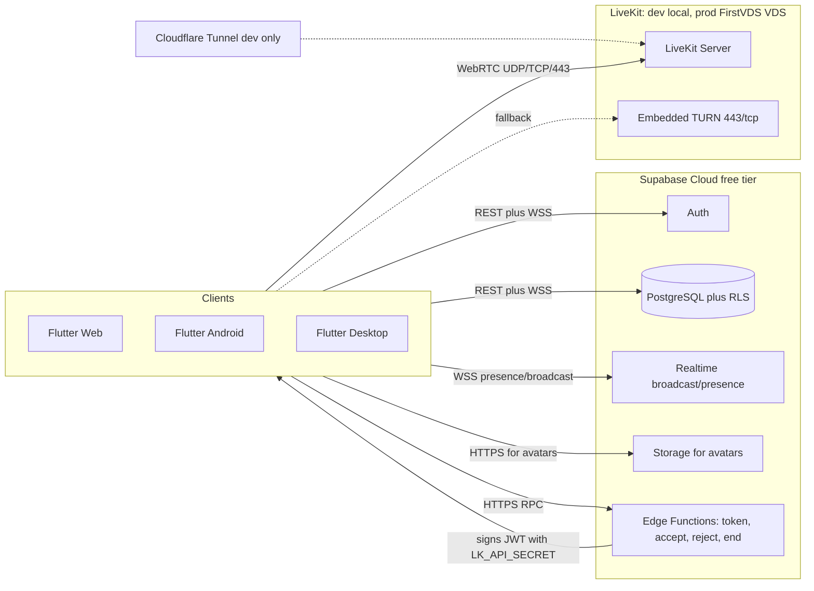
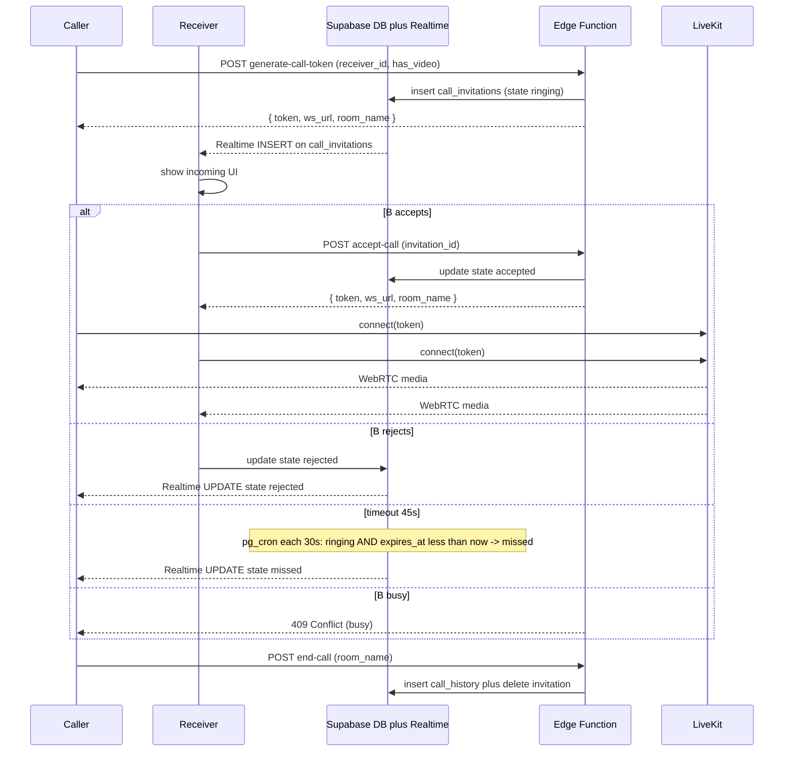
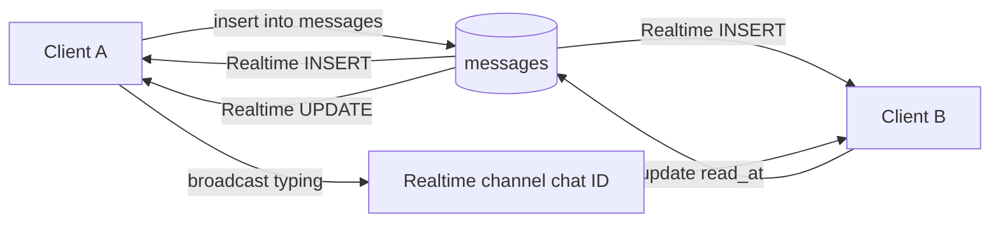

# VibeCall — Implementation Plan for AI Agents

> **Audience**: AI coding agents (Cursor, Claude Code и аналоги), выполняющие план пошагово.
> **Product**: кроссплатформенный аналог Skype.
> **MVP**: регистрация → уникальный username → контакты → 1‑на‑1 аудио/видео-звонки → текстовый чат → демонстрация экрана.
> **Budget**: $0 на старте. Все архитектурные решения зафиксированы с этим ограничением.
> **Платформенный приоритет**: Web → Android → Windows/Linux Desktop → (iOS позже, когда появится Apple Dev $99/год).

---

## 0. Как читать и использовать этот документ

Этот документ — единственный источник истины для реализации. Любое отступление от него должно сначала вернуться в PR с правкой `PLAN.md`.

### Правила для агента

1. **Один шаг = один PR — начиная с Phase 1**. Phase 0 (Foundation) — это короткие конфигурационные шаги без бизнес-логики и без CI, разрешается коммитить прямо в `main` отдельными коммитами на шаг. С момента **первого шага Phase 1 (Step 1.1)** каждый шаг = отдельная feature-ветка + Pull Request + merge в `main` (squash). См. также post-mortem ниже.
2. **Не отступай от стека и версий** (Раздел 1). Если библиотека из плана не подходит — открой issue/комментарий, не подменяй молча.
3. **Не клади секреты в репозиторий**. Все ключи — через `.env` (gitignored) или `supabase secrets set ...`.
4. **Проверяй Acceptance перед закрытием шага**. Каждый чекбокс — это команда, которую можно запустить.
5. **Конвенциональные коммиты**: `feat(scope): ...`, `fix(scope): ...`, `chore(scope): ...`. Scope = имя фичи (`auth`, `call`, `chat`, `infra`, ...).
6. **Конфиденциальность**: никаких email/телефонов в логи и Sentry-events (см. Раздел 4 «Sentry»).
7. **Branch naming (с Phase 1)**: `feat/<phase>-<step>-<slug>`, например `feat/p3-3.6-call-controller`.
8. **PR title (с Phase 1)**: префиксом номер шага: `[3.6] feat(call): implement CallController`.
9. **PR description (с Phase 1)**: ссылка на раздел плана (`#step-36`) + краткий чеклист из Acceptance + список новых/изменённых файлов + ссылки на скриншоты/видео для UI-шагов.
10. **Фиксация выполнения шага**. В том же PR (или коммите для Phase 0), который реализует шаг:
    - все чекбоксы Acceptance переводятся из `- [ ]` в `- [x]`;
    - сразу после блока `**Acceptance**` добавляется строка `**Status**: done — <commit-sha>` (короткий SHA итогового merge-коммита или единственного коммита шага);
    - если по объективным причинам какой-то пункт Acceptance не выполняется — оставить `- [ ]`, в `Status` указать `partial — <sha>` и добавить под Status строку `**Deferred**: <что и почему отложено>`.
    Эти правки — единственный авторитетный индикатор прогресса. AI-агент, читающий `PLAN.md`, обязан пропускать любой шаг, у которого `Status: done` или `Status: partial`.

### Post-mortem: почему Phase 0 шла прямо в `main`

Все 4 закрытых шага Phase 0 (`0.1` — `0.4`, коммиты `f148eb5`, `1ab4576`, `ed50a1b`, `16ed893`) выполнены прямыми коммитами в `main` без feature-веток и PR. Это **сознательно принятое решение** на основе следующих соображений:

- Phase 0 — это короткие конфиг-шаги без бизнес-логики (≤7 шагов × ~30 сек overhead на PR = ~3.5 минуты «потерянного» времени)
- CI ещё не настроен (это Step 0.7), значит PR-стадия не даёт автоматических проверок до merge
- Пользователь ревьюит каждый шаг интерактивно в чате — внешний слой ревью PR-формата избыточен
- История репо для Phase 0 уже в `main`, переписывать через `git rebase --interactive` + force-push — рискованно

**Что меняется с Phase 1**:
- Phase 1+ содержит SQL-миграции, RLS-политики, Flutter-фичи — там цена бага высока, PR + CI окупаются
- Step 0.7 (CI) настраивает `flutter analyze` + `flutter test` + `supabase db lint` на PR — PR-workflow обязателен, иначе CI бесполезен
- AI-агент с этого момента **обязан**: создать ветку → коммитить → пушить ветку → создавать PR через `gh pr create` → ждать зелёного CI → squash-merge в `main` → удалять ветку

**Решение не переписывать историю Phase 0** объясняется тем, что коммиты уже в `origin/main` и refer/ed by external links (например, `Status: done — 16ed893`). Force-push в `main` сломал бы их.

### Review-and-fix workflow (двухагентная схема)

Начиная со Step 0.6 в проекте применяется двухагентная схема: **executor-agent** реализует шаг по `PLAN.md`, **reviewer-agent** ревьюит, фиксит проблемы и закрывает шаг. Это контракт, обязательный для обоих агентов и для каждого следующего шага.

#### Распределение ролей

| Категория шага | Executor | Reviewer | Кто финализирует |
|---|---|---|---|
| Mechanical / scaffold (создание файлов по шаблону, `*.arb`, YAML CI, `pubspec.yaml`-правки, фича-папки) | executor-agent | reviewer-agent | reviewer |
| SQL миграции + RLS-политики (Step 1.1–1.2 и аналоги) | executor-agent | reviewer-agent (обязательно строкой) | reviewer |
| Любой Riverpod-провайдер / `GoRouter`-логика / Supabase init / Sentry init | executor-agent | reviewer-agent (обязательно строкой) | reviewer |
| TS Edge Functions с криптографией (LiveKit JWT, webhook signature verify) | reviewer-agent (без посредника) | — | reviewer |
| WebRTC negotiation / signaling / `livekit_client` интеграция | reviewer-agent (без посредника) | — | reviewer |
| Архитектурные решения, где `PLAN.md` оставляет выбор | reviewer-agent (без посредника) | — | reviewer |
| Дебаг production-багов | reviewer-agent (без посредника) | — | reviewer |

«Без посредника» = executor-agent **не запускается** на этих шагах; reviewer-agent работает напрямую.

#### Контракт executor-агента (обязателен на каждом шаге)

1. **Прочитать `PLAN.md §0` полностью** (правила + этот блок + Структура шага) перед любым действием. Прочитать целиком тело своего шага (Goal/Inputs/Actions/Acceptance/Pitfalls).
2. **Не отступать от Actions шага**: имена файлов, версии пакетов, структура папок — строго как в плане. Отступление → остановиться и спросить, не делать молча.
3. **Acceptance отмечать `[x]` только при наличии воспроизводимого доказательства**. Для каждой галочки в commit message блок `Verification:` должен содержать соответствующий вывод команды (1–3 строки). Если проверка требует внешний сервис, который ещё не настроен (Sentry DSN, live LiveKit, GitHub PR с CI) — оставлять `[ ]`, ставить `**Status**: partial — <sha>` и добавлять `**Deferred**: <причина и в каком шаге будет проверено>`. **Запрещено** ставить `[x]` «оптимистично».
4. **Перед каждым коммитом обязательны три проверки** (если шаг затрагивает Flutter-код):
   ```
   cd client && flutter analyze
   cd client && flutter test --dart-define-from-file=.env
   cd client && flutter build web --dart-define-from-file=.env
   ```
   Вывод (последние 5–10 строк) приклеить в commit message в блок `Verification:`. Если проверка не применима к шагу (например, чисто SQL-миграция) — указать `Verification: N/A — pure SQL/YAML/docs step`.
5. **После коммита — push** (для Phase 0) или `gh pr create` (для Phase 1+). Шаг не считается завершённым, пока изменения не на `origin`. Reviewer-agent не запускается, пока нет push.
6. **Commit message format** (поверх §0 правила 5):
   ```
   <type>(<scope>): step <N.M> — <короткое описание>

   <bullet list изменений>

   Verification:
   - flutter analyze: <output line>
   - flutter test: <output line>
   - flutter build web: <output line>

   <reference to PLAN.md §0 workflow если уместно>
   ```
7. **При сомнении — стоп**. Если шаг неоднозначен, если Action ссылается на несуществующий код, если возникает выбор между двумя реализациями — executor-agent **обязан** остановиться, не коммитить и оставить вопрос пользователю/reviewer-agent'у. Лучше потерять 5 минут на уточнение, чем 30 минут на rollback.

#### Запрещённые паттерны (executor-agent ловит их сам до коммита; reviewer-agent — рефлексивно при review)

- **Несколько `ProviderScope`** в одном дереве виджетов. ProviderScope создаётся **ровно один раз** в `main.dart` через `runApp(const ProviderScope(child: VibeCallApp()))`. Никогда не оборачивать что-либо в `ProviderScope` ниже по дереву.
- **`GoRouter` / `ThemeData` как `get` getter** на top-level. Только `final GoRouter router = GoRouter(...)`, `final ThemeData lightTheme = ...`. Getter пересоздаёт объект на каждое чтение → теряется navigation state, бесполезно аллоцируется ThemeData.
- **Виджет, размещённый в `MaterialApp.builder`, если он принципиально должен быть выше `MaterialApp`** (например, `SentryWidget`, error-boundary). Внутри `builder` он не увидит ошибки самого `Router`/`MaterialApp`.
- **`flutter test` / `flutter run` без `--dart-define-from-file=.env`** для шагов, использующих `Env.*`. Иначе assert упадёт на пустых stub-значениях.
- **Hardcoded user-facing строки** в Dart-коде. Любая видимая строка — через `AppLocalizations` + ARB.
- **Любые ключи / DSN / пароли в коммитах**. Только `.env` (gitignored), `supabase secrets set`, GitHub Actions Secrets.
- **Опциональные `?` и `!` в публичных API без обоснования**. Если `nullable-getter: false` в `l10n.yaml` — это сигнал стиля: non-nullable по умолчанию.
- **`pub get` без проверки `flutter pub outdated` после обновления pubspec**. Любая правка зависимостей должна сопровождаться выводом `outdated` в commit body (что обновилось, что осталось).
- **Закрытие шага без push в `origin`** (см. пункт 5 контракта).

#### Контракт reviewer-агента

1. **`git fetch && git status`** перед началом review. Подтянуть актуальный `origin/main`. Если executor-agent не запушил — review не начинается; вернуть executor'у запрос на push.
2. **Прочитать каждый созданный/изменённый файл целиком** (не diff!). Diff скрывает контекст; reviewer должен видеть, как новый код вписан в окружение.
3. **Прогнать три глобальные проверки** (analyze / test / build web) независимо от того, что executor написал в commit body. Доверяй, но проверяй.
4. **Сравнить Acceptance с фактическими доказательствами**. Любой `[x]` без воспроизводимого вывода в commit → откат в `[ ]` + `Deferred`.
5. **Применить запрещённые паттерны как чеклист**. Каждый пункт из списка выше — отдельный grep по новому коду.
6. **Архитектурный review**: соответствует ли реализация Goal шага, нет ли логических багов, которые не ловит analyze (race conditions, unawaited futures, неконсистентные state-машины, RLS-дыры).
7. **Фикс-коммит** (если нужен) — **отдельный** от executor-коммита, с типом `fix(...)`, в commit body — корневая причина для каждой правки и ссылка на executor-коммит. Это даёт ясную историю «что было не так и почему».
8. **Закрытие шага в `PLAN.md`**:
   - `Status: done — <executor-sha> (+ fix-up <reviewer-sha>: <короткое summary правок>)` если был фикс
   - `Status: done — <executor-sha>` если правок не было
   - `Status: partial — <executor-sha>` + `Deferred: <что>` если что-то намеренно не проверено
9. **Push после фикса** (Phase 0) или approve+merge PR (Phase 1+).

#### Эскалация к пользователю

Reviewer-agent **обязан** прервать review и спросить пользователя, если:
- Фикс требует изменения **Goal** или **Actions** самого шага в `PLAN.md` (а не только Acceptance / Pitfalls)
- Обнаружен баг, который тянется из предыдущего, уже закрытого шага (нужно открывать «откатывающий» PR)
- Executor-agent выбрал техническое решение, отличное от плана, и оно лучше планового (нужно решение, обновлять ли план)
- Acceptance в принципе невыполним без внешнего ресурса, который пользователь не предоставил

Executor-agent **обязан** прервать выполнение и спросить пользователя, если:
- Action ссылается на файл/команду, которой не существует
- `pub get` падает из-за конфликта зависимостей, не описанного в Pitfalls
- Реальная среда (OS, версия Flutter, наличие CLI-утилиты) отличается от заявленной в `Inputs`

#### Когда схема пересматривается

Этот workflow закреплён на Phase 0 (хвост) и Phase 1 (Supabase + DB + auth + chat scaffolding). Перед началом **Phase 2 (вызовы / WebRTC)** пользователь и reviewer-agent совместно перечитывают этот блок и решают, оставлять ли executor-agent на WebRTC-шагах или переходить в режим «только reviewer-agent». Критерий — текущая доля фикс-коммитов: если на Phase 1 ≥ 40% шагов потребовали fix-up, executor-agent отключается на Phase 2.

### PR-comments review workflow (с момента включения branch protection на `main`)

Это конкретная имплементация «Review-and-fix workflow» через GitHub PR review comments вместо in-chat review. Применяется на всех PR в `main` с момента, как на репо включена защита `main` (см. capability test ниже). Block выше («Review-and-fix workflow») остаётся валидным как общая семантика ролей; этот блок — как именно её механизировать через GitHub.

#### Branch protection на `main` (зафиксированный baseline)

Через GitHub Rulesets (`Settings → Rules → Rulesets`), ruleset с именем `main`:

- **Enforcement status**: Active
- **Target branches**: include by pattern `main`
- **Bypass list**: содержит **только owner** (`ruslanbay2022`) для bypass типа «pull requests» — необходимо для single-developer-репо, иначе owner не может смержить свой собственный PR (GitHub не разрешает self-approval). Force-push, deletions и остальные правила к owner всё равно применяются.
- **Rules**:
  - ✅ Restrict deletions
  - ✅ Require a pull request before merging
    - Required approvals: 1
    - ✅ Dismiss stale pull request approvals when new commits are pushed
    - ✅ Require conversation resolution before merging (рекомендовано; включается перед Phase 1)
  - ✅ Allowed merge methods: только **Squash** (история `main` остаётся линейной)
  - ✅ Block force pushes
  - **Require status checks to pass** — **включить после Step 0.7** (PR #3 смержен, squash SHA `7c46ca7`). В Ruleset → **Status checks** → добавить **все** обязательные job-имена, которые GitHub показывает на зелёном PR (имена точные, с пробелами/скобками как в UI; пример на момент закрытия Step 0.7):
    - `analyze + test + build web`
    - `build apk (debug)`
    - `build linux`
    - `build windows`
    - `supabase db lint`
    Без этого PR может проходить только по bypass; для Phase 1+ лучше требовать зелёный CI до merge (bypass оставить как аварийный, не основной путь).

#### PR review grammar (обязательно для reviewer-agent / пользователя)

Каждый inline-комментарий начинается с префикса в квадратных скобках. Префикс — единственный источник истины о приоритете; не на content, не на GitHub review state.

| Префикс | Семантика | Обязательность для executor-agent |
|---|---|---|
| `[blocker]` | Обязательный фикс. Без resolved-треда PR не мержится. | **Обязательно** применить |
| `[suggestion]` | Желательно, но можно отклонить с обоснованием в реплике. | Опционально, требует ответа |
| `[nit]` | Необязательно (косметика, стиль). | Можно проигнорировать **с явным отказом в реплике** |
| `[question]` | Требует ответа **текстом в треде**, не правки файла. | Обязательно ответить, **файл не трогать** |
| `[fyi]` | Информационно, действий не требует. | Опционально — можно подтвердить «acknowledged» |

#### GitHub review state — семантика для executor-agent

| State | Что значит | Действие executor'а |
|---|---|---|
| `CHANGES_REQUESTED` | Reviewer заблокировал merge до фикса всех `[blocker]` | Обязательный цикл фиксов + новый review |
| `COMMENTED` | Reviewer оставил замечания, но не блокирует | Те же `[blocker]` — обязательно фиксить; **префикс приоритетнее state** |
| `APPROVED` | Reviewer одобрил, merge доступен | Никаких правок не нужно, merge владельцем PR |

**Критично**: префикс `[blocker]` в комментарии **обязателен к исправлению независимо от review state** (`CHANGES_REQUESTED` или `COMMENTED`). State управляет только merge-блокировкой на стороне GitHub.

#### Conventions для executor-agent (по итогам capability test #1)

Помимо общего «Review-and-fix workflow» контракта, при работе через GitHub PR comments executor-agent обязан:

1. **Перейти в правильную PR-ветку перед коммитом**. Узнать ветку: `gh pr view <N> --json headRefName --jq .headRefName` (или REST API `GET /pulls/{n}` → `head.ref`). Затем `git fetch origin && git checkout <head-branch>`. **Не создавать новую ветку** под фиксы review — это даст дубликат коммита в орфанной ветке (как в capability test #1: создалась мусорная `fix/readme-review-comments` параллельно `ruslanbay2022-patch-1`).
2. **Ответы на `[question]` и обоснования отказа от `[nit]` — внутри thread'а**, не в top-level комментарии. Через REST: `POST /pulls/{n}/comments` с `in_reply_to: <comment_id>`. Через UI: кнопка «Reply…» под inline-комментарием. Top-level комментарий используется **только** для финального summary.
3. **Один summary-комментарий на одну итерацию review**. Перед публикацией: `GET /issues/{n}/comments` → проверить, что нет своего предыдущего комментария с шапкой `Addressed`. Если есть — не дублировать (в capability test #1 итоговый комментарий был запостен дважды с разницей в 2 секунды).
4. **Формат summary-комментария**:
   ```
   **Addressed blockers:**
   - [blocker comment URL or short anchor] — короткое описание правки
   - ...

   **Declined:**
   - [nit / suggestion] — обоснование отказа

   **Answered:**
   - [question] — ответ или ссылка на thread reply

   Awaiting re-review.
   ```
5. **При повторном раунде review** (новые комментарии после первого фикса) — новый summary-комментарий, не редактирование старого. История треда → audit trail.
6. **Не создавать мусорных веток**. Если по ошибке создал лишнюю — удалить через `git push origin --delete <branch>` (защита `main` это не запрещает, только `main` нельзя удалять).
7. **`--amend` запрещён**, force-push запрещён (физически блокируется веткой). Любая правка по review = новый коммит на ветке. Это сохраняет inline-якоря комментариев на конкретных SHA.
8. **Резолв тредов** — только reviewer/пользователь. Executor может в реплике написать «please mark resolved if OK», но не закрывает thread сам. С включённым «Require conversation resolution before merging» это к тому же физически нужно для merge.
9. **`gh pr merge` запрещён для executor-agent**. Merge — действие reviewer'а / пользователя после `Approve`. Executor останавливается на «Awaiting re-review».

#### Что делает reviewer-agent (= я) при PR-comments workflow

Поверх общего контракта из блока «Review-and-fix workflow»:

1. **Сравнить агентский self-report с фактами через REST API** (не доверять текстовому summary):
   - `GET /pulls/{n}` — `commits`, `additions`, `deletions`, `mergeable_state`
   - `GET /pulls/{n}/commits` — список SHA, проверить отсутствие amend (каждый коммит уникален и линеен)
   - `GET /pulls/{n}/reviews` — `state` (CHANGES_REQUESTED / COMMENTED / APPROVED)
   - `GET /pulls/{n}/comments` — все inline-комментарии и thread replies (`in_reply_to_id`)
   - `GET /issues/{n}/comments` — top-level комментарии (поиск дубликатов summary)
2. **Сравнить diff на ветке** (`git diff origin/main...origin/<head> -- <files>`) с заявленным в summary. `git diff --stat` показывает **накопленный** diff от base — учитывать это (а не суммировать per-commit правки).
3. **Если фикс полный** — оставить `Approve` review через `POST /pulls/{n}/reviews` `{event: "APPROVE"}` или UI. **Не резолвить треды вместо executor'а** — пользователь резолвит.
4. **Если фикс неполный** — новый review с `CHANGES_REQUESTED` (или `COMMENTED`) с новыми `[blocker]`-комментариями.

#### Capability test #1 — результат

| Параметр | Значение |
|---|---|
| PR | #1 «Correct README punctuation in project description» |
| Дата | 2026-05-16 |
| Executor | внешний агент Qwen3.6 Plus |
| Reviewer | я (Claude Opus 4.7) |
| Оценка | 7/9 (или 8/9 при щедром округлении) — **схема рабочая, нужны жёсткие conventions** |

Найденные паттерны → текущий блок (особенно пп. 1, 2, 3, 6 conventions). Test PR #1 был squash-мержен в `main` (первый legitimate PR в новой схеме; полезный diff — 0.5 и 0.6 в README).

#### Когда схема пересматривается

Поверх условий из блока «Review-and-fix workflow»: если на Phase 1 хоть один executor-agent делает force-push / amend в PR-ветку (физически защита `main` это не блокирует — только `main`-ветка защищена), **немедленный** ban executor-agent на всю Phase 1. Сила якорей inline-комментариев = базовая предпосылка PR-comments workflow.

### Структура шага

```
### Step X.Y — <название>
**Goal**: один абзац, что должно быть готово.
**Inputs**: предыдущие шаги, env-переменные, внешние сервисы.
**Actions**: пронумерованный список действий с командами/кодом.
**Acceptance**: чеклист проверяемых условий.
**Status**: добавляется после выполнения (`done — <sha>` / `partial — <sha>`).
**Out**: список созданных/изменённых файлов и артефактов.
**Pitfalls**: типичные ошибки и их обход.
```

### Глобальные команды проверки

Используются в Acceptance многократно:

- `cd client && flutter analyze` — 0 ошибок, 0 предупреждений
- `cd client && flutter test` — все тесты зелёные
- `cd client && dart run build_runner build` — без ошибок (флаг `--delete-conflicting-outputs` удалён в build_runner ≥2.15, поведение теперь по умолчанию)
- `supabase db lint` — без ошибок
- `supabase functions serve` — функции стартуют без ошибок
- `docker compose -f infra/dev/docker-compose.yml config` — валидный YAML

---

## 1. Зафиксированные решения

### Стек

Версии зафиксированы по факту резолва на машине разработчика в мае 2026 (Flutter 3.41.5 / Dart 3.11.3). При обновлении Flutter SDK перепроверять через `flutter pub outdated` и поднимать пины при необходимости.

| Слой | Технология | Версия | Обоснование (для $0 + Web-first) |
|---|---|---|---|
| Клиент | Flutter / Dart | Flutter ≥3.32, Dart ≥3.8 | единый код для 5 платформ; нижние границы определены требованиями `freezed 3.x` и `json_serializable 6.13+` |
| Auth / DB / Realtime / Storage | Supabase Cloud | Free Tier | 500 MB DB, 5 GB egress, 50K MAU, 1 GB Storage, 500K Edge Function invocations |
| Серверная логика | Supabase Edge Functions (Deno) | runtime 1.45+ | бесплатно, скрывает LiveKit API Secret |
| WebRTC SFU | LiveKit Server | `livekit/livekit-server:v1.7+` | open-source, без vendor lock |
| LiveKit dev hosting | Docker локально + Cloudflare Tunnel | latest | $0, публичный HTTPS без своего домена |
| LiveKit prod hosting (Phase 6) | FirstVDS VDS (KVM), Москва | 2 vCPU + 4 GB RAM + 40 GB SSD | ~500–900 ₽/мес; Oracle OCI deferred (регистрация недоступна) |
| Домен (prod) | DuckDNS поддомен | — | бесплатно |
| TLS (prod) | Caddy 2 + Let's Encrypt | `caddy:2-alpine` | автоматический ACME |
| State management | Riverpod 3 + riverpod_generator | `flutter_riverpod ^3.3.0`, `riverpod_annotation ^4.0.0`, `riverpod_generator ^4.0.0` | low boilerplate, AsyncValue, code-gen |
| Иммутабельные модели | Freezed + json_serializable | `freezed ^3.2.0`, `freezed_annotation ^3.1.0`, `json_serializable ^6.13.0`, `json_annotation ^4.11.0` | стандарт |
| Навигация | go_router | `^17.2.0` | declarative routing |
| Realtime/WebRTC SDK | livekit_client | `^2.7.0` | официальный клиент |
| Auth/DB SDK | supabase_flutter | `^2.9.0` | официальный клиент |
| Локализация | flutter_localizations + intl | sdk | ru/en с Phase 0 |
| Crash reporting | Sentry Free | `sentry_flutter ^9.20.0` | 5K events/мес бесплатно |
| Web хостинг (Phase 6) | Cloudflare Pages | Free | unlimited bandwidth |
| CI/CD | GitHub Actions | — | free для public repo |
| Codegen runner | build_runner | `^2.15.0` | в 2.15 удалён `--delete-conflicting-outputs` (поведение теперь по умолчанию) |
| Тесты | flutter_test + mocktail | `mocktail ^1.0.4` | стандарт |
| Linting | flutter_lints | `^6.0.0` | стандарт |
| Riverpod/custom lints | custom_lint + riverpod_lint | **отложены** | `custom_lint 0.8.x` пинит `analyzer ^7.5/^8`, конфликтует с `json_serializable 6.11+` (analyzer ≥9). Вернуть, когда выйдет `custom_lint` с поддержкой analyzer 9. См. §13. |

### Что НЕ входит в MVP

- iOS публикация (требует $99/год Apple Dev)
- Группы / групповые звонки
- Передача файлов / голосовые сообщения
- E2EE (LiveKit поддерживает, добавим в Phase 7)
- Запись звонков (LiveKit Egress)
- VoIP push (CallKit/ConnectionService) — Web их не требует
- Аналитика продукта (без неё MVP жизнеспособен)

### Бюджетный аудит ($0 для всего MVP)

- Supabase Free Tier — покрывает тысячи активных пользователей
- LiveKit на dev машине — $0
- Cloudflare Tunnel — $0, нет лимита трафика
- GitHub Actions — $0 для public repo
- Sentry Free — $0
- DuckDNS, Let's Encrypt, Cloudflare Pages — $0
- FirstVDS VDS (Phase 6) — **~500–900 ₽/мес** (2 vCPU, 4 GB RAM, безлимитный трафик); единственная платная часть MVP
- ~~Oracle Always Free~~ — **deferred** (регистрация OCI недоступна); изначальный $0-план сохранён в §13 как альтернатива

---

## 2. Архитектура

### Компонентная диаграмма



### Последовательность звонка



### Поток данных чата



---

## 3. Структура репозитория

Создаётся в Phase 0.

```
vibecall/
  README.md
  PLAN.md
  .gitignore
  .github/
    workflows/
      flutter_web.yml
      flutter_android.yml
      flutter_desktop.yml
      supabase_migrations_check.yml
  client/
    pubspec.yaml
    analysis_options.yaml
    build.yaml
    .env.example
    l10n.yaml
    lib/
      main.dart
      app/
        app.dart
        router.dart
        theme.dart
        env.dart
      core/
        error/
        network/
        l10n/
        utils/
      features/
        auth/
          data/   domain/   presentation/
        onboarding/
        profile/
        contacts/
        presence/
        chat/
        call/
      shared/
        widgets/   models/   providers/
    l10n/
      app_en.arb
      app_ru.arb
    test/
    android/   ios/   web/   windows/   linux/   macos/
  supabase/
    config.toml
    migrations/
      0001_profiles.sql
      0002_profiles_rls.sql
      0003_pg_trgm.sql
      0004_username_rpc.sql
      0005_contacts.sql
      0006_search_users_rpc.sql
      0007_call_invitations.sql
      0008_call_history.sql
      0009_call_rls.sql
      0010_pg_cron_call_timeout.sql
      0011_conversations_messages.sql
      0012_chat_rls.sql
      0013_avatars_storage.sql
    functions/
      _shared/
        cors.ts
        auth.ts
      generate-call-token/index.ts
      accept-call/index.ts
      reject-call/index.ts
      end-call/index.ts
    seed.sql
  infra/
    dev/
      docker-compose.yml
      livekit-dev.yaml
      cloudflared.example.env
      README.md
    prod/
      docker-compose.yml
      livekit-prod.yaml
      Caddyfile
      ufw.sh
      README.md
```

---

## 4. Конвенции

### Git и PR
- Trunk-based: `main` + короткоживущие `feat/<phase>-<step>-<slug>`.
- Squash merge. Один PR на один шаг плана.
- PR description обязан содержать: ссылку на шаг (`Step 3.6`), список Acceptance с отметками, скриншоты/видео для UI-шагов.

### Code style (Dart/Flutter)
- `flutter_lints ^4.0.0` + дополнительно `prefer_const_constructors`, `prefer_const_literals_to_create_immutables`, `avoid_print`, `always_use_package_imports`.
- Модели: только Freezed + json_serializable, никаких ручных `copyWith`.
- Provider naming: `<entity><Action>Provider` (`authStateProvider`, `contactsListProvider`).
- Никакого прямого `Supabase.instance.client` вне `*Repository`. UI и controllers получают доступ только через repositories.
- Никаких `print` — только `dart:developer` `log()` или Sentry.

### Структура фичи (feature-first + слои)

```
features/<feature>/
  data/
    <feature>_dto.dart            # Freezed DTO для JSON
    <feature>_repository.dart     # абстрактный
    <feature>_repository_impl.dart
  domain/
    <feature>_entity.dart         # Freezed домен
    <feature>_use_cases.dart      # опционально
  presentation/
    providers/
      <feature>_controller.dart   # Riverpod Notifier
    screens/
      <feature>_screen.dart
    widgets/
```

### Секреты

`client/.env` (gitignored, шаблон в `client/.env.example`):

```
SUPABASE_URL=https://<project>.supabase.co
SUPABASE_ANON_KEY=ey...
SENTRY_DSN=https://...@sentry.io/...
ENV=dev
```

Supabase Edge Function secrets (вне репо, ставятся через `supabase secrets set`):

```
LIVEKIT_API_KEY=APIxxxx
LIVEKIT_API_SECRET=secret-xxxx
LIVEKIT_WS_URL=wss://<tunnel-or-prod-domain>
```

Загрузка в Flutter — через `--dart-define-from-file=.env` или пакет `envied` (фиксируем `--dart-define-from-file` как стандарт, чтобы не плодить зависимости).

### Sentry — фильтр PII

В `beforeSend` обрезать `event.user.email`, `event.user.username`, `event.request.headers['authorization']`, `event.contexts['profile']`. Хранить только `event.user.id` (uuid).

### Локализация
- Все строки UI — через `AppLocalizations.of(context).<key>`.
- ARB-файлы: `app_en.arb` (source), `app_ru.arb`. Никаких хардкод-строк в виджетах.

### База данных
- Все таблицы — `public`, всегда с RLS.
- Имена колонок — `snake_case`. Имена таблиц — множественное число.
- Каждая миграция — отдельный файл `NNNN_<slug>.sql`, без правки прошлых миграций.
- Никакого `service_role` ключа на клиенте.

### Тесты
- Unit-тесты обязательны для всех repositories и controllers.
- Виджет-тесты — для критичных экранов (sign-in, incoming call, active call).
- Покрытие не обязательно, но `flutter test` должен проходить на каждом PR.

---

## 5. Phase 0 — Foundation

Цель: репо, окружения, скелет приложения, CI. Никакой бизнес-логики.

### Step 0.1 — Инициализация репозитория

**Goal**: GitHub-репо с базовой структурой, README, .gitignore.

**Inputs**: GitHub аккаунт.

**Actions**:
1. Создать public GitHub repo `vibecall` (public нужен для бесплатного CI).
2. Локально:
   ```bash
   git init vibecall && cd vibecall
   git branch -M main
   git remote add origin <repo-url>
   ```
3. Создать `[.gitignore](.gitignore)` с правилами для Flutter, Dart, Supabase CLI, JetBrains, VS Code, macOS, Windows, Linux, `.env`, `*.local.yaml`, `client/.env`, `infra/**/.env`, `supabase/.env*`, `supabase/.branches`, `supabase/.temp`.
4. Создать `[README.md](README.md)` с одним абзацем описания и ссылкой на `[PLAN.md](PLAN.md)`.
5. Скопировать этот `PLAN.md` в корень.
6. Initial commit, push в `main`.

**Acceptance**:
- [x] `git clone <repo>` работает в чистой папке
- [x] В корне есть `README.md`, `PLAN.md`, `.gitignore`
- [x] CI ещё не настроен — нормально

**Status**: done — f148eb5

**Out**: `README.md`, `PLAN.md`, `.gitignore` (фактически также подтянут `LICENSE` MIT, добавленный при создании репозитория на GitHub).

### Step 0.2 — Flutter scaffold + зависимости

**Goal**: Flutter-проект в `client/` с фиксированным набором зависимостей и работающим codegen (Freezed + Riverpod generator + json_serializable).

**Inputs**: Step 0.1, установленный Flutter ≥3.32 / Dart ≥3.8.

**Actions**:
1. `flutter create --platforms=web,android,windows,linux --org com.vibecall --project-name vibecall client`
2. Заменить `[client/pubspec.yaml](client/pubspec.yaml)` — фиксированный набор (версии актуальны на май 2026):
   ```yaml
   name: vibecall
   description: VibeCall — Skype-like cross-platform app
   publish_to: 'none'
   version: 0.1.0+1

   environment:
     sdk: ">=3.8.0 <4.0.0"
     flutter: ">=3.32.0"

   dependencies:
     flutter:
       sdk: flutter
     flutter_localizations:
       sdk: flutter
     intl: any
     supabase_flutter: ^2.9.0
     livekit_client: ^2.7.0
     flutter_riverpod: ^3.3.0
     riverpod_annotation: ^4.0.0
     freezed_annotation: ^3.1.0
     json_annotation: ^4.11.0
     go_router: ^17.2.0
     sentry_flutter: ^9.20.0
     permission_handler: ^12.0.0
     cached_network_image: ^3.4.0
     url_launcher: ^6.3.0
     equatable: ^2.0.5
     logger: ^2.4.0
     image_picker: ^1.1.2

   dev_dependencies:
     flutter_test:
       sdk: flutter
     flutter_lints: ^6.0.0
     build_runner: ^2.15.0
     riverpod_generator: ^4.0.0
     freezed: ^3.2.0
     json_serializable: ^6.13.0
     # custom_lint and riverpod_lint are temporarily disabled:
     # custom_lint 0.8.x pins analyzer ^7.5 / ^8, while json_serializable 6.11+
     # requires analyzer >=9. Re-enable once custom_lint adds analyzer 9 support.
     # See §13 (Deferred).
     mocktail: ^1.0.4

   flutter:
     uses-material-design: true
     generate: true
   ```
3. Создать `[client/analysis_options.yaml](client/analysis_options.yaml)`:
   ```yaml
   include: package:flutter_lints/flutter.yaml

   # custom_lint plugin is temporarily disabled — see pubspec.yaml.
   # When custom_lint adds analyzer >=9 support, uncomment:
   # analyzer:
   #   plugins:
   #     - custom_lint

   analyzer:
     errors:
       invalid_annotation_target: ignore
     exclude:
       - "**/*.g.dart"
       - "**/*.freezed.dart"

   linter:
     rules:
       avoid_print: true
       prefer_const_constructors: true
       prefer_const_literals_to_create_immutables: true
       always_use_package_imports: true
       require_trailing_commas: true
   ```
4. `cd client && flutter pub get`
5. Создать заглушку `[client/lib/main.dart](client/lib/main.dart)` (только `runApp(MaterialApp)` с placeholder Scaffold).
6. (Опционально) создать `[client/build.yaml](client/build.yaml)` с настройками для Freezed + Riverpod. По умолчанию не требуется — пресеты пакетов работают «из коробки».
7. Прогнать smoke-тест codegen: создать временно `lib/_smoke_codegen.dart` с одним `@freezed sealed class` (+ `factory fromJson`) и одним `@riverpod` провайдером; запустить `dart run build_runner build`; убедиться, что появились `_smoke_codegen.freezed.dart` и `_smoke_codegen.g.dart`; удалить и сам файл, и оба генерата.
8. `flutter analyze`, `flutter test`, `flutter build web --release`.

**Acceptance**:
- [x] `cd client && flutter analyze` → 0 issues
- [x] `cd client && flutter test` → 1 passed (дефолтный smoke test)
- [x] `cd client && flutter build web --release` собирается
- [x] `cd client && dart run build_runner build` отрабатывает без ошибок и на smoke-сэмпле выдаёт `*.freezed.dart` + `*.g.dart`

**Status**: done — 1ab4576

**Out**: `client/pubspec.yaml`, `client/analysis_options.yaml`, `client/lib/main.dart`, скелет Flutter-проекта, `client/pubspec.lock` (зафиксирован для воспроизводимых сборок).

**Pitfalls**:
- В **build_runner ≥2.15** флаг `--delete-conflicting-outputs` удалён (поведение теперь по умолчанию). При запуске генерации не передавать его.
- На **Windows** `flutter pub get` ругается «Building with plugins requires symlink support». Лечится включением Developer Mode (`start ms-settings:developers`). Без него web-сборка работает, нативные плагины — нет.
- `freezed 3.x` ожидает `sealed class X with _$X` либо `abstract class X with _$X`. Старый синтаксис `@freezed class X with _$X { factory X = _X; }` без `sealed`/`abstract` теперь даёт предупреждение.
- При апгрейде Flutter SDK перепроверить версии через `flutter pub outdated` — план фиксирует майскую 2026 связку.
- `permission_handler` на Web бессмысленен (браузер сам спрашивает); не вызывать его из Web-кода.

### Step 0.3 — Supabase project + CLI

**Goal**: создан Supabase-проект (Free Tier), CLI настроен, репозиторий привязан к удалённому проекту, локальная разработка через `supabase start` готова. Этот шаг **исполняется до** Step 0.4 потому, что `URL` и `anon key`, получаемые здесь, требуются для прохождения Acceptance Step 0.4.

**Inputs**: Step 0.2; учётная запись Supabase у пользователя; на машине должен быть установлен Docker (для `supabase start`).

**Actions**:
1. Создать аккаунт на https://supabase.com (бесплатный план, без карты).
2. Создать новый проект `vibecall`, регион — ближайший к целевой аудитории (для RU/СНГ: `Frankfurt (eu-central-1)`). Сохранить database-пароль в надёжном месте — он понадобится для `supabase link`.
3. Из Dashboard → Settings → API скопировать в надёжное локальное место (менеджер паролей):
   - `Project URL` (формат `https://<ref>.supabase.co`)
   - `Project Reference ID` (`<ref>`, 20 символов)
   - `publishable key` (новый формат: `sb_publishable_*`; в проектах до сентября 2025 — `anon public key`, длинный JWT начинающийся на `eyJ…`). Это **публичный** ключ, безопасно отдавать клиенту. Понадобится в Step 0.4.
   - `secret key` (новый формат: `sb_secret_*`; в старых проектах — `service_role key`). Имеет полный админский доступ в обход RLS. **Никогда** не пересылай его в чаты, мессенджеры или AI-ассистентам и не клади в репозиторий. Понадобится только в Phase 3, где загружается напрямую в Supabase Edge Function Secrets через Dashboard → Settings → Edge Functions → Secrets, либо локально через `supabase secrets set ...`.
4. Установить `supabase` CLI. Доступные способы на Windows (в порядке предпочтения):
   - `scoop install supabase`
   - `winget install Supabase.CLI`
   - Если ни scoop, ни winget недоступны — скачать релиз напрямую (вариант, использованный в текущем проекте):
     ```powershell
     New-Item -ItemType Directory -Force .tools | Out-Null
     $tag = (Invoke-RestMethod "https://api.github.com/repos/supabase/cli/releases/latest").tag_name
     Invoke-WebRequest -Uri "https://github.com/supabase/cli/releases/download/$tag/supabase_windows_amd64.tar.gz" -OutFile .tools/supabase.tar.gz -UseBasicParsing
     tar -xzf .tools/supabase.tar.gz -C .tools/
     ```
     `.tools/` уже в [.gitignore](.gitignore), бинарник `.tools/supabase.exe` не попадает в репо. Вызывать как `.\.tools\supabase.exe <command>`.
5. В корне репозитория:
   ```bash
   supabase init
   ```
   Это создаёт `[supabase/config.toml](supabase/config.toml)` и `[supabase/.gitignore](supabase/.gitignore)`. В `config.toml` поле `project_id` — это **локальный** идентификатор для `supabase start` (Docker-стек), **не** cloud project ref. Установить `project_id = "vibecall"` (lowercase) для консистентности.
6. Зафиксировать cloud project ref в комментарии в `supabase/config.toml` (см. шаблон ниже), чтобы он был виден следующему разработчику/агенту:
   ```toml
   # Cloud project ref: <ref>
   # URL: https://<ref>.supabase.co
   # To link CLI before db push:
   #   supabase login
   #   supabase link --project-ref <ref>
   ```
7. Создать трекер каталога миграций:
   ```powershell
   New-Item -ItemType File supabase/migrations/.gitkeep
   ```
8. `supabase link --project-ref <ref>` — **отложить до Step 1.1** (первый `supabase db push`). Команда требует `SUPABASE_ACCESS_TOKEN` (получается интерактивно через `supabase login` с открытием браузера) и database password (interactive prompt). Эти секреты не должны попадать в чат/AI-агенту/репозиторий — пользователь выполняет `supabase login` сам перед Step 1.1.
9. (Опц., но рекомендуется) поднять локальную Supabase для безопасного тестирования миграций:
   ```bash
   supabase start
   ```
   Поднимает локальный Postgres + Auth + Realtime + Studio через Docker. Используется в Phase 1+. На этом шаге достаточно проверить, что стартует без ошибок (требует запущенный Docker Desktop).

**Acceptance**:
- [x] `supabase --version` отдаёт версию (≥2.0) — фактически 2.98.2 в локальном `.tools/supabase.exe`
- [x] `supabase/config.toml` в репозитории, `project_id = "vibecall"`, cloud ref зафиксирован в комментарии
- [x] `supabase/migrations/.gitkeep` существует
- [x] `URL`, `Project Ref`, `publishable key` сохранены локально вне репозитория (передаются в Step 0.4); `secret key` сохранён отдельно для Phase 3
- [x] `supabase link` зафиксирован как deferred-action перед Step 1.1 (см. §13)

**Status**: done — ed50a1b

**Out**: `supabase/config.toml`, `supabase/migrations/.gitkeep`, `supabase/.gitignore` (создан `supabase init`), Supabase-проект в Cloud Dashboard. Секретные значения **не коммитятся**.

**Pitfalls**:
- `supabase start` требует **запущенный Docker Desktop** на Windows. Без него команда падает; для Step 0.3 это нестрашно, для Phase 1+ обязательно.
- `secret key` (`sb_secret_*`) / `service_role key` имеют полный доступ к БД в обход RLS. Никогда не клади в `client/.env`, в чат, в репозиторий — только в Supabase Edge Function Secrets (Phase 3).
- `supabase link` требует ДВА секрета (access token + db password). Никогда не пересылай их в чат — выполняй интерактивно (`supabase login` + ввод пароля).
- Cloud project ref ≠ local `project_id` в `config.toml`. Не пытайся проставить cloud ref в `project_id` — это сломает локальный Docker-стек.
- Если регион выбран неверно — в Free Tier его нельзя сменить без пересоздания проекта.

### Step 0.4 — Окружение и env-loading

**Goal**: безопасная загрузка `.env` в приложение, единый класс `Env`, проверка, что Flutter-клиент видит реальные Supabase-ключи.

**Inputs**: Step 0.3 (нужны `Project URL` и `anon public key` из Supabase Dashboard).

**Actions**:
1. Создать `[client/.env.example](client/.env.example)`:
   ```
   SUPABASE_URL=
   SUPABASE_ANON_KEY=
   SENTRY_DSN=
   LIVEKIT_WS_URL=
   ENV=dev
   ```
2. Создать локально `client/.env` (gitignored), заполнить **реальными** значениями из Step 0.3:
   ```
   SUPABASE_URL=https://<ref>.supabase.co
   SUPABASE_ANON_KEY=eyJhbGciOiJI...
   SENTRY_DSN=
   LIVEKIT_WS_URL=
   ENV=dev
   ```
   `SENTRY_DSN` и `LIVEKIT_WS_URL` пока пустые — заполняются позже (Sentry — в Step 0.6, LiveKit — в Step 3.2).
3. Создать `[client/lib/app/env.dart](client/lib/app/env.dart)`:
   ```dart
   class Env {
     static const supabaseUrl = String.fromEnvironment('SUPABASE_URL');
     static const supabaseAnonKey = String.fromEnvironment('SUPABASE_ANON_KEY');
     static const sentryDsn = String.fromEnvironment('SENTRY_DSN');
     static const livekitWsUrl = String.fromEnvironment('LIVEKIT_WS_URL');
     static const env = String.fromEnvironment('ENV', defaultValue: 'dev');
     static bool get isProd => env == 'prod';
     static void assertAll() {
       assert(supabaseUrl.isNotEmpty, 'SUPABASE_URL is empty');
       assert(supabaseAnonKey.isNotEmpty, 'SUPABASE_ANON_KEY is empty');
     }
   }
   ```
4. Стандартный запуск (зафиксировать в README):
   ```bash
   cd client
   flutter run -d chrome --dart-define-from-file=.env
   ```
5. Временно добавить в `main.dart` вызов `Env.assertAll()` для проверки (постоянное место — Step 0.6). После запуска убедиться, что не падает.
6. Обновить корневой `[README.md](README.md)` секцией «Локальный запуск» с командой выше.

**Acceptance**:
- [x] `client/.env.example` запушен; `client/.env` существует локально, gitignored (`git check-ignore -v client/.env` подтверждает)
- [x] `cd client && flutter run -d chrome --dart-define-from-file=.env` запускает приложение в Chrome без assertion-ошибок (проверено вживую: «Debug service listening», «Starting application from main method» без ошибок)
- [x] В DevTools вкладке Console приложение печатает плейсхолдер `VibeCall`
- [x] README обновлён командой запуска
- [x] **Бонус**: `client/test/env_smoke_test.dart` — постоянный регресс-тест, проверяющий что `--dart-define-from-file=.env` доставляет переменные и `Env.assertAll()` не падает

**Status**: done — 16ed893

**Out**: `client/.env.example`, `client/lib/app/env.dart`, `client/lib/main.dart` (обновлён), `client/test/env_smoke_test.dart`, обновлённый `README.md`. `client/.env` остаётся локально, в репо его нет.

**Pitfalls**:
- `String.fromEnvironment` — **compile-time** константа. Любая правка `.env` требует **перезапуска** `flutter run` (hot reload не подхватит).
- В CI (Step 0.7) `.env` нет — Web-сборка должна работать с stub-значениями через `--dart-define`. В CI этот шаг проверять не нужно.
- Если `Env.assertAll()` падает с «SUPABASE_URL is empty» — проверь, что используешь `--dart-define-from-file=.env` (а не `--define`). На Flutter <3.7 этот флаг не работает; у нас требуется ≥3.32, проблем не должно быть.

### Step 0.5 — Локализация ru/en

**Goal**: подключены `flutter_localizations` + ARB, есть две локали.

**Actions**:
1. Создать `[client/l10n.yaml](client/l10n.yaml)`:
   ```yaml
   arb-dir: l10n
   template-arb-file: app_en.arb
   output-localization-file: app_localizations.dart
   ```
2. `[client/l10n/app_en.arb](client/l10n/app_en.arb)`:
   ```json
   { "@@locale": "en", "appTitle": "VibeCall", "signIn": "Sign in", "signUp": "Sign up" }
   ```
3. `[client/l10n/app_ru.arb](client/l10n/app_ru.arb)`:
   ```json
   { "@@locale": "ru", "appTitle": "VibeCall", "signIn": "Войти", "signUp": "Регистрация" }
   ```
4. `flutter gen-l10n` — сгенерируется `client/lib/l10n/app_localizations.dart` (под `gen/` в Flutter ≥3.16).
5. В `MaterialApp` добавить `localizationsDelegates: AppLocalizations.localizationsDelegates`, `supportedLocales: AppLocalizations.supportedLocales`.

**Acceptance**:
- [x] `flutter gen-l10n` без ошибок (без deprecation warning после удаления `synthetic-package`)
- [x] `flutter analyze` — `No issues found`
- [x] `flutter test --dart-define-from-file=.env` — все 5 тестов зелёные (env smoke + widget render)
- [x] `flutter build web --dart-define-from-file=.env` — `Built build/web` (компилится с подключённым l10n)
- [x] `MaterialApp.onGenerateTitle` использует `AppLocalizations.of(context).appTitle` → заголовок «VibeCall» в обеих локалях
- [x] Поддержаны локали `en` и `ru`; переключение через системную локаль браузера/ОС работает «из коробки» благодаря `Localizations.delegate`

**Status**: done — 34bba8b

**Out**: `client/l10n.yaml`, `client/l10n/app_en.arb`, `client/l10n/app_ru.arb`, сгенерированные `client/lib/l10n/app_localizations*.dart`, обновлённый `client/lib/main.dart` (использует `AppLocalizations`).

**Pitfalls**:
- В Flutter 3.32+ ключ `synthetic-package` в `l10n.yaml` **deprecated** — оставлять нельзя, иначе `flutter gen-l10n` ругается в stderr.
- Сгенерированные `app_localizations*.dart` коммитим: в `.gitignore` уже есть исключение `!**/l10n/app_localizations*.dart`. При `flutter pub get` они авто-перегенерируются (через `flutter.generate: true`) — следи за случайными diff-ами после правки ARB.
- Для placeholder-ов в ARB обязательно описывать тип в `@key.placeholders` (см. `environmentLabel`), иначе генератор падает или возвращает `Object?`.

### Step 0.6 — Riverpod + go_router + Theme скелет

**Goal**: `ProviderScope`, `MaterialApp.router` с одним placeholder-роутом `/`, тёмная и светлая темы, точка входа в Sentry.

**Actions**:
1. `[client/lib/app/theme.dart](client/lib/app/theme.dart)` — `lightTheme` и `darkTheme` (Material 3, `useMaterial3: true`).
2. `[client/lib/app/router.dart](client/lib/app/router.dart)` — `GoRouter` с одним `/` маршрутом на `HomePlaceholderScreen`.
3. `[client/lib/app/app.dart](client/lib/app/app.dart)` — `MaterialApp.router(routerConfig: ...)`.
4. `[client/lib/main.dart](client/lib/main.dart)`:
   ```dart
   Future<void> main() async {
     WidgetsFlutterBinding.ensureInitialized();
     Env.assertAll();
     await Supabase.initialize(url: Env.supabaseUrl, anonKey: Env.supabaseAnonKey);
     if (Env.sentryDsn.isNotEmpty) {
       await SentryFlutter.init((o) {
         o.dsn = Env.sentryDsn;
         o.beforeSend = stripPii;
         o.environment = Env.env;
       }, appRunner: () => runApp(const ProviderScope(child: VibeCallApp())));
     } else {
       runApp(const ProviderScope(child: VibeCallApp()));
     }
   }
   ```
5. Реализовать `stripPii` в `[client/lib/core/error/sentry_filter.dart](client/lib/core/error/sentry_filter.dart)`.

**Acceptance**:
- [x] `flutter run -d chrome --dart-define-from-file=.env` рендерит placeholder (`HomePlaceholderScreen` через `GoRouter`)
- [x] `flutter analyze` → `No issues found`
- [x] `flutter test --dart-define-from-file=.env` → 5/5 (env smoke + widget render)
- [x] `flutter build web --dart-define-from-file=.env` → `Built build/web`
- [x] Единственный `ProviderScope` создаётся в `main.dart` (внутри `MaterialApp.router.builder` не дублируем); `SentryWidget` обёрнут вокруг `MaterialApp.router` максимально близко к корню
- [x] `router`, `lightTheme`, `darkTheme` — top-level `final` (не getter), чтобы не пересоздавать `GoRouter`/`ThemeData` на каждый ребилд
- [ ] **Deferred**: Sentry test event (`Sentry.captureException(Exception('test'))` → event в Sentry UI). Требует реальный `SENTRY_DSN` в `.env`; проверяется в Step 1.x при заводе Sentry-проекта. Сейчас `Env.sentryDsn` пуст → ветка `SentryFlutter.init` не выполняется, ловить нечего.

**Status**: done — c3912e6 (+ fix-up 38c6156: removed double `ProviderScope`, moved `SentryWidget` out of `MaterialApp.builder`, converted `router`/themes to `final`)

**Out**: `app.dart`, `router.dart`, `theme.dart`, `core/error/sentry_filter.dart`, `features/home/presentation/home_placeholder_screen.dart`.

**Pitfalls**:
- **Не создавай второй `ProviderScope`** ни в `MaterialApp.router.builder`, ни где-либо ниже `runApp(const ProviderScope(...))`. Каждый `ProviderScope` — изолированный контейнер: внешние и внутренние `ref.watch`/`ref.read` увидят разное состояние, и баги типа «провайдер не обновляется» практически невозможно отловить.
- `SentryWidget` должен стоять максимально близко к корню (внутри `VibeCallApp`, оборачивая `MaterialApp.router`). В `MaterialApp.builder` он не увидит ошибки виджетов выше себя (включая сам `Router`). Если Sentry не инициализирован (DSN пуст) — `SentryWidget` работает как no-op, ставить его безопасно всегда.
- `GoRouter get router => GoRouter(...)` (getter) — антипаттерн: новый экземпляр на каждый доступ, обнуляет navigation stack. Только `final GoRouter router = GoRouter(...)` или провайдер через Riverpod.

### Step 0.7 — CI: GitHub Actions

**Goal**: на каждый PR с изменениями в `client/**` (или соответствующих workflow-файлах) гоняются строгий `flutter analyze`, тесты и сборки **web + Android + Linux + Windows**; отдельный workflow проверяет миграции Supabase (пока no-op до первого `*.sql`).

**Actions** (фактическая реализация закоммичена в `main` squash-merge PR #3, SHA `7c46ca7`; на ветке develop это заняло 4 коммита до стабилизации):

1. **[`.github/workflows/flutter_web.yml`](.github/workflows/flutter_web.yml)** — `ubuntu-latest`, `working-directory: client`, триггеры по `paths` (`client/**`, сам workflow). Flutter **stable `3.41.x`** (паритет с dev SDK §1; `3.32.x` не резолвит pub из-за транзитивных зависимостей). Шаги: `flutter pub get` → `flutter analyze --fatal-infos --fatal-warnings` → `flutter test` + `flutter build web --release` с `--dart-define=SUPABASE_URL=https://stub.supabase.co`, `SUPABASE_ANON_KEY=stub-anon-key-ci`, `ENV=ci` (удовлетворяет `test/env_smoke_test.dart`). `build_runner` в CI **не** вызывается (на Step 0.x нет сгенерированного кода помимо l10n).
2. **[`.github/workflows/flutter_android.yml`](.github/workflows/flutter_android.yml)** — `ubuntu-latest`, `actions/setup-java@v4` (Temurin **17**, AGP 8.x), `flutter build apk --debug --split-per-abi` с теми же `dart-define`.
3. **[`.github/workflows/flutter_desktop.yml`](.github/workflows/flutter_desktop.yml)** — matrix: `ubuntu-latest` → `linux`, `windows-latest` → `windows`, `fail-fast: false`, `flutter build <target> --release`. Linux: `apt-get install` полный набор по [Flutter Linux desktop](https://docs.flutter.dev/get-started/install/linux/desktop) **плюс `libcurl4-openssl-dev`** (иначе CMake в **sentry-native** падает: `Could NOT find CURL`).
4. **[`.github/workflows/supabase_migrations_check.yml`](.github/workflows/supabase_migrations_check.yml)** — `supabase/setup-cli@v1`; если в `supabase/migrations/` нет `*.sql`, выводит notice и **exit 0**; иначе `supabase start` (slim exclude) → `supabase db lint` → `supabase stop`.

Общие детали: `concurrency` + `cancel-in-progress: true` на workflow; таймауты 15–25 мин.

**Acceptance**:
- [x] PR #3 в `main` показывает **5 зелёных** check-run'ов на финальном коммите перед squash (`0dc0956` на ветке; merge в `main` — `7c46ca7`): `analyze + test + build web`, `build apk (debug)`, `build linux`, `build windows`, `supabase db lint`
- [x] `flutter analyze` с **`--fatal-infos --fatal-warnings`** в CI — любой warning/info ломает job
- [x] После merge: включить **Require status checks** в Ruleset `main` (см. §0 «Branch protection») — опционально для single-dev, но **обязательно рекомендовано** перед Phase 1

**Status**: done — 7c46ca7

**Out**: `.github/workflows/flutter_web.yml`, `flutter_android.yml`, `flutter_desktop.yml`, `supabase_migrations_check.yml`.

**Pitfalls**:
- **Версия Flutter в CI ≠ нижняя граница pubspec**. `pubspec` даёт `flutter: ">=3.32.0"`, но стек (Riverpod 3 / Freezed 3 / json_serializable / Sentry / Supabase) на практике тянет Dart **≥3.10**; CI пинит **`3.41.x`** под реальный dev SDK. При bump SDK на машине — поднимать пин в трёх workflow одновременно.
- **Linux desktop + Sentry**: без `libcurl4-openssl-dev` сборка падает в `_deps/sentry-native-src` на `find_package(CURL)`. Это не про LiveKit — `libwebrtc` скачивается; виновник именно native Sentry.
- **`--dart-define` в CI**: stub URL должен быть `https://…supabase.co`, иначе падает `env_smoke_test.dart`.
- **Чистые docs-only PR**: из-за `paths` триггеры Flutter **не** стартуют — это экономия минут; для «обязательного полного CI на каждый PR» нужно расширить `paths` или отдельный `workflow_dispatch` (отложено).
- Логи job'ов через анонимный GitHub API — **403**; отладка «почему упало» — через UI Actions или авторизованный `gh`.

**Phase 0 Definition of Done**:
- Репо публичный, **CI на Flutter-изменениях зелёный** (5 checks), `flutter run -d chrome` запускает placeholder, env + l10n + Riverpod/роутер/Sentry-скелет на месте, Supabase CLI-scaffold в репо; **Phase 1** — следующая глава (PR-per-step + миграции).

---

## 6. Phase 1 — Auth + Profiles

Цель: пользователь может зарегистрироваться, подтвердить email, выбрать уникальный username, видеть и редактировать свой профиль (включая аватар).

**Phase status**: done — 0c39de1 (Steps 1.1–1.7)

### Phase 1 prerequisites (обязательно выполнить до Step 1.1)

С этой фазы вступает в силу PR-workflow (§0 правила 1, 7, 8, 9). Перед первым шагом убедиться:

1. **GitHub CLI (`gh`) установлен и авторизован**:
   - Если `winget`/`scoop` доступны: `winget install GitHub.cli` или `scoop install gh`
   - Иначе — скачать релиз в локальную `.tools/` (уже gitignored):
     ```powershell
     $tag = (Invoke-RestMethod "https://api.github.com/repos/cli/cli/releases/latest").tag_name
     $ver = $tag.TrimStart('v')
     Invoke-WebRequest -Uri "https://github.com/cli/cli/releases/download/$tag/gh_${ver}_windows_amd64.zip" -OutFile .tools/gh.zip -UseBasicParsing
     Expand-Archive -Force .tools/gh.zip -DestinationPath .tools/gh
     ```
     Использовать как `.\.tools\gh\bin\gh.exe <command>`.
   - Авторизация (интерактивная, открывает браузер): `gh auth login` → GitHub.com → HTTPS → паролем браузера или device flow. Токен сохраняется локально в `~/.config/gh/hosts.yml`, в репозиторий не попадает.
2. **`supabase link` выполнен** (см. §13 deferred-action):
   ```powershell
   supabase login                                        # opens browser
   supabase link --project-ref olnbzcozwwcvuqhyikqp
   ```
   После `link` команда `supabase db push` начинает работать против cloud-проекта.
3. **Docker Desktop запущен** — нужен для `supabase start` (миграции тестируем локально перед push на cloud).

**PR-чек-лист на каждый шаг Phase 1+**:
- [ ] Ветка создана: `git checkout -b feat/p<phase>-<step>-<slug>`
- [ ] Коммиты в ветке (один или несколько, лишь бы PR логически отражал шаг)
- [ ] `git push -u origin <branch>`
- [ ] PR создан через `gh pr create --title "[X.Y] feat(scope): ..." --body "..."`
- [ ] CI (Step 0.7) зелёный — без этого PR не мерджим
- [ ] Squash-merge: `gh pr merge --squash --delete-branch`
- [ ] Acceptance в `PLAN.md` поставлены `[x]`, добавлен `Status: done — <merge-sha>`

### Step 1.1 — Migration: profiles + trigger

**Goal**: таблица `profiles`, триггер автозаполнения, базовый индекс.

**Actions**:
1. `[supabase/migrations/0001_profiles.sql](supabase/migrations/0001_profiles.sql)`:
   ```sql
   create extension if not exists "uuid-ossp";

   create table public.profiles (
     id uuid primary key references auth.users(id) on delete cascade,
     username text unique not null check (username ~ '^[a-z0-9_]{3,20}$'),
     display_name text not null check (char_length(display_name) between 1 and 50),
     avatar_url text,
     bio text check (bio is null or char_length(bio) <= 280),
     created_at timestamptz not null default now(),
     updated_at timestamptz not null default now()
   );

   create or replace function public.handle_new_user()
   returns trigger language plpgsql security definer set search_path = public as $$
   begin
     insert into public.profiles (id, username, display_name)
     values (
       new.id,
       'user_' || replace(substr(new.id::text, 1, 8), '-', ''),
       coalesce(new.raw_user_meta_data->>'display_name', 'New User')
     );
     return new;
   end; $$;

   drop trigger if exists on_auth_user_created on auth.users;
   create trigger on_auth_user_created
     after insert on auth.users
     for each row execute function public.handle_new_user();

   create or replace function public.set_updated_at()
   returns trigger language plpgsql as $$
   begin new.updated_at = now(); return new; end; $$;

   create trigger profiles_set_updated_at
     before update on public.profiles
     for each row execute function public.set_updated_at();
   ```
2. `supabase db push` (или `supabase migration up` локально).

**Acceptance**:
- [x] `supabase db lint` без ошибок (локально executor-agent: `No schema errors found`; CI PR #5: `supabase db lint` зелёный)
- [x] После создания пользователя в Supabase Auth в `profiles` появляется запись (проверено в Dashboard/SQL Editor: `test@test.com` → `username = user_<uuid-prefix>`, `display_name = New User`; удаление пользователя очистило профиль через `on delete cascade`)
- [x] `username` уникален, регулярка ограничивает спецсимволы (`unique not null` + `check (username ~ '^[a-z0-9_]{3,20}$')` в `0001_profiles.sql`)

**Status**: done — 93d398c

**Out**: `supabase/migrations/0001_profiles.sql`.

**Pitfalls**:
- Executor-agent уже выполнил `supabase db push` в linked cloud project. Для следующих миграций cloud push делать только после явного подтверждения пользователя или в рамках согласованного PR-flow; локальный/CI lint — до push.
- В SQL Editor не вставлять напрямую в `auth.users`: пользователя создавать через Supabase Auth UI/API, иначе можно обойти внутреннюю логику Auth.
- `profiles` пока без RLS — это ожидаемо. Политики идут отдельным шагом 1.2.

### Step 1.2 — RLS для profiles

**Goal**: чтение публичное, изменение только своего профиля.

**Actions**:
1. `[supabase/migrations/0002_profiles_rls.sql](supabase/migrations/0002_profiles_rls.sql)`:
   ```sql
   alter table public.profiles enable row level security;

   create policy profiles_select_public on public.profiles
     for select using (true);

   create policy profiles_update_self on public.profiles
     for update using (auth.uid() = id) with check (auth.uid() = id);

   create policy profiles_insert_self on public.profiles
     for insert with check (auth.uid() = id);
   ```

**Acceptance**:
- [x] Анон пользователь может `select * from profiles` (policy `profiles_select_public` → `using (true)`, CI `supabase db lint` зелёный в PR #8)
- [x] Пользователь A не может `update` запись пользователя B (policy `profiles_update_self` → `using (auth.uid() = id) with check (auth.uid() = id)`, CI `supabase db lint` зелёный в PR #8)

**Status**: done — e399864

**Out**: `supabase/migrations/0002_profiles_rls.sql`.

**Pitfalls**:
- PR #8 не делал cloud `db push` — это правильно после Step 1.1 Pitfall. Перед production/test use миграцию нужно применить в linked Supabase project через `supabase db push` после явного подтверждения.
- RLS policy на `insert self` нужна для будущих клиентских insert/upsert сценариев, но автосоздание профиля через `security definer` trigger из Step 1.1 не зависит от caller RLS.
- Runtime multi-user проверку удобнее делать после Step 1.5/1.6, когда появится клиентский auth flow; сейчас schema-level + CI lint приняты как Step 1.2 verification.

### Step 1.3 — pg_trgm + индексы

**Goal**: быстрый partial-match по username/display_name.

**Actions**:
1. `[supabase/migrations/0003_pg_trgm.sql](supabase/migrations/0003_pg_trgm.sql)`:
   ```sql
   create extension if not exists pg_trgm;
   create index profiles_username_trgm_idx on public.profiles
     using gin (username gin_trgm_ops);
   create index profiles_display_name_trgm_idx on public.profiles
     using gin (display_name gin_trgm_ops);
   ```

**Acceptance**:
- [x] `explain select ... where username ilike '%foo%'` использует GIN index (CI supabase db lint в PR #11; runtime EXPLAIN опционально)

**Status**: done — b1a3ba2

**Out**: `supabase/migrations/0003_pg_trgm.sql`

**Pitfalls**:
- Executor сделал cloud `db push` без подтверждения — не повторять; для следующих SQL PR только локально `migration up` / `db lint`

### Step 1.4 — RPC `username_available`

**Goal**: проверка уникальности username на лету.

**Actions**:
1. `[supabase/migrations/0004_username_rpc.sql](supabase/migrations/0004_username_rpc.sql)`:
   ```sql
   create or replace function public.username_available(p_username text)
   returns boolean
   language sql stable security definer set search_path = public as $$
     select not exists (
       select 1 from public.profiles
       where username = lower(p_username)
     ) and lower(p_username) ~ '^[a-z0-9_]{3,20}$';
   $$;

   revoke all on function public.username_available(text) from public;
   grant execute on function public.username_available(text) to authenticated, anon;
   ```

**Acceptance**:
- [x] `select username_available('admin')` возвращает boolean (функция создана, CI supabase db lint в PR #14)
- [x] Anon роль имеет execute permission (grant в 0004_username_rpc.sql)

**Status**: done — 2c6d04d

**Out**: `supabase/migrations/0004_username_rpc.sql`

**Pitfalls**:
- Дубликат PR #14/#15 — создавать только один PR (`gh pr create` один раз)

### Step 1.5 — Auth feature (sign up / in / out)

**Goal**: экраны Sign Up / Sign In / Sign Out с email+пароль + confirmation flow.

**Actions**:
1. `[client/lib/features/auth/data/auth_repository.dart](client/lib/features/auth/data/auth_repository.dart)` — обёртка над `Supabase.instance.client.auth`:
   - `Future<void> signUp(email, password, {displayName})`
   - `Future<void> signIn(email, password)`
   - `Future<void> signOut()`
   - `Future<void> resendConfirmation(email)`
   - `Stream<AuthState> get authStateChanges`
2. `[client/lib/features/auth/presentation/providers/auth_controller.dart](client/lib/features/auth/presentation/providers/auth_controller.dart)`:
   ```dart
   @riverpod
   class AuthController extends _$AuthController {
     @override
     Stream<AuthState?> build() =>
       ref.watch(authRepositoryProvider).authStateChanges;
   }
   ```
3. UI: `SignInScreen`, `SignUpScreen`, `ConfirmEmailScreen` — простые формы с валидацией.
4. Маршруты в `go_router`: `/sign-in`, `/sign-up`, `/confirm-email`. Redirect-логика:
   - не авторизован + не на auth-маршруте → `/sign-in`
   - авторизован + нет профиля с заполненным username → `/onboarding`
   - всё ок → `/home`
5. Тесты: `AuthRepository` mock + проверка вызовов.

**Acceptance**:
- [x] Можно зарегистрироваться, прийти на `ConfirmEmailScreen` (PR #17, маршрут /confirm-email)
- [x] После confirmation сессия активна (manual smoke / Dashboard Auth; Deferred: automated smoke test в Step 1.6)
- [x] `signOut` возвращает на `/sign-in` (PR #17)
- [x] `flutter analyze` → 0 (CI PR #17, 5 jobs green)
- [x] Unit-тесты на AuthRepository (10 tests passed, auth_repository_test.dart)

**Status**: done — 1baa915 (+ fix-up в squash: build_runner CI, profiles redirect, router cleanup)

**Out**: фича `client/lib/features/auth/` + `router.dart` + `l10n` + CI `build_runner` step

**Pitfalls**:
- Supabase email confirmation на dev можно отключить через Dashboard → Auth → Providers. Не отключай в prod.
- В Web confirmation link открывается в той же вкладке — `supabase_flutter` должен правильно разбирать `redirect_url`. Конфигурируется в Dashboard → Auth → URL Configuration.
- `*.g.dart` в `.gitignore` — CI обязан запускать `build_runner` (уже в workflows)
- onboarding redirect: `profiles.username` startsWith `user_`, не `userMetadata`
- один PR на шаг (`gh pr create` один раз)

### Step 1.6 — Onboarding

**Goal**: после первого входа пользователь выбирает уникальный `username` и `display_name`.

**Actions**:
1. `[client/lib/features/onboarding/presentation/screens/onboarding_screen.dart](client/lib/features/onboarding/presentation/screens/onboarding_screen.dart)` — форма с двумя полями.
2. Live-проверка `username` через RPC `username_available` с debounce 300ms.
3. По submit: `supabase.from('profiles').update({...}).eq('id', userId)`.
4. После успеха — redirect на `/home`.

**Acceptance**:
- [x] Невалидный username показывает ошибку до отправки (client validator + usernameFormat, PR #19)
- [x] Занятый username выдаёт «Этот никнейм уже занят» (RPC username_available + usernameTaken ru, PR #19; cloud 0004 — user db push)
- [x] Успех → `/home` (profiles.update + context.go, PR #19)

**Status**: done — 5939a91

**Out**: `client/lib/features/onboarding/` + router OnboardingScreen

**Pitfalls**:
- RPC `username_available` только после 0004 в cloud (`db push`)
- При ошибке RPC live-check молча не показывает «занят» (catch в onboarding_screen)
- Один PR на шаг

### Step 1.7 — Профиль + аватар

**Goal**: экран просмотра/редактирования профиля, загрузка аватара в Supabase Storage.

**Actions**:
1. Миграция `[supabase/migrations/0013_avatars_storage.sql](supabase/migrations/0013_avatars_storage.sql)`:
   ```sql
   insert into storage.buckets (id, name, public) values ('avatars', 'avatars', true)
     on conflict (id) do nothing;

   create policy "avatars are publicly readable" on storage.objects
     for select using (bucket_id = 'avatars');

   create policy "users can upload own avatar" on storage.objects
     for insert with check (
       bucket_id = 'avatars' and auth.uid()::text = (storage.foldername(name))[1]
     );

   create policy "users can update own avatar" on storage.objects
     for update using (
       bucket_id = 'avatars' and auth.uid()::text = (storage.foldername(name))[1]
     );

   create policy "users can delete own avatar" on storage.objects
     for delete using (
       bucket_id = 'avatars' and auth.uid()::text = (storage.foldername(name))[1]
     );
   ```
   Путь файла: `<userId>/<uuid>.jpg`.
2. `[client/lib/features/profile/...](client/lib/features/profile/)` — экран `ProfileScreen` (просмотр + редактирование), кнопка «Сменить аватар» → `image_picker` → upload в bucket `avatars` → обновить `profiles.avatar_url`.

**Acceptance**:
- [x] Загруженный аватар отображается в профиле и в шапке (`cached_network_image`) (PR #21; fix-up: refresh после /profile)
- [x] Пользователь не может загрузить файл в чужую папку (verify в Supabase Studio) (RLS политики 0013 — upload только в `<userId>/`, PR #21)

**Status**: done — 0c39de1 (+ fix-up в squash: username InputDecorator, Home avatar refresh)

**Out**: `0013_avatars_storage.sql` + `client/lib/features/profile/`

**Pitfalls**:
- 0013 в cloud только после user `db push`
- `image_picker` на web — gallery

**Phase 1 Definition of Done**:
Пользователь регистрируется, подтверждает почту, выбирает username, редактирует профиль с аватаром. RLS закрыты, CI зелёный.

**Status**: done — 0c39de1

- [x] Steps 1.1–1.7 закрыты
- [x] Auth + onboarding + profile работают
- [x] RLS 0002 (profiles select/update/insert)
- [x] CI 6 checks на Flutter/SQL PR (web, android, desktop ×2, supabase lint)

**Next**: Phase 2 — Contacts + Presence (§7)

---

## 7. Phase 2 — Contacts + Presence

Цель: добавление в контакты по поиску, заявки pending/accepted, presence online/offline в реальном времени.

**Phase status**: done — c0a11c5 (Steps 2.1–2.5)

### Step 2.1 — Migration: contacts + RLS

**Actions**:
1. `[supabase/migrations/0005_contacts.sql](supabase/migrations/0005_contacts.sql)`:
   ```sql
   create type contact_status as enum ('pending', 'accepted', 'blocked');

   create table public.contacts (
     id uuid primary key default gen_random_uuid(),
     user_id uuid not null references public.profiles(id) on delete cascade,
     contact_id uuid not null references public.profiles(id) on delete cascade,
     status contact_status not null default 'pending',
     created_at timestamptz not null default now(),
     unique (user_id, contact_id),
     check (user_id <> contact_id)
   );

   create index contacts_user_idx on public.contacts (user_id, status);
   create index contacts_contact_idx on public.contacts (contact_id, status);

   alter table public.contacts enable row level security;

   create policy contacts_select_own on public.contacts for select
     using (auth.uid() = user_id or auth.uid() = contact_id);

   create policy contacts_insert_own on public.contacts for insert
     with check (auth.uid() = user_id);

   create policy contacts_update_involved on public.contacts for update
     using (auth.uid() = user_id or auth.uid() = contact_id);

   create policy contacts_delete_involved on public.contacts for delete
     using (auth.uid() = user_id or auth.uid() = contact_id);
   ```

**Acceptance**:
- [x] `supabase db lint` ок (CI PR #23 green)
- [x] RLS работает (policies в 0005_contacts.sql: select/insert/update/delete; runtime SQL-сценарии — optional / user verify)

**Status**: done — d841c21

**Out**: `supabase/migrations/0005_contacts.sql`

**Pitfalls**:
- cloud push: `db push --include-all` (0005 после 0013 в cloud — out-of-order)
- один PR на шаг

### Step 2.2 — RPC `search_users`

**Actions**:
1. `[supabase/migrations/0006_search_users_rpc.sql](supabase/migrations/0006_search_users_rpc.sql)`:
   ```sql
   create or replace function public.search_users(q text)
   returns table (id uuid, username text, display_name text, avatar_url text)
   language sql stable security definer set search_path = public as $$
     select id, username, display_name, avatar_url
     from public.profiles
     where (username ilike '%' || q || '%' or display_name ilike '%' || q || '%')
       and id <> auth.uid()
     order by similarity(username, q) desc nulls last
     limit 20;
   $$;

   revoke all on function public.search_users(text) from public;
   grant execute on function public.search_users(text) to authenticated;
   ```

**Acceptance**:
- [x] вызов от анона выдаёт 401 (grant только authenticated, не anon, 0006)
- [x] от authenticated — список (RPC + pg_trgm similarity, PR #25; runtime: из app / JWT, не SQL Editor — auth.uid() NULL → пустой результат)

**Status**: done — 2ffd066

**Out**: `supabase/migrations/0006_search_users_rpc.sql`

**Pitfalls**:
- cloud: `db push --include-all` (0006 < 0013)
- SQL Editor без JWT: `search_users` всегда пустой (`id <> auth.uid()`)
- один PR на шаг

### Step 2.3 — Contacts feature

**Actions**:
1. `ContactsRepository`: `listAccepted()`, `listIncomingRequests()`, `listOutgoingRequests()`, `sendRequest(contactId)`, `acceptRequest(id)`, `rejectRequest(id)`, `remove(id)`, `block(id)`.
2. `ContactsController` (Riverpod) + Realtime subscription на `contacts` где `user_id = auth.uid() or contact_id = auth.uid()`.
3. UI: `ContactsScreen` с табами «Контакты / Входящие / Исходящие».

**Acceptance**:
- [x] Двусторонняя дружба: при `accept` создаётся вторая запись `contacts (user_id=B, contact_id=A, status=accepted)` (клиентский reverse insert, PR #27).
- [x] Тесты repository (mocktail: sendRequest, acceptRequest, remove — PR #27).

**Status**: done — dd19671 (+ fix-up в squash: Realtime channel, ref.invalidate, remove both rows)

**Out**: `client/lib/features/contacts/`

**Pitfalls**:
- Realtime: Dashboard → contacts → Enable Realtime (или publication `supabase_realtime`)
- Дубликат PR #27/#28 — один `gh pr create`
- sendRequest UI — Step 2.4 (SearchScreen); smoke через SQL/manual ok

### Step 2.4 — User search UI

**Actions**:
1. `SearchScreen` с `TextField` (debounce 250ms) → `supabase.rpc('search_users', {q})`.
2. Карточка результата: аватар, display_name, username, кнопка «Добавить» / статус.

**Acceptance**:
- [x] Поиск выдаёт результаты (SearchScreen + RPC search_users, debounce 250ms, min 2 chars; smoke user, PR #30)
- [x] Кнопка «Добавить» отправляет заявку (ContactsRepository.sendRequest → Outgoing/Incoming; smoke user, PR #30)

**Status**: done — 03f622a (+ fix-up в squash: empty-state hint, searchAddError l10n, stale RPC guard)

**Out**: `client/lib/features/search/` (+ route `/search`, nav из ContactsScreen)

**Pitfalls**:
- client-only PR: `supabase db lint` не запускается (path filter в workflow) — merge через owner bypass
- Web: hash-route `/#/search`; IconButton в AppBar на web малозаметна — smoke через URL ok
- `search_users` в SQL Editor без JWT → пустой результат (как Step 2.2)
- один `gh pr create` на шаг

### Step 2.5 — Presence

**Goal**: показывать online/offline у контактов в реальном времени.

**Actions**:
1. После логина клиент подключается к `supabase.channel('global-presence', RealtimeChannelConfig(presence: PresenceOptions(key: userId)))` и `track({})`.
2. `PresenceController` хранит `Set<String> onlineUserIds`, обновляется по callback `presence_state` / `presence_diff`.
3. В UI контактов и чата — точка-индикатор.
4. На lifecycle `paused`/`detached` — `untrack`.

**Acceptance**:
- [x] Две вкладки разными аккаунтами — оба видят online друг друга (Contacts green dot, PR #33; smoke user)
- [x] Закрыть вкладку — у другого через ~30s offline (Realtime timeout; smoke user, PR #33)

**Status**: done — c0a11c5 (+ fix-up в squash: test import supabase_flutter for CI analyze)

**Out**: `client/lib/features/presence/` (+ lifecycle handler в app.dart, OnlineIndicator в contacts)

**Pitfalls**:
- Web: `WidgetsBindingObserver` не ловит закрытие вкладки — offline через Realtime timeout ~30s (ok по PLAN)
- Chat UI presence — Phase 4 (Step 4.3); Step 2.5 — только ContactsScreen
- client-only PR: `supabase db lint` path filter → owner bypass
- CI: test не импортировать `realtime_client` напрямую — только `supabase_flutter`
- один `gh pr create` на шаг

**Phase 2 Definition of Done**:
Контакты добавляются по поиску, заявки pending/accepted, presence online/offline в реальном времени, CI зелёный.

**Phase status**: done — c0a11c5 (Steps 2.1–2.5)

- [x] Steps 2.1–2.5 закрыты
- [x] Contacts + search + presence (smoke user)
- [x] Миграции 0005–0006 + client features contacts/search/presence
- [x] CI green на feature PRs Phase 2

**Next**: Phase 3 — 1-на-1 Calls (§8)

---

## 8. Phase 3 — 1-на-1 Calls

Цель: пользователь A нажимает «Позвонить» → пользователю B приходит входящий → принять/отклонить → активный звонок через self-hosted LiveKit. Полный сигналинг через Supabase Realtime, токены — через Edge Functions.

### Step 3.1 — Migrations: call_invitations + call_history

**Actions**:
1. `[supabase/migrations/0007_call_invitations.sql](supabase/migrations/0007_call_invitations.sql)`:
   ```sql
   create type call_inv_state as enum ('ringing','accepted','rejected','cancelled','missed','timeout','busy');

   create table public.call_invitations (
     id uuid primary key default gen_random_uuid(),
     room_name text not null,
     caller_id uuid not null references public.profiles(id) on delete cascade,
     receiver_id uuid not null references public.profiles(id) on delete cascade,
     has_video boolean not null default true,
     state call_inv_state not null default 'ringing',
     created_at timestamptz not null default now(),
     expires_at timestamptz not null default now() + interval '45 seconds',
     ended_at timestamptz,
     check (caller_id <> receiver_id)
   );

   create index call_inv_receiver_state_idx on public.call_invitations (receiver_id, state);
   create index call_inv_caller_state_idx on public.call_invitations (caller_id, state);
   create unique index call_inv_one_active_per_receiver
     on public.call_invitations (receiver_id) where state = 'ringing';
   ```
2. `[supabase/migrations/0008_call_history.sql](supabase/migrations/0008_call_history.sql)`:
   ```sql
   create type call_outcome as enum ('missed','rejected','accepted','cancelled','busy','timeout');

   create table public.call_history (
     id uuid primary key default gen_random_uuid(),
     room_name text not null,
     caller_id uuid not null references public.profiles(id) on delete set null,
     receiver_id uuid not null references public.profiles(id) on delete set null,
     outcome call_outcome not null,
     has_video boolean not null default true,
     duration_sec int not null default 0,
     started_at timestamptz not null default now(),
     ended_at timestamptz
   );

   create index call_history_caller_idx on public.call_history (caller_id, started_at desc);
   create index call_history_receiver_idx on public.call_history (receiver_id, started_at desc);
   ```
3. `[supabase/migrations/0009_call_rls.sql](supabase/migrations/0009_call_rls.sql)`:
   ```sql
   alter table public.call_invitations enable row level security;
   create policy ci_select on public.call_invitations for select
     using (auth.uid() in (caller_id, receiver_id));
   create policy ci_insert on public.call_invitations for insert
     with check (auth.uid() = caller_id);
   create policy ci_update_receiver on public.call_invitations for update
     using (auth.uid() = receiver_id) with check (auth.uid() = receiver_id);
   create policy ci_update_caller_cancel on public.call_invitations for update
     using (auth.uid() = caller_id and state = 'ringing')
     with check (auth.uid() = caller_id and state in ('cancelled','ringing'));

   alter table public.call_history enable row level security;
   create policy ch_select on public.call_history for select
     using (auth.uid() in (caller_id, receiver_id));
   ```

**Acceptance**:
- [x] Миграции применяются (`supabase db lint` green, CI PR #35; local `db reset` 0007→0009 OK)
- [x] RLS закрывает чужие звонки (policies в 0009: ci_select/insert/update_*, ch_select; PR #35)

**Status**: done — 53c8db4

**Out**: `supabase/migrations/0007_call_invitations.sql`, `0008_call_history.sql`, `0009_call_rls.sql`

**Pitfalls**:
- cloud push: `db push --include-all` (0007–0009 < 0013 в cloud — out-of-order; user approval required)
- один `gh pr create` на шаг
- SQL-only PR: CI `supabase db lint` runs; Flutter jobs path-filtered
- 0008: `NOT NULL` + `ON DELETE SET NULL` на caller/receiver — как в PLAN; runtime delete profile с history может fail (deferred fix)

### Step 3.2 — LiveKit dev: Docker + Cloudflare Tunnel

**Goal**: на машине разработчика поднят LiveKit с публичным HTTPS-адресом без своего домена.

**Actions**:
1. Создать Cloudflare аккаунт (бесплатный), Zero Trust → Networks → Tunnels → создать tunnel `vibecall-dev`, получить токен.
2. `[infra/dev/docker-compose.yml](infra/dev/docker-compose.yml)`:
   ```yaml
   services:
     livekit:
       image: livekit/livekit-server:v1.7.2
       command: --config /etc/livekit.yaml
       restart: unless-stopped
       network_mode: host
       volumes:
         - ./livekit-dev.yaml:/etc/livekit.yaml:ro
     cloudflared:
       image: cloudflare/cloudflared:latest
       restart: unless-stopped
       network_mode: host
       command: tunnel --no-autoupdate run --token ${CF_TUNNEL_TOKEN}
       env_file: .env
   ```
3. `[infra/dev/livekit-dev.yaml](infra/dev/livekit-dev.yaml)`:
   ```yaml
   port: 7880
   bind_addresses: ["0.0.0.0"]
   rtc:
     tcp_port: 7881
     port_range_start: 50000
     port_range_end: 50200
     use_external_ip: false
   keys:
     devkey: devsecretdevsecretdevsecretdevse
   logging:
     level: info
   ```
4. `[infra/dev/cloudflared.example.env](infra/dev/cloudflared.example.env)`:
   ```
   CF_TUNNEL_TOKEN=<paste-from-cloudflare>
   ```
   В Cloudflare Zero Trust → Public Hostname: `vibecall-lk-dev.<your-cf-domain>` → Service: `http://localhost:7880`. Для WebSocket это работает «из коробки».
5. `[infra/dev/README.md](infra/dev/README.md)` — инструкция запуска: `docker compose up -d`.
6. `LIVEKIT_WS_URL=wss://vibecall-lk-dev.<cf>.com` — добавить в `client/.env` и в Supabase secrets.

**Acceptance**:
- [x] `curl -I https://vibecall-lk-dev.visitufa.online` → OK (smoke user; PR #37)
- [x] LiveKit dev доступен по публичному HTTPS (visitufa.online, tunnel vibecall-dev; smoke user)

**Status**: done — c338da7 (+ fix-up в squash: cloudflared.example.env gitignore)

**Out**: `infra/dev/` (+ `client/.env.example` comment)

**Pitfalls**:
- Windows: `docker-compose.windows.yml` (ports), не `network_mode: host`
- Cloudflare UI: Published application route (не старый Configure → Public Hostname)
- `CF_TUNNEL_TOKEN` в `infra/dev/.env` (не placeholder из example)
- `cloudflared.example.env` — gitignore exception `!infra/dev/cloudflared.example.env`
- infra-only PR: Flutter CI path-filtered; merge via bypass ok
- Supabase `secrets set LIVEKIT_*` — Step 3.3
- один `gh pr create` на шаг

### Step 3.3 — Edge Functions

**Actions**:
1. Установить секреты:
   ```bash
   supabase secrets set LIVEKIT_API_KEY=devkey LIVEKIT_API_SECRET=devsecretdevsecretdevsecretdevse LIVEKIT_WS_URL=wss://vibecall-lk-dev.<cf>.com
   ```
2. `[supabase/functions/_shared/cors.ts](supabase/functions/_shared/cors.ts)` — общие CORS-заголовки.
3. `[supabase/functions/_shared/auth.ts](supabase/functions/_shared/auth.ts)` — извлекает `user` из JWT (`SUPABASE_URL`/`anon key` нужен только для проверки):
   ```ts
   import { createClient } from "https://esm.sh/@supabase/supabase-js@2";

   export async function getUser(req: Request) {
     const auth = req.headers.get("Authorization") ?? "";
     const supa = createClient(
       Deno.env.get("SUPABASE_URL")!,
       Deno.env.get("SUPABASE_ANON_KEY")!,
       { global: { headers: { Authorization: auth } } },
     );
     const { data, error } = await supa.auth.getUser();
     if (error || !data.user) throw new Response("Unauthorized", { status: 401 });
     return { user: data.user, supa };
   }
   ```
4. `[supabase/functions/generate-call-token/index.ts](supabase/functions/generate-call-token/index.ts)`:
   ```ts
   import { AccessToken } from "https://esm.sh/livekit-server-sdk@2.6.1";
   import { getUser } from "../_shared/auth.ts";
   import { corsHeaders } from "../_shared/cors.ts";

   Deno.serve(async (req) => {
     if (req.method === "OPTIONS") return new Response("ok", { headers: corsHeaders });
     try {
       const { user, supa } = await getUser(req);
       const { receiverId, hasVideo } = await req.json();
       if (!receiverId || typeof hasVideo !== "boolean") {
         return new Response("Bad request", { status: 400, headers: corsHeaders });
       }

       const adminSupa = createServiceClient();
       const { data: busy } = await adminSupa.from("call_invitations")
         .select("id").eq("receiver_id", receiverId).eq("state", "ringing").maybeSingle();
       if (busy) return new Response(JSON.stringify({ error: "busy" }), {
         status: 409, headers: { ...corsHeaders, "Content-Type": "application/json" },
       });

       const ids = [user.id, receiverId].sort();
       const roomName = `dm_${ids[0]}__${ids[1]}_${Date.now()}`;

       const { error: insertErr } = await adminSupa.from("call_invitations").insert({
         room_name: roomName, caller_id: user.id, receiver_id: receiverId, has_video: hasVideo,
       });
       if (insertErr) throw insertErr;

       const at = new AccessToken(
         Deno.env.get("LIVEKIT_API_KEY")!,
         Deno.env.get("LIVEKIT_API_SECRET")!,
         { identity: user.id, ttl: 60 * 60 },
       );
       at.addGrant({
         roomJoin: true, room: roomName,
         canPublish: true, canSubscribe: true, canPublishData: true,
         canPublishSources: hasVideo
           ? ["camera","microphone","screen_share","screen_share_audio"]
           : ["microphone"],
       });

       return new Response(JSON.stringify({
         token: await at.toJwt(),
         wsUrl: Deno.env.get("LIVEKIT_WS_URL"),
         roomName,
       }), { headers: { ...corsHeaders, "Content-Type": "application/json" } });
     } catch (e) {
       if (e instanceof Response) return e;
       return new Response(String(e), { status: 500, headers: corsHeaders });
     }
   });

   function createServiceClient() {
     return createClient(
       Deno.env.get("SUPABASE_URL")!,
       Deno.env.get("SUPABASE_SERVICE_ROLE_KEY")!,
     );
   }
   import { createClient } from "https://esm.sh/@supabase/supabase-js@2";
   ```
5. `[supabase/functions/accept-call/index.ts](supabase/functions/accept-call/index.ts)`: проверить, что receiver — это auth.uid, что state=ringing; обновить state=accepted; вернуть токен для receiver.
6. `[supabase/functions/reject-call/index.ts](supabase/functions/reject-call/index.ts)`: state=rejected.
7. `[supabase/functions/end-call/index.ts](supabase/functions/end-call/index.ts)`: вычислить duration, вставить в `call_history`, обновить state соответствующе или удалить запись.

**Acceptance**:
- [x] `curl POST .../generate-call-token` от authenticated клиента → JWT + wsUrl + roomName (smoke user; #39+#40 deploy)
- [x] Без auth → 401; `accept-call` от caller → 403 (smoke user)
- [x] Активный ringing → 409 busy (smoke user)
- [ ] JWT валидируется LiveKit (`livekit-cli token verify`) — **Deferred → Step 3.5** (JWT выдаётся, verify при client connect)

**Status**: done — d6a9d93 (+ fix-up c929d30: TrackSource enum, _shared/livekit.ts)

**Deferred**: `livekit-cli token verify` → Step 3.5 (client LiveKit connect)

**Out**: `supabase/functions/` — 4 функции + `_shared/` (`cors`, `auth`, `supabase`, `livekit`)

**Pitfalls**:
- `canPublishSources`: SDK v2 требует `TrackSource` enum, не строки → 500 без fix (#40)
- `_shared/livekit.ts` — общий `issueLiveKitToken()` (после #40)
- `supabase secrets set LIVEKIT_*` + `functions deploy` — в cloud, не в git; user approval
- PowerShell curl: JSON через `ConvertTo-Json` / одинарные кавычки (не `\"` в `-d`)
- race busy: unique index → 409 (fix в #39); pre-check + insert
- `end-call`: `duration_sec NOT NULL` → default 0 (fix в #39)
- smoke orphan `ringing` если JWT упал до fix #40 — cleanup через `end-call`
- functions-only PR: Flutter CI path-filtered; merge via bypass ok
- один `gh pr create` на шаг

### Step 3.4 — pg_cron timeout

**Goal**: автоматически переводить `ringing` в `missed` через 45 секунд.

**Actions**:
1. `[supabase/migrations/0010_pg_cron_call_timeout.sql](supabase/migrations/0010_pg_cron_call_timeout.sql)`:
   ```sql
   create extension if not exists pg_cron;

   create or replace function public.expire_old_call_invitations()
   returns void language sql security definer set search_path = public as $$
     update public.call_invitations
     set state = 'missed', ended_at = now()
     where state = 'ringing' and expires_at < now();
   $$;

   select cron.schedule(
     'expire-call-invitations',
     '*/1 * * * *',
     $$ select public.expire_old_call_invitations(); $$
   );
   ```

**Acceptance**:
- [x] Миграция `0010` применена (local lint/reset CI #42; cloud — SQL Editor + `schema_migrations` 0010; user)
- [x] `expire_old_call_invitations()`: ringing + `expires_at < now()` → `missed` (cloud: функция + cron job `expire-call-invitations`; cron каждую минуту)

**Status**: done — d211234

**Out**: `supabase/migrations/0010_pg_cron_call_timeout.sql`

**Pitfalls**:
- cloud `db push`: timeout TCP 5432 (firewall/ISP) → fallback Dashboard SQL Editor + `insert into supabase_migrations.schema_migrations (version) values ('0010')`
- pg_cron: включить в Dashboard → Extensions до push/SQL
- cron granularity `*/1 * * * *` (не 30s — как в PLAN Action)
- `security definer` + `search_path = public` — как в миграции
- SQL-only PR: CI `supabase db lint`; Flutter path-filtered
- client-side missed fallback — если pg_cron недоступен (не нужен — pg_cron работает у user)
- один `gh pr create` на шаг

### Step 3.5 — Call data layer

**Actions**:
1. `CallInvitationDto` (Freezed) + `CallInvitation` (domain).
2. `CallRepository`:
   - `Future<CallToken> startCall(receiverId, hasVideo)` → вызов Edge Function
   - `Future<CallToken> acceptCall(invitationId)`
   - `Future<void> rejectCall(invitationId)`
   - `Future<void> cancelCall(invitationId)`
   - `Future<void> endCall(roomName, durationSec)`
   - `Stream<CallInvitation> incomingCallStream()` — Realtime подписка на INSERT в call_invitations where receiver_id = auth.uid
   - `Stream<CallInvitation> outgoingCallUpdates(id)` — UPDATE на конкретное приглашение

**Acceptance**:
- [x] Unit-тесты с mock Supabase-клиента (10 tests, `call_repository_test.dart`; PR #44 CI)

**Status**: done — e0f818d

**Out**: `client/lib/features/call/data/` + `client/lib/features/call/domain/call_invitation.dart` + `client/test/features/call/data/call_repository_test.dart`

**Pitfalls**:
- plain Dart classes вместо Freezed (PLAN Action 1 — Freezed; реализация по конвенции репо, Freezed 3.2.5 + Dart 3.8+)
- `endCall`: `invitationId` + `durationSec` (§12.2), не `roomName`
- `cancelCall`: direct DB update `state=cancelled`, не Edge Function
- `call_repository.g.dart`: CI `build_runner`, не коммитится (как другие providers)
- `FunctionException` 409 → `CallBusyException`
- client-only PR: `supabase db lint` path-filtered; merge via bypass ok
- один `gh pr create` на шаг

### Step 3.6 — CallController (Riverpod)

**Goal**: глобальный контроллер звонка, переживающий навигацию.

**Actions**:
1. `[client/lib/features/call/presentation/providers/call_controller.dart](client/lib/features/call/presentation/providers/call_controller.dart)`:
   ```dart
   @freezed
   sealed class CallState with _$CallState {
     const factory CallState.idle() = _Idle;
     const factory CallState.outgoing({required String roomName, required String receiverId}) = _Outgoing;
     const factory CallState.incoming({required CallInvitation invitation}) = _Incoming;
     const factory CallState.connecting() = _Connecting;
     const factory CallState.active({required Room room, required RemoteParticipant peer}) = _Active;
     const factory CallState.ended({required CallOutcome outcome}) = _Ended;
     const factory CallState.error(String message) = _Error;
   }

   @Riverpod(keepAlive: true)
   class CallController extends _$CallController {
     Room? _room;
     DateTime? _connectedAt;
     @override CallState build() => const CallState.idle();

     Future<void> startCall({required String receiverId, required bool video}) async { /* ... */ }
     Future<void> accept(CallInvitation inv) async { /* ... */ }
     Future<void> reject(CallInvitation inv) async { /* ... */ }
     Future<void> cancel() async { /* ... */ }
     Future<void> hangup() async { /* ... */ }
     Future<void> toggleMute() async { /* ... */ }
     Future<void> toggleCamera() async { /* ... */ }
   }
   ```
2. Подписаться на `room.events` (`ParticipantConnected`, `ParticipantDisconnected`, `Disconnected`) и обновлять state.

**Acceptance**:
- [x] Unit-level: CallController + state machine (12 tests, PR #46 CI)
- [x] Manual: два клиента connect via LiveKit dev — **user QA 2026-05-20** (вместе с Step 3.8 e2e)

**Status**: done — 5b9b081 (+ fix-up in squash: notifyIncoming, hangup guard, timeout outcome)

**Deferred**: —

**Out**: `client/lib/features/call/presentation/providers/call_controller.dart`, `call_state.dart`, `domain/call_outcome.dart`, `test/.../call_controller_test.dart`

**Pitfalls**:
- CallState: Dart 3 sealed classes, не Freezed (как 3.5)
- `notifyIncoming()` — entry point для Step 3.7 listener (accept требует `CallStateIncoming`)
- `invitationId`: query by `room_name` после `startCall` (не в CallToken)
- LiveKit `ParticipantConnectedEvent.participant` — typed RemoteParticipant в SDK 2.7
- hangup re-entry guard — avoid double `endCall`
- client-only PR: supabase db lint path-filtered; merge via bypass ok
- один `gh pr create` на шаг

### Step 3.7 — Incoming call listener + BroadcastChannel

**Goal**: после логина приложение слушает входящие. На Web — одна вкладка «звенит».

**Actions**:
1. `incomingCallListenerProvider` (Riverpod) — `keepAlive: true`, стартует после `auth=signedIn`, подписывается на `CallRepository.incomingCallStream()`. При новом invitation:
   - На Web: захватить лидерство через `BroadcastChannel('vibecall-call')` с `navigator.locks` (или таймштамп-голосование). Только лидер показывает overlay.
   - На остальных платформах: всегда показывать overlay.
2. `IncomingCallOverlay` — модальное окно поверх любого экрана с кнопками Accept/Reject.
3. Реализовать через `go_router` `ShellRoute` + `Overlay`.

**Acceptance**:
- [x] Unit: listener + coordinator (15 call tests: 11 coordinator + 4 listener; 61 total, PR #48 CI)
- [x] `flutter analyze` / `flutter build web` — PR #48 CI
- [x] Manual: incoming overlay + accept/reject + переход на ActiveCallScreen — **user QA 2026-05-20** (Chrome + Edge, два аккаунта)
- [ ] Manual: 2 вкладки одного аккаунта → overlay только в одной (BroadcastChannel leader) — **Deferred → optional smoke** (не прогонялся явно; A1 из MANUAL-QA)
- [ ] Manual: Reject sync между вкладками — **Deferred → optional smoke** (A2 из MANUAL-QA)

**Status**: done — 966f117 (+ fix-up in squash: web leader election, reject→idle, onboarding in shell)

**Deferred**: 2-tab BroadcastChannel tests (leader election, reject sync) — optional smoke; не прогонялись явно

**Out**: `incoming_call_listener.dart`, `call_tab_coordinator*.dart`, `incoming_call_overlay.dart`, `call_app_shell.dart`, `router.dart` (ShellRoute), l10n keys, `test/.../incoming_call_listener_test.dart`, `test/.../call_tab_coordinator_test.dart`; `call_controller.dart` (+`clearIncoming()`)

**Pitfalls**:
- Web leader election: claim/ring + 200ms window + lexicographic min `tabId`; `navigator.locks` не использован (fallback voting)
- Reject из overlay: `rejectCall` + `clearIncoming()` + `postDismiss` — не `CallController.reject()` (иначе `CallStateEnded`)
- `CallAppShell` eager-watches `incomingCallListenerProvider`
- Election logic дублирована в test `_pickLeader` vs web impl — при изменении синхронизировать
- Residual race: election может завершиться до чужого `claim` (>200ms) — маловероятно для BroadcastChannel

### Step 3.8 — Active call screen

**Actions**:
1. `ActiveCallScreen` — два `VideoTrackRenderer` (local + remote), HUD с кнопками: mute, camera off, end, switch camera, screen share (stub до Phase 5).
2. Аудио-only режим (если `has_video=false`) — крупный аватар собеседника + анимация уровня звука.
3. По `CallState.ended` — экран «Звонок завершён» с длительностью.

**Acceptance**:
- [x] Unit / CI: `flutter analyze`, `flutter test` (66/66 в feature; call suite после fix-up), `flutter build web` — PR #50 CI green (+ Linux GStreamer fix)
- [x] Manual: video-звонок между двумя клиентами через LiveKit dev — **user QA 2026-05-20** (Chrome + Edge; localhost + tunnel)
- [x] Manual: mute/camera toggle перестаёт публиковать трек — **user QA 2026-05-20**
- [ ] Manual: audio-only UI с **анимацией уровня звука** — **Deferred** (avatar есть, level animation не реализована; polish позже)

**Status**: done — `9122161` (+ fix-up in squash: ringtone, camera toggle/removePublishedTrack, callee enableLocalCamera=false, _promoteToActive, repeat call from ended, GStreamer CI)

**Deferred**: audio level animation для `has_video=false`; ringback tone для caller (не в scope 3.8)

**Out**:
- `client/lib/features/call/presentation/screens/active_call_screen.dart`
- `client/lib/features/call/presentation/widgets/call_hud.dart`
- `client/lib/features/call/presentation/widgets/call_media_utils.dart`
- `client/lib/features/call/presentation/widgets/call_app_shell.dart` (CallNavigationListener, ringtone watch)
- `client/lib/features/call/presentation/providers/call_controller.dart` (+ switchCamera, resetToIdle, media fixes)
- `client/lib/features/call/presentation/providers/incoming_ringtone.dart`
- `client/assets/sounds/incoming_ring.wav`
- `client/lib/app/router.dart` (`/call` GoRoute)
- `client/lib/features/contacts/presentation/screens/contacts_screen.dart` (audio/video call buttons)
- l10n keys en/ru; tests in `client/test/features/call/`
- `MANUAL-QA-phase-3-e2e.md`; `infra/dev/livekit-dev.yaml`, `docker-compose.windows.yml`, `infra/dev/README.md` (ICE/tunnel notes)
- `.github/workflows/flutter_desktop.yml` (GStreamer deps)

**Pitfalls**:
- Callee **accept** без auto-camera (`enableLocalCamera: false`) — одна камера на Windows
- `_promoteToActive()` после connect — иначе callee зависает на «Подключение…»
- `toggleCamera()` off → `removePublishedTrack`, не только mute
- `_canStartNewCall` из `ended`/`error` — повторный звонок после ended screen
- Incoming ringtone: `audioplayers` + loop пока `CallStateIncoming`
- LiveKit ICE локально: `node_ip: 127.0.0.1`; tunnel на Windows Docker → Dashboard `http://host.docker.internal:7880`
- CI Linux desktop: после `audioplayers` нужны `libgstreamer1.0-dev` packages
- Screen share — stub до Phase 5 (ожидаемо)

### Step 3.9 — Call history

**Actions**:
1. `CallHistoryScreen` — список из `call_history` с фильтрами «Все / Пропущенные».
2. `CallRepository.fetchCallHistory(filter)` — Supabase select с join `caller`/`receiver` profile.
3. `CallHistoryController` (Riverpod AsyncNotifier) — `setFilter` / `refresh`.
4. `CallHistoryFilter { all, missed }` — `missed`: `receiver_id = me AND outcome in (missed, timeout, cancelled)`.
5. UI: `SegmentedButton` All / Missed, `ListTile` с peer-аватаром, outcome иконка+цвет, направление + тип звонка (audio/video), `mm:ss` для accepted, `RefreshIndicator`, error retry.
6. Route `/call-history` в `ShellRoute`; link в Home.
7. Migration `0015_call_history_on_terminal_state.sql` — trigger: terminal outcome (rejected/cancelled/busy/timeout/missed) → insert в `call_history` (помимо `end-call` для accepted).
8. Realtime dismiss: `incomingCallDismissStream` (callee — UPDATE terminal + DELETE) + caller `outgoingCallUpdates` DELETE.
9. Web ringtone: `AudioCache.instance.clear()` перед play; `web_audio_unlock` при reject/accept (user gesture) для следующего звонка на Web (audioplayers 6.x `_Namespace` bug).

**Acceptance**:
- [x] Unit / CI: `flutter analyze`, `flutter test`, `flutter build web` — PR #53 + #54 CI green (51 call tests + full suite)
- [x] Manual: история отображается после звонков — **user QA 2026-06-02**
- [x] Manual: иконки и цвета по outcome — **user QA 2026-06-02**
- [x] Manual: фильтр «Пропущенные» — missed/timeout/cancelled для receiver — **user QA 2026-06-02**
- [x] Manual: reject/cancel/timeout попадают в `call_history` (trigger 0015) — **user QA 2026-06-02**
- [x] Manual: dismiss incoming/outgoing при cancel/reject (Realtime) — **user QA 2026-06-02**
- [x] Manual: повторный incoming ring на Web (Edge) — **user QA 2026-06-02** (fix #54)

**Status**: done — `cd2f329` (+ fix-up `1f2745c`: migration 0015 terminal archive, Realtime dismiss, missed+cancelled filter, Web ringtone AudioCache + unlock)

**Out**:
- `client/lib/features/call/presentation/screens/call_history_screen.dart`
- `client/lib/features/call/presentation/providers/call_history_controller.dart`
- `client/lib/features/call/domain/call_history_entry.dart`
- `client/lib/features/call/data/call_history_dto.dart`
- `client/lib/features/call/data/call_repository.dart` (`fetchCallHistory`, `incomingCallDismissStream`, `outgoingCallUpdates` DELETE)
- `client/lib/features/call/data/call_invitation_dto.dart` (`fromRealtime`)
- `client/lib/features/call/presentation/providers/incoming_call_listener.dart` (dismiss stream)
- `client/lib/features/call/presentation/providers/incoming_ringtone.dart` + `web_audio_unlock*.dart`
- `client/lib/features/call/presentation/widgets/incoming_call_overlay.dart` (`unlockForNextRing` on reject/accept)
- `client/lib/features/call/platform/call_tab_coordinator_web.dart` (`postDismiss` local reset)
- `client/pubspec.yaml` (`web: ^1.1.0` for `web_audio_unlock_web.dart`)
- `client/lib/app/router.dart` (`/call-history`)
- `client/lib/features/home/presentation/home_placeholder_screen.dart` (link)
- `supabase/migrations/0015_call_history_on_terminal_state.sql`
- l10n en/ru; tests in `client/test/features/call/`

**Pitfalls**:
- `call_history` для terminal outcomes — trigger **0015**, не только `end-call` (accepted)
- «Пропущенные»: `receiver_id = me` AND `outcome in (missed, timeout, cancelled)`; `rejected` только в «Все»
- Realtime DELETE `oldRecord` может быть partial → `CallInvitationDto.fromRealtime`, try/catch в `emitInvitation`
- Callee dismiss: `incomingCallDismissStream` (UPDATE terminal + DELETE); caller: `outgoingCallUpdates` + DELETE
- Web ringtone: не `dispose()` плеер на каждый stop; `AudioCache.instance.clear` перед play; unlock только на reject/accept (не глобальный pointer-down listener — `_Namespace` bug audioplayers 6.x)
- `web: ^1.1.0` в pubspec — прямая зависимость для `web_audio_unlock_web.dart` (CI `depend_on_referenced_packages`)
- Realtime на `call_history` **не нужен** — REST + pull-to-refresh
- cloud: `0015` уже в SQL Editor; другие env — `supabase db push` после review

**Phase 3 DoD**: два пользователя могут провести аудио/видео-звонок через локальный LiveKit. Основные сценарии (accept/reject/cancel/timeout + history) работают. CI зелёный. **Manual e2e verified 2026-06-02** (core flows Step 3.6–3.9 Acceptance; optional/deferred — Step 3.7–3.8 Deferred, MANUAL-QA A–D частично).

---

## 9. Phase 4 — Текстовый чат

Цель: 1‑на‑1 текстовый чат с историей, индикатором «прочитано» и «печатает».

### Step 4.1 — Migration: conversations + messages

**Actions**:
1. `0016_conversations_messages.sql` — `conversations`, `messages`, RPC `ensure_conversation`, grant/revoke, trigger `touch_conversation` (**security definer**)
2. `0017_chat_rls.sql` — RLS: `conv_select`, `msg_select`, `msg_insert`, `msg_update_read`; без INSERT policy на `conversations` (создание через RPC)

**Acceptance**:
- [x] `supabase db lint` без ошибок — PR #57 CI green
- [x] Миграции `0016` + `0017` в репозитории и применены на cloud — **user `db push` 2026-06-04**
- [x] RLS: участник беседы видит/пишет сообщения; `ensure_conversation` вызывается authenticated (grant execute)
- [x] `touch_conversation` обновляет `last_message_at` (security definer — обход отсутствия conv UPDATE policy)

**Status**: done — `12273f6` (+ fix in squash: `touch_conversation` security definer for RLS on insert)

**Out**:
- `supabase/migrations/0016_conversations_messages.sql`
- `supabase/migrations/0017_chat_rls.sql`

**Pitfalls**:
- Нумерация в старом тексте PLAN (`0011`/`0012`) ≠ фактические файлы **`0016`/`0017`** (в репо уже `0013`–`0015`)
- `ensure_conversation`: canonical pair `user_a < user_b`; `grant execute to authenticated` обязателен
- `conversations`: только SELECT для users; INSERT через RPC `security definer`
- `touch_conversation` **должен** быть `security definer` — иначе INSERT в `messages` не обновит `last_message_at` (нет UPDATE policy на `conversations`)
- `msg_update_read`: только не-sender; `with check (true)` — MVP, ужесточить в 4.2+ при необходимости
- Realtime publication на `messages` — **не** в 4.1, Step **4.2**
- Cloud: `db push` уже выполнен пользователем; повторный push не нужен

### Step 4.2 — Chat repository + Realtime

**Actions**:
1. `supabase/migrations/0018_chat_realtime.sql` — `replica identity full` + publication `supabase_realtime` для `messages` и `conversations`
2. Domain: `Message`, `Conversation`, `ChatPeer` в `client/lib/features/chat/domain/`
3. DTO: `MessageDto` (+ `fromRealtime`), `ConversationDto` (peer join profiles)
4. `ChatRepository` / `SupabaseChatRepository`: `ensureConversation` (RPC `p_other`), `fetchMessages` (chronological после `reversed`), `fetchConversations`, `sendMessage`, `markRead`, `messageStream`, `conversationsStream`
5. `ChatTyping` / `SupabaseChatTyping` — broadcast `typing:$conversationId`, фильтр self
6. Unit-тесты: `client/test/features/chat/data/chat_repository_test.dart` (9 тестов)

**Acceptance**:
- [x] `supabase db lint` без ошибок — PR #59 CI green
- [x] Миграция `0018` в репозитории и применена на cloud — **user `db push --include-all` 2026-06-04** (`0018` `chat_realtime` в Dashboard)
- [x] `dart analyze --fatal-infos` и `flutter test` green (PR #59: 9 chat tests, 84 total)
- [x] `ChatRepository` API + typing broadcast; без UI/router/l10n на этом шаге

**Status**: done — `eef2a25` (#59)

**Out**:
- `supabase/migrations/0018_chat_realtime.sql`
- `client/lib/features/chat/domain/message.dart`
- `client/lib/features/chat/domain/conversation.dart`
- `client/lib/features/chat/domain/chat_peer.dart`
- `client/lib/features/chat/data/message_dto.dart`
- `client/lib/features/chat/data/conversation_dto.dart`
- `client/lib/features/chat/data/chat_repository.dart`
- `client/lib/features/chat/data/chat_typing.dart`
- `client/test/features/chat/data/chat_repository_test.dart`

**Pitfalls** (Step 4.2):
- Realtime publication только в **`0018`** — без cloud push stream'ы не работают
- `conversationsStream` обновляется по INSERT/UPDATE **`conversations`** (в т.ч. `last_message_at` через trigger `touch_conversation`), не по прямой подписке на `messages`
- `messageStream`: INSERT + UPDATE (`read_at`); malformed payload — try/catch (как call invitations)
- `fetchMessages`: порядок **asc** для UI (`desc` + `reversed`); pagination `beforeCursor` → `.lt('created_at', ...)`
- `chat_repository.g.dart` в gitignore — CI/local `dart run build_runner build`
- `fetchConversations()` на abstract API — доп. к PLAN-списку, используется `conversationsStream`
- Cloud: `0018` уже применён пользователем; повторный push не нужен

### Step 4.3 — Chat UI

**Actions**:
1. `ConversationsScreen` — список бесед: аватар, имя, последнее сообщение, время.
2. `ChatScreen(conversationId)` — список сообщений (reverse `ListView`), bubble-стили для своих/чужих, поле ввода, кнопки «прикрепить» (stub), «голосовое» (stub).
3. Pagination: при скролле к верху → подгрузка предыдущих 50.
4. Typing-индикатор отображается, когда есть события за последние 3 секунды.
5. Router `/chats`, `/chat/:conversationId`; ссылка с home; иконка «Начать переписку» в `ContactsScreen`.
6. Riverpod: `ConversationsController`, `ChatController`, `ChatTypingProvider`; l10n en/ru.

**Pitfalls** (интеграция с data-layer 4.2):
- **`notifyTyping`**: канал создаётся в `peerTypingStream` — до первой подписки `notifyTyping` — no-op. В `ChatScreen`: в `initState`/provider сначала `peerTypingStream(conversationId)`, затем `notifyTyping` при вводе
- **Дубликаты сообщений**: `sendMessage` + Realtime INSERT → в UI дедуплицировать по `message.id` (optimistic optional)
- **`markRead`**: RLS `msg_update_read` только на **чужих** сообщениях; при открытии чата помечать входящие без `read_at`
- **Pagination**: `fetchMessages(..., beforeCursor: oldest.createdAt)`; не дублировать при merge с `messageStream`
- **`MessageDto.fromRealtime`**: в коде не используется (stream — `fromJson(newRecord)`); при рефакторинге выровнять с `CallInvitationDto.fromRealtime` или удалить мёртвый код
- Typing UI: debounce 3 с (PLAN Actions); события только от peer (`userId != currentUserId`)

**Acceptance**:
- [x] `dart analyze --fatal-infos` и `flutter test` green — PR #61 CI green
- [x] `/chats` и `/chat/:id` в router; ссылка с home; чат из контактов (`ensureConversation`)
- [x] Realtime: отправленное сообщение видно у обоих (manual QA)
- [x] При открытии чата входящие без `read_at` помечаются прочитанными
- [x] Pagination вверх не дублирует сообщения; typing indicator 3 с (manual QA)
- [x] Без SQL / без cloud push

**Status**: done — `f383f71` (#61)

**Out**:
- `client/lib/features/chat/presentation/screens/conversations_screen.dart`
- `client/lib/features/chat/presentation/screens/chat_screen.dart`
- `client/lib/features/chat/presentation/providers/conversations_controller.dart`
- `client/lib/features/chat/presentation/providers/chat_controller.dart`
- `client/lib/features/chat/presentation/providers/chat_typing_provider.dart`
- `client/lib/app/router.dart` (маршруты `/chats`, `/chat/:conversationId`)
- `client/lib/features/home/presentation/home_placeholder_screen.dart`
- `client/lib/features/contacts/presentation/screens/contacts_screen.dart` (chat icon)
- `client/l10n/app_en.arb`, `client/l10n/app_ru.arb`

### Step 4.3.1 — Chat notifications (sound + unread badge)

**Actions**:
1. Asset `message_notification.wav`; `ChatMessageSound` + Web `HTMLAudioElement` replay.
2. `globalIncomingMessageStream()` singleton; `ChatIncomingRelay` (sound + unread).
3. `fetchUnreadCountsByConversation()`; badge в `ConversationsScreen`.
4. Global badge на home («Чаты») и в AppBar контактов; auth-gated providers.
5. `chat_notification_logic.dart` + unit-тесты; `ActiveChatRouteSync` для нулевого badge в открытом чате.

**Acceptance**:
- [x] Звук на входящее (не своё, dedupe по id); звук в открытом чате — по продуктовому решению PR #63
- [x] Unread badge в списке бесед; сброс при открытии чата (`markRead` + `activeChat`)
- [x] Global badge home/contacts; providers не падают без auth session
- [x] `dart analyze --fatal-infos`, `flutter test` green — PR #63 CI green
- [x] Без SQL / FCM push

**Status**: done — `1890e04` (#63)

**Out**:
- `client/assets/sounds/message_notification.wav`
- `client/lib/features/chat/presentation/providers/chat_message_sound.dart`
- `client/lib/features/chat/presentation/providers/chat_incoming_relay.dart`
- `client/lib/features/chat/presentation/providers/unread_counts_controller.dart`
- `client/lib/features/chat/presentation/providers/total_unread_chat_count.dart`
- `client/lib/features/chat/presentation/providers/chat_notification_logic.dart`
- `client/lib/features/chat/presentation/widgets/chat_notification_listener.dart`
- `client/lib/features/chat/presentation/widgets/chat_unread_badge.dart`
- `client/lib/features/chat/platform/chat_message_sound_player_web.dart`
- `client/test/features/chat/chat_notification_logic_test.dart`

### Step 4.3.2 — Contact-level unread badges

**Actions**:
1. `mapUnreadCountsByPeerUserId` — pure function + unit-тесты в `chat_notification_logic_test.dart`.
2. `unreadCountsByPeerUserIdProvider` — объединяет `unreadCountsController` + `conversationsController` + `activeChatConversation`.
3. `ChatUnreadBadge` на иконке «Начать переписку» в `_ContactList` (`showCall: true`).

**Acceptance**:
- [x] Badge у контакта с непрочитанными; 0 если нет беседы или всё прочитано — PR #65 manual QA
- [x] Обновление в realtime при входящем сообщении (via `ChatIncomingRelay` + provider watch) — PR #65
- [x] `dart analyze --fatal-infos` и `flutter test` green — PR #65 CI

**Status**: done — `3f12d25` (#65)

**Out**:
- `client/lib/features/chat/presentation/providers/chat_notification_logic.dart` (`mapUnreadCountsByPeerUserId`)
- `client/lib/features/chat/presentation/providers/unread_counts_by_peer_user_id.dart`
- `client/lib/features/contacts/presentation/screens/contacts_screen.dart`
- `client/test/features/chat/chat_notification_logic_test.dart`

**Pitfalls**:
- Маппинг peer id требует беседу в `conversationsController` — краткая гонка: unread по `conversationId` может прийти раньше refresh списка бесед
- `conversationsController` поднимается при открытии Contacts (нужен для маппинга)
- Badge только на вкладке принятых контактов (`showCall`); incoming/outgoing без иконки чата

### Step 4.4 — In-call chat

**Actions**:
1. `CallStateActive.peerUserId` — caller/receiver id при promote/accept.
2. `inCallConversationIdProvider` — lazy `ensureConversation(peerUserId)` на время звонка.
3. `InCallChatSheet` на `ActiveCallScreen` — read/send, reuse `chatControllerProvider(conversationId)`; sheet `bottom: callHudReservedHeight` — HUD не перекрывает ввод.
4. Кнопка «Сообщения» в `CallHud` + `ChatUnreadBadge` по `unreadCountsController`.
5. `InCallOpenChat` + `inCallOpenChatAtNotify` — active conversation вне `/chat/:id`; `set()` только в `addPostFrameCallback` (не `initState`).
6. Sound/unread: `markRead` при открытой панели; unread не растёт для открытой беседы; **звук на каждое входящее** (в т.ч. при открытой панели — по QA).
7. Web sound: сериализованная очередь + reuse `HTMLAudioElement` в `chat_message_sound_player_web.dart` (не `pause()` сразу после `play()`).
8. Delivery status (WhatsApp-style): `0019_message_delivered_at.sql`, `Message.deliveredAt`, `markDelivered`, `MessageBubble` + `MessageStatusTicks` (общий с `ChatScreen`).
9. Cleanup: `inCallOpenChat` / conversation cache при hangup.
10. Unit-тесты: `message_delivery_status_test.dart`; обновления `chat_repository_test`, `chat_notification_logic_test`.

**Acceptance**:
- [x] Читать и писать во время активного аудио/видеозвонка — PR #67 manual QA (2 browsers)
- [x] `markRead` при открытой in-call панели; unread не растёт для открытой беседы — PR #67
- [x] Звук входящих во время звонка (панель открыта и закрыта) — PR #67 manual QA
- [x] Бейдж непрочитанных на иконке чата в `CallHud` — PR #67
- [x] HUD не перекрывает поле ввода (sheet inset) — PR #67
- [x] Галочки доставки/прочтения (✓ / ✓✓ / синие ✓✓) — PR #67 + migration `0019` на cloud
- [x] `dart analyze --fatal-infos` и `flutter test` green — PR #67 CI (103 tests)
- [x] Hangup очищает in-call state — PR #67

**Status**: done — `6b35c5d` (#67)

**Out**:
- `client/lib/features/call/presentation/providers/call_state.dart`
- `client/lib/features/call/presentation/providers/call_controller.dart`
- `client/lib/features/call/presentation/providers/in_call_conversation_id.dart`
- `client/lib/features/call/presentation/screens/active_call_screen.dart`
- `client/lib/features/call/presentation/widgets/call_hud.dart`
- `client/lib/features/call/presentation/widgets/in_call_chat_sheet.dart`
- `client/lib/features/chat/presentation/providers/in_call_open_chat.dart`
- `client/lib/features/chat/presentation/in_call_open_chat_at_notify.dart`
- `client/lib/features/chat/presentation/providers/chat_controller.dart`
- `client/lib/features/chat/presentation/providers/chat_message_sound.dart`
- `client/lib/features/chat/presentation/providers/unread_counts_controller.dart`
- `client/lib/features/chat/presentation/providers/chat_incoming_relay.dart`
- `client/lib/features/chat/presentation/widgets/chat_notification_listener.dart`
- `client/lib/features/chat/presentation/widgets/message_bubble.dart`
- `client/lib/features/chat/presentation/widgets/message_status_ticks.dart`
- `client/lib/features/chat/presentation/screens/chat_screen.dart`
- `client/lib/features/chat/domain/message.dart`
- `client/lib/features/chat/domain/message_delivery_status.dart`
- `client/lib/features/chat/data/message_dto.dart`
- `client/lib/features/chat/data/chat_repository.dart`
- `client/lib/features/chat/platform/chat_message_sound_player_web.dart`
- `client/test/features/chat/message_delivery_status_test.dart`
- `supabase/migrations/0019_message_delivered_at.sql`
- l10n: `callOpenChat`, `chatMessageStatusSending/Sent/Delivered/Read`

**Pitfalls**:
- Route `/call` ≠ `/chat/:id` — нужен `InCallOpenChat`, не только `ActiveChatRouteSync`
- `inCallOpenChat.set()` в `initState` → crash/provider notify during build; только `addPostFrameCallback`
- Sheet поверх HUD без inset перекрывает ввод — `bottom: callHudReservedHeight(context)`
- Web: hot reload ломает generated providers — **hot restart (`R`)** после provider-изменений
- Web audio: немедленный `pause()`/revoke blob после `play()` глушит следующие звуки — reuse element + delayed pause
- Галочки доставки требуют колонку `delivered_at` — **`0019` на cloud** (user applied manually)
- Дублирующие LiveKit listeners в `_ActiveView` → `defunct` setState; один источник событий
- Исходный PLAN «без миграций» — фактически добавлен `0019` для delivery ticks в рамках #67

**Phase 4 DoD**: 1-1 чат с историей, read/delivery receipts, typing, уведомлениями (звук + badge) и in-call чатом работают в реальном времени — **закрыт** (`f383f71` + `1890e04` + `3f12d25` + `6b35c5d`). Phase 4 (core + polish) **полностью закрыта**.

---

## 10. Phase 5 — Демонстрация экрана

Цель: во время активного звонка можно расшарить экран.

### Step 5.1 — Включение screen share

**Actions** — зафиксировать реализацию:

1. `CallController.toggleScreenShare` — через `CallScreenShare.start` / `unpublishScreenTracks`; `_screenShareBusy`; cleanup на hangup.
2. `CallScreenShare` — платформенные пути:
   - **Web:** unpublish camera → `setScreenShareEnabled`; fallback relaxed `getDisplayMedia`; restore camera on stop; `simulcast: false`.
   - **Desktop (Win/macOS/Linux):** `ScreenSelectDialog` — все мониторы/окна.
   - **Android:** `setScreenShareEnabled` + manifest `ScreenCaptureService`.
3. `call_media_utils` — `isParticipantScreenSharing`, `participantScreenShareTrack`, `participantPrimaryRemoteVideoTrack` (screen > camera).
4. `ActiveCallScreen` — remote main = `participantPrimaryRemoteVideoTrack` (минимальный render для 5.1; dual PiP — Step 5.2).
5. `CallHud` — кнопка screen share, `toggleScreenShare(context:)`, SnackBar при ошибке.
6. `RoomOptions(fastPublish: false)`, custom `Timeouts` (publish 20s).
7. JWT `livekit.ts` — `SCREEN_SHARE` + `SCREEN_SHARE_AUDIO` в `canPublishSources` **всегда** (не только video call).
8. Direct `flutter_webrtc` в `pubspec.yaml` для relaxed Web capture.
9. `[ScreenShare]` debug logs (`kDebugMode`): publish/subscribe stages.
10. Unit-тесты: `call_media_utils_test.dart` (22 tests screen share helpers).

**Acceptance**:
- [x] Web: системный picker, расшаренный экран/окно виден у собеседника — PR #70 manual QA (Chrome↔Edge, A→B и B→A)
- [x] Web: stop share → remote снова camera (или avatar) — PR #70 manual QA
- [x] Hangup во время screen share — cleanup без зависшего capture — PR #69/#70
- [x] User cancel picker — без crash, кнопка off-state — PR #69
- [x] Audio-call + screen share: remote main показывает screen (`hasVideo=false`) — код #69 + JWT #70
- [x] `dart analyze --fatal-infos`, `flutter test`, `flutter build web` green — PR #69/#70 CI (126 tests)
- [ ] Android: системный диалог + remote видит экран — **Deferred**: manual QA не проводился; manifest/service добавлены в #69
- [ ] Windows: picker + remote видит окно/экран — **Deferred**: `ScreenSelectDialog` в #70; manual QA не проводился

**Status**: done — `4ac37c1` (#69 `93e08ee` + #70)

**Out**:
- `client/lib/features/call/presentation/call_screen_share.dart`
- `client/lib/features/call/presentation/providers/call_controller.dart`
- `client/lib/features/call/presentation/providers/call_state.dart`
- `client/lib/features/call/presentation/screens/active_call_screen.dart`
- `client/lib/features/call/presentation/widgets/call_hud.dart`
- `client/lib/features/call/presentation/widgets/call_media_utils.dart`
- `client/android/app/src/main/AndroidManifest.xml`
- `client/pubspec.yaml` — `flutter_webrtc: ^1.4.0`
- `client/test/features/call/call_media_utils_test.dart`
- `supabase/functions/_shared/livekit.ts`
- l10n: `callScreenShare`, `callStopScreenShare`, `callScreenShareEnableFailed`

**Pitfalls** (Step 5.1):
- PR #69 squash в `main` без Web-fix → потребовался follow-up PR #70 (`call_screen_share.dart`)
- Capture banner «localhost демонстрирует…» ≠ успешный LiveKit publish — смотреть `[ScreenShare]` logs
- Web video call: camera + screen одновременно → `TrackPublishException`; fix: unpublish camera перед share
- `RoomOptions(fastPublish: false)` — меньше negotiate race при publish
- JWT fix требует **redeploy** `generate-call-token` + `accept-call` и **новый звонок** (старый токен без `SCREEN_SHARE` для audio)
- Chrome picker вкладка «Окно» — часто только окна текущего монитора; workaround: «Весь экран»
- Web: `setScreenShareEnabled` catch → fallback `getDisplayMedia` может открыть **второй** picker при publish-fail
- Hot reload недостаточен — **hot restart (`R`)** после provider/LiveKit изменений
- Step 5.2 intentionally out of scope: dual PiP, swap camera/screen, одновременный показ двух remote video
- Linux Wayland desktop capturer — не тестировался; может потребовать portal (defer → Pitfalls 5.3/docs)

### Step 5.2 — UI с несколькими треками

**Actions** — фактическая реализация #72:

1. `call_media_utils.dart` — `RemoteVideoLayout` (`main`, `pip`, `isDual`); `remoteVideoLayout(peer, {swapped})`: default main=screen, pip=camera; swap меняет местами.
2. `ActiveCallScreen._ActiveView` — remote render через `remoteVideoLayout`; main fullscreen; remote PiP `120×180` **слева** (`top: 48, left: 16`); local PiP camera **справа** без изменений.
3. Tap remote PiP → `_remoteVideoSwapped` toggle; `Tooltip` + l10n `callSwapRemoteVideo`.
4. Сброс `_remoteVideoSwapped` когда dual исчезает (`!layout.isDual`).
5. `ValueKey` по `track.sid` для main и pip.
6. Review fix: `Positioned` — прямой child `Stack`, `GestureDetector` внутри (не наоборот).
7. Unit-тесты `remoteVideoLayout`: dual default, swapped, solo camera/screen, null peer, muted pubs (7 tests).
8. `participantPrimaryRemoteVideoTrack` **сохранён** (5.1 helper).

**Acceptance**:
- [x] Remote layout: при camera+screen у peer — main=screen, PiP=camera (default) — PR #72 + unit tests
- [x] Tap PiP swap main ↔ pip — PR #72 code + unit `swapped: true`
- [x] Только camera / только screen / нет треков — fullscreen или avatar — unit tests + Web manual
- [x] Stop screen share → camera fullscreen, swap reset — Web manual + code
- [x] Local PiP + HUD + in-call chat без регрессии — PR #72 scope
- [x] `dart analyze --fatal-infos`, `flutter test` (133), `flutter build web` green — PR #72 CI
- [ ] Dual+swap manual на desktop/Android (оба трека одновременно) — **Deferred**: Web sharer unpublish camera; desktop QA не проводился

**Status**: done — `98d136e` (#72)

**Out**:
- `client/lib/features/call/presentation/widgets/call_media_utils.dart`
- `client/lib/features/call/presentation/screens/active_call_screen.dart`
- `client/test/features/call/call_media_utils_test.dart`
- l10n: `callSwapRemoteVideo` (en/ru)

**Pitfalls** (Step 5.2):
- **Web 5.1:** при screen share camera unpublish — у remote часто **нет** dual PiP; UI показывает один screen fullscreen — ожидаемо
- `Positioned` должен быть прямым child `Stack` — иначе runtime crash при PiP (#72 review fix)
- Remote PiP слева, local PiP справа — не перекрывать
- Swap state сбрасывать при исчезновении dual — иначе перепутанный main после stop share
- Dual/swap manual QA на Web ограничен; полный swap — desktop/Android когда peer публикует camera+screen одновременно

### Step 5.3 — Desktop builds

**Actions**:

1. `flutter_desktop.yml` (Step 0.7) — PR CI: `linux` + `windows` release build.
2. `desktop_release.yml` — push tag `v*` → zip linux+windows → `softprops/action-gh-release`.
3. Stub `--dart-define` в release (как CI); production env — Phase 6.
4. Optional `workflow_dispatch` для теста без тега.

**Acceptance**:
- [x] Windows/Linux собираются в CI на PR — `flutter_desktop.yml` (Step 0.7)
- [x] Tag `v*` публикует `.zip` в GitHub Releases — PR #74 (`55026ba`)
- [ ] Локальный запуск распакованного билда — **Deferred** (не тестировался)
- [x] §12.1 migration index исправлен (этот docs-close PR)

**Status**: done — `55026ba` (#74)

**Out**: `.github/workflows/desktop_release.yml`

**Pitfalls** (Step 5.3):
- Linux `bundle/` целиком в zip; Windows `Release/` + DLLs
- `permissions: contents: write` для `GITHUB_TOKEN` на release job
- `build_runner` обязателен (generated `.g.dart`)
- Stub `--dart-define` — release без production secrets; production env — Phase 6
- Не путать с Phase 6.5 Android APK release

**Phase 5 DoD**: screen share Web — **закрыт** (5.1–5.2); desktop release CI+zip — **закрыт** (5.3); Android/Windows screen share manual — **partial** (Deferred 5.1); Android APK release — Phase 6.5.

---

## 11. Phase 6 — Production

Цель: перенос LiveKit с локалки на **prod VDS** (FirstVDS), собственный поддомен (DuckDNS) и TLS (Caddy). Релиз веб-версии и Android APK.

> **Решение по хостингу (2026):** изначально — Oracle Always Free ($0); регистрация OCI **недоступна** → prod VM на **FirstVDS** (~500–900 ₽/мес). Стек Steps 6.2–6.8 без изменений.

### Step 6.1 — FirstVDS VPS (prod VM)

**Actions**:
1. Создать аккаунт на https://firstvds.ru (оплата: карта, СБП, ЮMoney).
2. Заказать VDS **Готовые серверы 10.0** (тариф **Разгон** или эквивалент):
   - **2 vCPU**, **4 GB RAM**, **40 GB SSD**
   - **1× IPv4** (включён), канал **безлимит** (до 1–10 Гбит/с по тарифу)
   - **OS:** Ubuntu 22.04 LTS
   - **ДЦ:** Москва (WEB DC / IXcellerate)
   - **Не заказывать:** Windows (+лицензия), ispmanager (TLS — Caddy в Step 6.3)
3. SSH: добавить **public** key (`ssh-keygen -t ed25519`); пользователь **`ubuntu`** (FirstVDS, ключ `.pem`). На Windows — `icacls` для `.pem` только `(R)` текущему user.
4. Bootstrap на VM — `[infra/prod/bootstrap-vm.sh](infra/prod/bootstrap-vm.sh)` (см. `[infra/prod/README.md](infra/prod/README.md)`):
   ```bash
   scp -i ~/vibecall.pem infra/prod/bootstrap-vm.sh ubuntu@<PUBLIC_IP>:~/
   # Windows: после scp — sed -i 's/\r$//' ~/bootstrap-vm.sh (CRLF)
   ssh -i ~/vibecall.pem ubuntu@<PUBLIC_IP> 'bash ~/bootstrap-vm.sh'
   # re-login SSH после usermod -aG docker
   ```
   Ubuntu 22.04 FirstVDS: пакет **`docker-compose-v2`** (не `docker-compose-plugin`).
5. Порты LiveKit (Step 6.4) — на FirstVDS KVM достаточно **UFW на VM**; отдельного cloud Security List (как в OCI) **нет**.

**Acceptance**:
- [x] SSH на VDS работает (`ubuntu` + ed25519 `.pem`) — manual QA 2026-03
- [x] `docker run --rm hello-world` → `Hello from Docker!` — manual QA 2026-03
- [x] Runbook + bootstrap актуальны под FirstVDS — #77 (`78fd3f3`)

**Status**: done — `78fd3f3` (#76 `bd9e4a5` runbook + #77 FirstVDS/bootstrap fix; manual VDS QA)

**Out**:
- VDS на FirstVDS (вне git)
- `[infra/prod/README.md](infra/prod/README.md)`
- `[infra/prod/bootstrap-vm.sh](infra/prod/bootstrap-vm.sh)`

**Pitfalls** (Step 6.1):
- Oracle OCI — **deferred**; не блокировать Phase 6 из‑за недоступности OCI
- `usermod -aG docker` → обязателен **re-login SSH**, иначе `permission denied` на docker.sock
- **Не** `ufw enable` в bootstrap — риск потерять SSH до Step 6.4
- ispmanager не нужен (+399 ₽/мес); Caddy выдаст Let's Encrypt в 6.3
- Прогрев (1 GB RAM) — **недостаточно** для LiveKit; минимум **4 GB** (Разгон)
- Windows: `.pem` только `(R)` для текущего user в `icacls` — иначе `UNPROTECTED PRIVATE KEY FILE`
- `bootstrap-vm.sh` с CRLF ломает `set -euo pipefail` на Linux — `sed` или `.gitattributes` `*.sh eol=lf`
- Ubuntu 22.04 FirstVDS: пакет `docker-compose-v2`, не `docker-compose-plugin`
- VPN (`happ-tun` и т.п.) может влиять на SSH timeout — проверять `Test-NetConnection -Port 22`

### Step 6.2 — DuckDNS поддомен

**Actions**:
1. Зарегистрироваться на https://www.duckdns.org, subdomain **`vibecall`**, скопировать token.
2. На VM — скрипты из репо (см. `[infra/prod/README.md](infra/prod/README.md)` §7):
   ```powershell
   scp -i ~/vibecall.pem infra/prod/duckdns-*.sh infra/prod/duckdns.env.example ubuntu@<PUBLIC_IP>:~/
   ssh -i ~/vibecall.pem ubuntu@<PUBLIC_IP> "sed -i 's/\r$//' ~/*.sh"
   ```
   ```bash
   sudo cp duckdns.env.example /etc/duckdns/duckdns.env
   sudo nano /etc/duckdns/duckdns.env   # DUCKDNS_DOMAIN=vibecall, DUCKDNS_TOKEN=...
   sudo bash ~/install-duckdns.sh       # cron */5, первый update
   ```
3. Проверка: `dig +short vibecall.duckdns.org` → IP VDS.

**Acceptance**:
- [x] `dig +short vibecall.duckdns.org` → IP VDS — manual QA 2026-06
- [x] Скрипты + runbook §7 в репо — #79 (`ce8c829`)
- [x] Cron ubuntu `*/5` + `duckdns-update` → OK — manual QA 2026-06

**Status**: done — `ce8c829` (#79 DuckDNS scripts; manual dig QA 2026-06)

**Out**:
- `[infra/prod/duckdns-update.sh](infra/prod/duckdns-update.sh)`, `duckdns.env.example`, `install-duckdns.sh`
- `[infra/prod/README.md](infra/prod/README.md)` §7
- `/etc/duckdns/duckdns.env` на VDS (вне git)
- DNS A-record `vibecall.duckdns.org` → VDS IP

**Pitfalls** (Step 6.2):
- Token только в `/etc/duckdns/duckdns.env` на VM — **never git**
- `/etc/duckdns`: **`chown root:ubuntu` + `chmod 750`** — иначе cron-user `ubuntu` не может открыть env при `640` (каталог `700` блокирует traverse)
- `duckdns.env`: `chown root:ubuntu`, `chmod 640`
- Сначала создать env, затем повторить `install-duckdns.sh` (скрипт выходит с инструкцией если env нет)
- Windows CRLF на `.sh` — `sed -i 's/\r$//'` перед install

### Step 6.3 — Caddy + LiveKit prod

**Actions** (факт #81):
1. `[infra/prod/livekit-prod.yaml](infra/prod/livekit-prod.yaml)` — prod config (`use_external_ip: true`, TURN `vibecall.duckdns.org`, logging info). Keys **не** в yaml (LiveKit не раскрывает `${VAR}` в конфиг-файле) — передаются через `--keys` в docker compose из `.env`.
2. `[infra/prod/Caddyfile](infra/prod/Caddyfile)` — reverse proxy на `localhost:7880` (оба сервиса `network_mode: host`).
3. `[infra/prod/docker-compose.yml](infra/prod/docker-compose.yml)` — LiveKit (`v1.7.2`) + Caddy (`2-alpine`), оба `network_mode: host`.
4. `[infra/prod/.env.example](infra/prod/.env.example)` + `.gitignore` exception. Реальный `.env` на VDS генерируется через `openssl rand`.
5. `infra/prod/README.md` §8 — deploy runbook (scp → `.env` → `docker compose up -d` → `curl` + `livekit-cli`).

**Acceptance**:
- [x] `curl -I https://vibecall.duckdns.org` → LE cert OK (HTTP/2 200) — manual QA 2026-06
- [x] `livekit-cli list-rooms` на `wss://vibecall.duckdns.org` → exit 0 — manual QA 2026-06
- [x] Prod compose + runbook §8 в репо — #81 (`60d6f65`)

**Status**: done — `60d6f65` (#81 Caddy + LiveKit prod; manual HTTPS/WSS QA 2026-06-14)

**Out**:
- `[infra/prod/livekit-prod.yaml](infra/prod/livekit-prod.yaml)`, `[Caddyfile](infra/prod/Caddyfile)`, `[docker-compose.yml](infra/prod/docker-compose.yml)`, `[.env.example](infra/prod/.env.example)`
- `[infra/prod/README.md](infra/prod/README.md)` §8
- `infra/prod/.env` на VDS (вне git)
- HTTPS/WSS на `vibecall.duckdns.org`

**Pitfalls** (Step 6.3):
- Keys **не** в `livekit-prod.yaml` — LiveKit не раскрывает `${VAR}` в yaml; только `--keys` в compose из `.env`
- Caddy bridge + `localhost:7880` **не работает** при LiveKit `host` — нужен host networking для Caddy или `host.docker.internal`
- Prod keys **≠** dev (`devkey`) — отдельные значения для Step 6.5
- Let's Encrypt: порты 80/443 reachable; первый cert ~1–2 мин (`docker compose logs caddy`)
- TURN `external_tls: true` — полный TURN/TLS через L4 в Step 6.4+; 6.3 = HTTPS + list-rooms
- UFW enable — только Step 6.4 с правилами 22/80/443
- Сохранить prod keys для `supabase secrets set` (Step 6.5)

### Step 6.4 — Firewall (UFW на VDS)

**Actions** (факт #84):
- `[infra/prod/ufw.sh](infra/prod/ufw.sh)` — idempotent, `22/tcp` до `enable`, sleep 5, `ufw show added`
- FirstVDS: UFW на VM = основной барьер (нет cloud ACL)
- README §9 — scp, `sed` CRLF, `sudo bash ufw.sh`
- Verification: `curl -I https://vibecall.duckdns.org` после UFW; `nmap` опционально (Windows: `curl.exe -I`, `Test-NetConnection -Port 443`)

**Acceptance**:
- [x] UFW active, правила PLAN (22/80/443/7881/3478/5349/50000-60000) — manual QA 2026-06
- [x] Доступ снаружи после UFW: `curl -I https://vibecall.duckdns.org` → 200 — manual QA 2026-06
- [x] `ufw.sh` + README §9 в репо — #84 (`d3d23b5`)
- [ ] Звонок через мобильный 4G — **Deferred → Step 6.5** (после `supabase secrets set`)

**Status**: done — `d3d23b5` (#84 UFW; manual QA 2026-06-14)

**Deferred**: PLAN 6.4 звонок 4G/NAT-TURN — Step 6.5 после prod LiveKit secrets

**Out**:
- `[infra/prod/ufw.sh](infra/prod/ufw.sh)`
- `[infra/prod/README.md](infra/prod/README.md)` §9
- UFW active на VDS

**Pitfalls** (Step 6.4):
- **22/tcp** обязателен до `ufw enable` — иначе lockout SSH
- Повторный `ufw.sh` — дубликаты правил OK, идемпотентен
- **7880** не открывать — WSS только :443
- Windows: `curl` = alias PowerShell — использовать **`curl.exe -I`**
- `docker compose ps` — только **на VDS** (`ssh ... "cd ~ && docker compose ps"`), не на Windows `cd ~`
- UDP `nmap` с Windows может быть `open|filtered` — TCP 443 + curl достаточно для manual QA
- Звонок 4G — Step 6.5 (Supabase secrets + prod LK URL)

### Step 6.5 — Переключение Edge Function

**Actions**:
1. `supabase secrets set LIVEKIT_WS_URL=wss://vibecall.duckdns.org LIVEKIT_API_KEY=<prod> LIVEKIT_API_SECRET=<prod>`
2. Локально проверить, что dev-инсталляция всё ещё работает с dev-ключами через `LIVEKIT_WS_URL_DEV` (опц.).

**Acceptance**: реальный звонок через prod LiveKit работает.

**Out**: обновлённые секреты.

### Step 6.6 — Веб-релиз (Cloudflare Pages)

**Actions**:
1. Cloudflare Pages → подключить GitHub repo → build command: `cd client && flutter build web --release --dart-define-from-file=.env`. Build output: `client/build/web`.
2. Environment Variables (production) — те же ключи, что в `.env`, но prod-Supabase, prod-LK URL.
3. Custom domain опционально (DuckDNS можно использовать для `www`).

**Acceptance**: production-URL открывается, sign-in/звонки работают.

**Out**: рабочий Cloudflare Pages проект.

### Step 6.7 — Android релиз

**Actions**:
1. GitHub Actions: на push tag `v*` собирать APK и публиковать в GitHub Releases.
2. Создать keystore локально, положить в GitHub Secrets (`ANDROID_KEYSTORE_BASE64`, `ANDROID_KEY_ALIAS`, `ANDROID_KEY_PASSWORD`, `ANDROID_STORE_PASSWORD`).
3. Подписать APK в workflow.

**Acceptance**: `git tag v0.1.0 && git push --tags` → APK появляется в Releases.

**Out**: workflow для тег-релизов.

### Step 6.8 — Документация

**Actions**:
1. Дописать `[README.md](README.md)`: как клонировать, запустить локально, запустить prod-инсталляцию, ссылки на DuckDNS, Cloudflare Pages, Supabase Dashboard.
2. Раздел Troubleshooting: типичные ошибки (порты, TURN, NAT).

**Acceptance**: новый разработчик может пройти README от 0 до запущенного приложения за <1 час.

**Out**: финальный README.

**Phase 6 DoD**: production-инсталляция работает, веб-версия открыта по публичному URL, Android APK скачивается из Releases. Бюджет: **основной стек $0** (Supabase/CF/DuckDNS/GitHub); **VPS FirstVDS ~500–900 ₽/мес** — единственная платная часть MVP.

---

## 12. Reference

### 12.1 Сводка всех миграций

Порядок применения:
- `0001_profiles.sql`
- `0002_profiles_rls.sql`
- `0003_pg_trgm.sql`
- `0004_username_rpc.sql`
- `0005_contacts.sql`
- `0006_search_users_rpc.sql`
- `0007_call_invitations.sql`
- `0008_call_history.sql`
- `0009_call_rls.sql`
- `0010_pg_cron_call_timeout.sql`
- `0013_avatars_storage.sql`
- `0014_call_invitations_realtime.sql`
- `0015_call_history_on_terminal_state.sql`
- `0016_conversations_messages.sql`
- `0017_chat_rls.sql`
- `0018_chat_realtime.sql`
- `0019_message_delivered_at.sql`

**Примечания:**
- Номера `0011`/`0012` в раннем PLAN **не использовались** — чат введён как `0016`/`0017` (Step 4.2).
- Пропуск `0011`/`0012` в нумерации файлов — намеренный (не ошибка).
- Полные тексты — в шагах Phase 1–4 (как сейчас).

### 12.2 Сводка Edge Functions

- `generate-call-token` — POST `{receiverId, hasVideo}` → `{token, wsUrl, roomName}` или 409 busy. Создаёт `call_invitations`.
- `accept-call` — POST `{invitationId}` → `{token, wsUrl, roomName}`. Обновляет state.
- `reject-call` — POST `{invitationId}` → 204.
- `end-call` — POST `{invitationId, durationSec}` → 204. Создаёт запись в `call_history`, удаляет invitation.

Все используют `_shared/auth.ts` + `_shared/cors.ts`. Service-role клиент инициализируется только в Edge Function, никогда не утекает в ответ.

### 12.3 Ключевые порты LiveKit

- `7880/tcp` — signaling (WSS через Caddy/Cloudflare Tunnel)
- `7881/tcp` — WebRTC over TCP (fallback)
- `3478/udp` — STUN
- `5349/tcp + 5349/udp` — TURN-over-TLS (порт 443 ICE)
- `50000–60000/udp` — RTP media

### 12.4 Конфигурации

- `[infra/dev/docker-compose.yml](infra/dev/docker-compose.yml)` — LiveKit + Cloudflare Tunnel (Step 3.2)
- `[infra/prod/docker-compose.yml](infra/prod/docker-compose.yml)` — LiveKit + Caddy (Step 6.3)
- `[infra/prod/Caddyfile](infra/prod/Caddyfile)` — TLS proxy (Step 6.3)
- `[infra/prod/livekit-prod.yaml](infra/prod/livekit-prod.yaml)` — prod конфиг (Step 6.3)
- `[infra/prod/ufw.sh](infra/prod/ufw.sh)` — firewall (Step 6.4)
- `[infra/prod/README.md](infra/prod/README.md)` + `[infra/prod/bootstrap-vm.sh](infra/prod/bootstrap-vm.sh)` — FirstVDS VM bootstrap (Step 6.1)

---

## 13. Открытые вопросы и Future Work

Заводим как issues в GitHub после MVP:

- **Oracle Cloud Always Free (альтернатива FirstVDS)** — изначальный $0 prod-хостинг (Ampere A1, 2 OCPU / 12 GB). **Deferred:** регистрация OCI недоступна (2026). При появлении доступа — можно мигрировать LiveKit с FirstVDS на OCI; Steps 6.2–6.8 те же, в 6.4 вернуть OCI Security List.
- **iOS publishing** — Apple Developer Account $99/год + Mac для сборки. Решение по таймингу — когда появится бюджет.
- **VoIP push** — CallKit (iOS) и ConnectionService (Android) для звонков при закрытом приложении. Требует доработки нативного слоя.
- **Группы и групповые звонки** — расширение схемы (таблица `rooms` вместо `conversations`, `room_members`).
- **E2EE** — LiveKit Encryption (Insertable Streams). Усложняет screen recording, но не сам share.
- **Запись звонков** — LiveKit Egress (отдельный контейнер). Хранение записей — Supabase Storage или S3-совместимое.
- **Передача файлов** — Supabase Storage bucket `chat-files` + RLS по conversation membership.
- **Голосовые сообщения** — запись через `record` пакет, отправка как файл.
- **Аналитика** — PostHog Cloud Free / Plausible / Umami self-hosted.
- **Push-уведомления чата** — FCM Web + Android (через `firebase_messaging`). iOS — после Apple Dev.
- **Блокировка пользователей** — `contact_status = 'blocked'` уже в схеме; нужен UI и фильтрация в search/incoming.
- **Многоустройственность** — текущая схема позволяет нескольким сессиям одного user.id; звонок попадёт ко всем сессиям одновременно (звенят все вкладки на разных устройствах). Координация через Realtime Presence + первая принявшая отменяет остальные.
- **`supabase link --project-ref <ref>`** — отложен с момента Step 0.3 до начала Step 1.1. Команда требует интерактивного `supabase login` (открывает браузер, кладёт `SUPABASE_ACCESS_TOKEN` в локальный `~/.supabase`) и database password — оба секрета не должны проходить через чат/AI/репозиторий. Перед первым `supabase db push` пользователь выполняет:
  ```
  supabase login
  supabase link --project-ref olnbzcozwwcvuqhyikqp
  ```
- **`custom_lint` + `riverpod_lint`** — отложены с момента Step 0.2. На май 2026 последний `custom_lint 0.8.x` пинит `analyzer ^7.5/^8`, что конфликтует с `json_serializable ≥6.11` (требует `analyzer ≥9`). Действие: периодически проверять `flutter pub add --dev custom_lint riverpod_lint --dry-run`; как только пройдёт — вернуть оба пакета в `dev_dependencies` и раскомментировать секцию `analyzer.plugins` в `[client/analysis_options.yaml](client/analysis_options.yaml)`.

---

## 14. Definition of Done (всего MVP)

- [ ] Phase 0–6 пройдены, все Acceptance закрыты
- [ ] CI зелёный на `main` для web/android/desktop
- [ ] Production-LiveKit на FirstVDS VDS, TLS Let's Encrypt валиден
- [ ] Веб-версия доступна по публичному URL (Cloudflare Pages)
- [ ] Android APK в GitHub Releases
- [ ] Затраты с момента старта — **~$0** + VPS FirstVDS (~500–900 ₽/мес после Phase 6)
- [ ] README позволяет новому разработчику развернуть всё за <1 час
- [ ] Sentry получает события из prod, PII не утекает
- [ ] Два пользователя в разных сетях (включая мобильный 4G) могут полноценно созвониться, переписаться и расшарить экран
